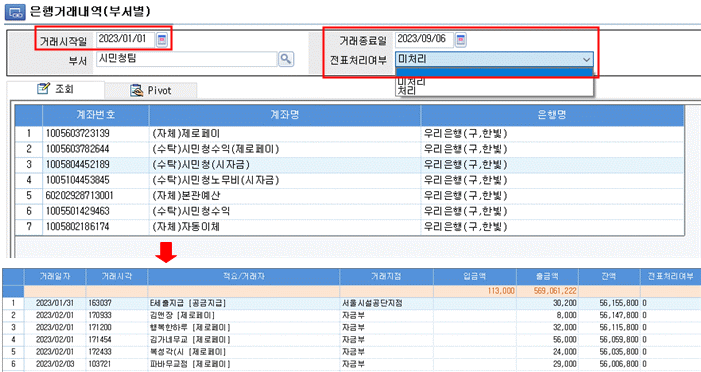
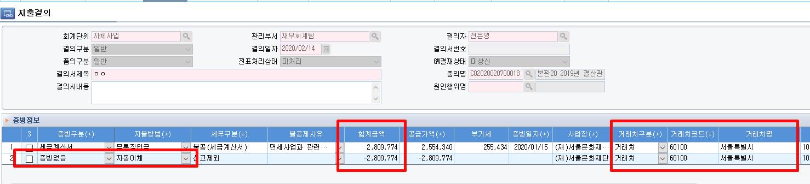
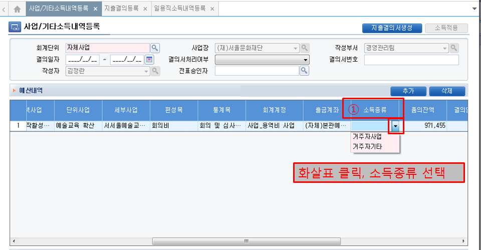
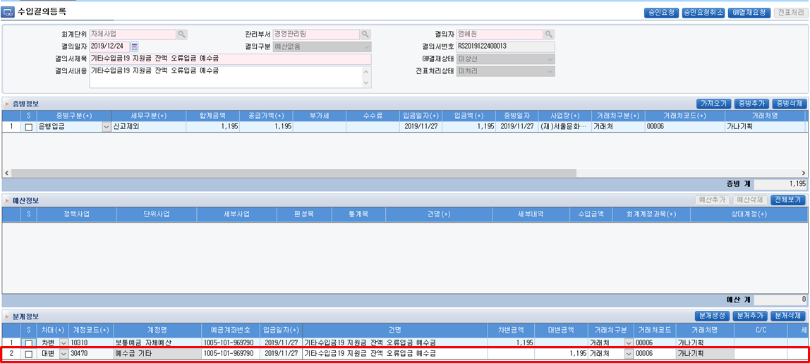
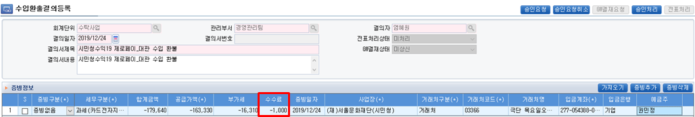

|                    |
|:------------------:|
| **☆ 회계 매뉴얼☆** |

|  |  |
|----|:--:|
| **A. 회계 일반 – 더존IU 이용시 참고사항** | [**<u>p.3</u>**] |
| **※ 거래처 등록 방법** | [**<u>p.9</u>**] |
|  |  |
| **B. 부가가치세** | [**<u>p.12</u>**] |
| **C. 원천징수 (사업, 기타, 일용직 소득)** | [**<u>p.14</u>**] |
| **D. 법인카드 & 제로페이** | [**<u>p.16</u>**] |
|  |  |
| **E. 더존IU (회계) - 주요변경사항** | [**<u>p.17</u>**] |
| **E-1. 수입결의서 입력 시 ‘증빙정보’ 및 ‘예산정보’ 복사 기능 추가** | [**<u>p.17</u>**][1] |
| **E-2. 계좌거래내역 조회 / 법인카드 승인내역 조회 / 제로페이 사용내역 조회** | [**<u>p.18</u>**] |
|  |  |
| **F. 더존IU 입력방법 - \[지출결의등록\] - 일반적인 지출** | [**<u>p.19</u>**] |
| **F-1.** \[결의구분 : 일반/원인행위\] **전자세금계산서/전자계산서-무통장입금** | [**<u>p.19</u>**][2] |
| **F-2.** \[결의구분 : 일반/원인행위\] **전자세금계산서/전자계산서-지로 (※ 지로 실물 제출 필수)** | [**<u>p.22</u>**] |
| **F-3.** \[결의구분 : 일반/원인행위\] **전자세금계산서/전자계산서-자동이체** | [**<u>p.24</u>**] |
| **F-4.** \[결의구분 : 일반/원인행위\] **(종이)세금계산서/(종이)계산서 (※ 실물증빙 제출 필수)** | [**<u>p.26</u>**] |
| **F-5.** \[결의구분 : 일반\] **신용카드(법인)** | [**<u>p.27</u>**] |
| **F-5-1.** \[결의구분 : 일반\] **법인카드 해외 이용분** | [**<u>p.28</u>**] |
| **F-5-2.** \[결의구분 : 일반\] **다른 예산 신용카드(법인) 사용 \[① 지출결의 방법\]** | [**<u>p.29</u>**] |
| **F-5-3.** \[수입결의등록 : 예산없음\] **다른 예산 신용카드(법인) 사용 \[② 지출계좌 입금결의\]** | [**<u>p.30</u>**] |
| **F-6.** \[결의구분 : 일반\] **체크카드/제로페이** | [**<u>p.31</u>**] |
| **F-7.** \[결의구분 : 일반/원인행위\] **증빙없음** | [**<u>p.32</u>**] |
| **F-8.** \[결의구분 : 일반/원인행위\] **1개 증빙-예산 여러개 사용** | [**<u>p.33</u>**] |
| **F-9.** \[결의구분 : 일반/원인행위\] **1개 증빙-C/C 구분** | [**<u>p.34</u>**] |
|  |  |
| **G. 더존IU 입력방법 \[지출결의등록\] - 예산없음** | [**<u>p.35</u>**] |
| **G-1.** \[결의구분 : 예산없음\] **증빙없음** | [**<u>p.35</u>**][3] |
| **G-2.** \[결의구분 : 예산없음\] **신용카드(법인) – 선 입금 후 지출 (ex. 오류결제)** | [**<u>p.36</u>**] |
| **G-3.** \[결의구분 : 예산없음\] **신용카드(법인)/체크카드/제로페이 (ex. 오류결제)** | [**<u>p.37</u>**] |
| **G-4.** \[결의구분 : 예산없음\] **별도 세금계산서 발행분 입력** | [**<u>p.38</u>**] |
| **G-5.** \[결의구분 : 예산없음\] **해외송금** | [**<u>p.39</u>**] |
|  |  |
| **H. 더존IU 입력방법 \[지출결의등록\] - 일괄품의** | [**<u>p.40</u>**] |
| **H-1.** \[결의구분 : 일반(일괄품의_일반)\] | [**<u>p.40</u>**][4] |
| **H-2.** \[결의구분 : 일반(일괄품의_기타사업일용)\] | [**<u>p.40</u>**][5] |
|  |  |
| **I. 더존IU 입력방법 \[지출결의등록\] - 사업·기타·일용 (거주자)** | [**<u>p.41</u>**] |
| **I-1.** \[인사관리-사업/기타소득내역등록\] **사업·기타소득** | [**<u>p.42</u>**] |
| **I-2.** \[인사관리-사업/기타소득내역등록\] **일용직소득** | [**<u>p.45</u>**] |
| **I-3.** \[지출결의등록-결의구분(사업,기타,일용)\] **인건비의 지출결의등록** | [**<u>p.48</u>**] |
| **J. 더존IU 입력방법 \[지출환입결의등록\]** | [**<u>p.49</u>**] |
| **J-1. 올해 예산으로 처리 – (-)세금계산서/계산서 증빙 발행** | [**<u>p.49</u>**][6] |
| **J-2. 올해 예산으로 처리 – 법인카드/제로페이/체크카드 취소** | [**<u>p.51</u>**] |
| **J-3. 올해 예산으로 처리 – 증빙없음** | [**<u>p.52</u>**] |
| **J-4. 올해 예산으로 처리 – 수수료 제외하고 입금되는 경우** | [**<u>p.53</u>**] |
| **J-5. 지출결의 시 품의 잘 못 선택한 경우 (지출결의 결재 완료된 경우)** | [**<u>p.54</u>**] |
| **※ 기타수입금 처리 – 수입결의등록** |  |
|  |  |
| **K. 더존IU 입력방법 \[수입결의등록\]** | [**<u>p.55</u>**] |
| **K-1.** \[결의구분 : 입금내역\] **전자세금계산서/전자계산서/현금영수증** | [**<u>p.55</u>**][7] |
| **K-2.** \[결의구분 : 입금내역\] **신용카드/카드전자지급수단 (판매수수료 있는 경우)** | [**<u>p.58</u>**] |
| **K-3.** \[결의구분 : 입금내역\] **신고제외** | [**<u>p.59</u>**] |
| **K-4.** \[결의구분 : (세금)계산서 선발행\] **입금 전 ‘청구’ (세금)계산서 발행** | [**<u>p.59</u>**][8] |
| **K-5.** \[결의구분 : 예산없음\] **(세금)계산서 선발행 건 입금, 오류입금 건 등** | [**<u>p.60</u>**] |
| **k-6.** \[결의구분 : 분할입력(증빙없음)\] **수입금이 통합되어 입금되는 결제사 매출 건 등** | [**<u>p.62</u>**] |
| **K-7. 오류입금 건 처리** \[수입결의등록(증빙없음)→지출결의등록(증빙없음)\] | [**<u>p.63</u>**] |
|  |  |
| **L. 더존IU 입력방법 \[수입환출결의등록\]** | [**<u>p.64</u>**] |
| **L-1. 환불 (수수료 없는 경우) - 전자세금계산서/전자계산서/현금영수증(전체취소)** | [**<u>p.64</u>**][9] |
| **L-2. 환불 (수수료 없는 경우) - 현금영수증(부분취소)** | [**<u>p.67</u>**] |
| **L-3. 환불 (판매수수료 있는 경우) - 신용카드/전자지급수단(제로페이)** | [**<u>p.69</u>**] |
| **L-4. 환불 (취소수수료 수익이 있는 경우)** | [**<u>p.70</u>**] |
| **L-5. 수입예산을 잘 못 선택한 후 수입결의를 한 경우 (수입결의 결재 완료)** | [**<u>p.71</u>**] |
|  |  |
| **M. 더존IU 입력방법 \[전도금\]** | [**<u>p.72</u>**] |
| **M-1.** \[지출결의등록 : 결의구분(일반)\] **전도금 신청(증빙없음-무통장입금)** | [**<u>p.72</u>**][10] |
| **M-2.** \[지출결의등록 : 결의구분(예산없음(가지급금반제))\] **전도금 정산** | [**<u>p.73</u>**] |
| **M-3.** \[지출환입결의등록\] **전도금 정산 잔액 반납** | [**<u>p.74</u>**] |
|  |  |
| **N. 더존IU 입력방법 \[기부금\]** | [**<u>p.75</u>**] |
| **N-1.** \[결의구분 : 기부금\] **수수료 제외하고 입금되는 경우** | [**<u>p.75</u>**][11] |
| **N-2.** \[결의구분 : 기부금\] **수수료 별도 인출** | [**<u>p.76</u>**] |
| **N-3.** \[결의구분 : 기부금\] **현물기부금 입금** | [**<u>p.77</u>**] |
| **N-4.** \[결의구분 : 지출결의등록\] **수수료 지급** | [**<u>p.77</u>**][12] |
|  |  |
| **O. 더존IU 입력방법 \[e나라\]** | [**<u>p.78</u>**] |
| **O-1.** \[결의구분 : 분할입력(증빙없음)\] **e나라도움 예탁계좌 사업비 입금** | [**<u>p.78</u>**][13] |
| **O-2.** \[결의구분 : 일반 지출결의 등록과 동일\] **e나라도움 지출 시** | [**<u>p.78</u>**][14] |

|  |  |  |  |
|:--:|----|----|---:|
| **A** |  | **회계 일반 – 더존IU 이용시 참고사항** | [**<u>\[목차 돌아가기\]</u>**][15] |

1.  **회계단위 : 법인세법상 (고유목적사업/수익사업), 공익법인회계기준(공익목적사업/기타사업)**

① 사업구분

<table>
<colgroup>
<col style="width: 25%" />
<col style="width: 25%" />
<col style="width: 25%" />
<col style="width: 25%" />
</colgroup>
<tbody>
<tr>
<td colspan="2" style="text-align: center;"><strong>법인세법상 구분</strong></td>
<td colspan="2" style="text-align: center;"><strong>공익법인회계기준상 구분</strong></td>
</tr>
<tr>
<td style="text-align: center;"><strong>고유목적사업</strong></td>
<td style="text-align: center;"><strong>수익사업</strong></td>
<td style="text-align: center;"><strong>공익목적사업</strong></td>
<td style="text-align: center;"><strong>기타사업</strong></td>
</tr>
<tr>
<td style="text-align: center;">법인세법상 수익사업이 아닌 고유목적사업</td>
<td style="text-align: center;">
일반적으로 경제적 효익을 얻는 사업

(ex. 이자소득, 대가를 얻는 계속적 행위로 인한 수입)
</td>
<td style="text-align: center;">정관에 기재된 공익목적사업</td>
<td style="text-align: center;">그 외 사업</td>
</tr>
</tbody>
</table>

② 서울문화재단의 사업구분

<table>
<colgroup>
<col style="width: 5%" />
<col style="width: 20%" />
<col style="width: 40%" />
<col style="width: 34%" />
</colgroup>
<tbody>
<tr>
<td colspan="3" style="text-align: center;"><strong>구분</strong></td>
<td style="text-align: center;"><strong>재단의 사업</strong></td>
</tr>
<tr>
<td rowspan="6" style="text-align: center;">
공익

목적

사업
</td>
<td style="text-align: center;">자체사업 (S1000)</td>
<td style="text-align: center;">자체예산 사업 (고유목적사업)</td>
<td style="text-align: center;">보통의 자체사업</td>
</tr>
<tr>
<td style="text-align: center;">기부금사업 (S2000)</td>
<td style="text-align: center;">
기부금수익을 재원으로 하는 사업

(고유목적사업)
</td>
<td style="text-align: center;">기부금 영수증 발행 수익을 재원으로 하는 사업</td>
</tr>
<tr>
<td style="text-align: center;">수익사업(자체사업) (S3000)</td>
<td style="text-align: center;">자체예산 사업 (수익사업)</td>
<td style="text-align: center;">참가료, 대행수수료 등</td>
</tr>
<tr>
<td style="text-align: center;">수익사업(수탁사업) (S3500)</td>
<td style="text-align: center;">수탁사업 (수익사업)</td>
<td style="text-align: center;">없음 (2024. 9. 기준)</td>
</tr>
<tr>
<td style="text-align: center;">수탁사업 (S4000)</td>
<td style="text-align: center;">수탁심의위원회 거친 수탁사업 (고유목적사업)</td>
<td style="text-align: center;">공연예술창작활성화지원사업 등</td>
</tr>
<tr>
<td style="text-align: center;">기타재원사업 (S5000)</td>
<td style="text-align: center;">수탁사업 이외의 외부 재원 조달 사업 (고유목적사업)</td>
<td style="text-align: center;">문예위, 메세나협회 등</td>
</tr>
<tr>
<td rowspan="2" style="text-align: center;">
기타

사업
</td>
<td style="text-align: center;">
자체사업(자체기타사업)

(SO1000)
</td>
<td style="text-align: center;">공익목적사업 외의 고유목적사업</td>
<td style="text-align: center;">자금운영 이자 수입 등</td>
</tr>
<tr>
<td style="text-align: center;">
수익사업(자체기타사업)

(S03000)
</td>
<td style="text-align: center;">공익목적사업 외의 수익사업</td>
<td style="text-align: center;">카페 운영 등</td>
</tr>
</tbody>
</table>

**2. ERP(더존IU) 지출/수입 프로세스정책 및 협력 관리**

① ERP 프로세스 요약 : 원인행위등록, 인건비 내역등록(사업/기타/일용)은 해당사항 있는 경우만 작성  
(단, 예술인고용보험이 적용 되어야 할 경우 인사팀 협조)

<table>
<colgroup>
<col style="width: 8%" />
<col style="width: 11%" />
<col style="width: 14%" />
<col style="width: 19%" />
<col style="width: 21%" />
<col style="width: 11%" />
<col style="width: 14%" />
</colgroup>
<tbody>
<tr>
<td style="text-align: center;"><strong>메뉴명</strong></td>
<td style="text-align: center;"><strong>품의등록</strong></td>
<td style="text-align: center;"><strong>원인행위등록</strong></td>
<td style="text-align: center;"><strong>인건비 내역등록</strong></td>
<td style="text-align: center;"><strong>지출·수입결의등록</strong></td>
<td style="text-align: center;"><strong>회계승인</strong></td>
<td style="text-align: center;"><strong>전표승인/지출</strong></td>
</tr>
<tr>
<td style="text-align: center;">사용자</td>
<td style="text-align: center;">사업부서</td>
<td style="text-align: center;">계약/조달부서</td>
<td style="text-align: center;">사업부서</td>
<td style="text-align: center;">사업부서</td>
<td style="text-align: center;">회계부서</td>
<td style="text-align: center;">회계부서</td>
</tr>
<tr>
<td style="text-align: center;">기능</td>
<td style="text-align: center;">예산등록</td>
<td style="text-align: center;">계약업무</td>
<td style="text-align: center;">
소득내역등록

(※ 사업/기타/일용)
</td>
<td style="text-align: center;">지출·수입결의서 작성</td>
<td style="text-align: center;">회계업무</td>
<td style="text-align: center;">회계업무</td>
</tr>
</tbody>
</table>

② 지출·수입결의서 전자결재

<table>
<colgroup>
<col style="width: 28%" />
<col style="width: 7%" />
<col style="width: 28%" />
<col style="width: 7%" />
<col style="width: 29%" />
</colgroup>
<tbody>
<tr>
<td style="text-align: center;"><strong>지출·수입결의등록</strong></td>
<td rowspan="2" style="text-align: center;">→</td>
<td style="text-align: center;"><strong>전자결재상신</strong></td>
<td rowspan="2" style="text-align: center;">→</td>
<td style="text-align: center;"><strong>전자결재완료</strong></td>
</tr>
<tr>
<td style="text-align: center;">담당자</td>
<td style="text-align: center;">담당자</td>
<td style="text-align: center;">이후 회계부서 지출</td>
</tr>
</tbody>
</table>

③ 지출·수입결의서 전자결재 결재 순서  
- <u>회계부서의 협조는 전자결재 시스템 상 **‘협조’로 표현될뿐,** 실제로는 회계부서 **별도 ‘결재’건임**</u>

※ **참고 : 사무위임전결 공통사항의 “지출 회계결의서” 결재권자 규정에 따름.**

<table style="width:100%;">
<colgroup>
<col style="width: 20%" />
<col style="width: 9%" />
<col style="width: 9%" />
<col style="width: 9%" />
<col style="width: 9%" />
<col style="width: 9%" />
<col style="width: 9%" />
<col style="width: 9%" />
<col style="width: 9%" />
</colgroup>
<tbody>
<tr>
<td rowspan="2" style="text-align: center;"><strong>최종결재자(매니저/팀장)</strong></td>
<td style="text-align: center;">사업부서</td>
<td style="text-align: center;"><em>계약</em></td>
<td style="text-align: center;"><em>회계부서</em></td>
<td style="text-align: center;"><em>회계부서</em></td>
<td style="text-align: center;">사업부서</td>
<td style="text-align: center;"></td>
<td style="text-align: center;"></td>
<td style="text-align: center;"></td>
</tr>
<tr>
<td style="text-align: center;">담당</td>
<td style="text-align: center;"><em>각 담당</em></td>
<td style="text-align: center;"><em>지출담당</em></td>
<td style="text-align: center;"><em>지출팀장</em></td>
<td style="text-align: center;">매니저/팀장</td>
<td style="text-align: center;"></td>
<td style="text-align: center;"></td>
<td style="text-align: center;"></td>
</tr>
<tr>
<td rowspan="2" style="text-align: center;"><strong>최종결재자(실장)</strong></td>
<td style="text-align: center;">사업부서</td>
<td style="text-align: center;">사업부서</td>
<td style="text-align: center;"><em>계약</em></td>
<td style="text-align: center;"><em>회계부서</em></td>
<td style="text-align: center;"><em>회계부서</em></td>
<td style="text-align: center;"><em>회계부서</em></td>
<td style="text-align: center;">사업부서</td>
<td style="text-align: center;"></td>
</tr>
<tr>
<td style="text-align: center;">담당</td>
<td style="text-align: center;">매니저/팀장</td>
<td style="text-align: center;"><em>각 담당</em></td>
<td style="text-align: center;"><em>지출담당</em></td>
<td style="text-align: center;"><em>지출팀장</em></td>
<td style="text-align: center;"><em>본부장</em></td>
<td style="text-align: center;">실장</td>
<td style="text-align: center;"></td>
</tr>
</tbody>
</table>

④ 지출·수입결의서 전자결재시 유의사항

\- 지출/수입결의 전자결재 중 오류 시 반려 → 기결재자통과 등 기안이 수정되지 않음 / 해당사항 수정 후 재기안

→ 전자결재 처음부터 시작

\- 오류발생 시 모두 정정 후 진행되어야 하며 수기정정 불가능. 거래처 계좌번호 및 주민등록번호 확인 철저

\- 수입의 경우, 품의/원인행위/인건비내역등록 입력 X

**3. 결의서 종류 : 지출(일반), 지출(사업/기타/일용), 지출환입, 지출(일괄품의_일반), 지출(일괄품의_사업기타일용), 수입(일반), 수입환출**

**4. 회계결의서 구비서류**

① 첨부서류 : 결의서 전자결재시 붙임문서로 첨부**<u>(A4 용지 크기에 맞춰 파일 작성)</u>**

② **<u>붙임문서는 모두 각각의 파일로 첨부. 하나의 파일로 첨부 금지</u>**

예) 1. 물품검수조서/검수내역서, 2. 산출기초조사서, 2. 견적서 → 별도 첨부 (O)

vs. 1. 통장사본/사업자등록증 함께 스캔하여 1개 파일 → (X)

③ (공통) 첨부서류

\- 품의 기안 : 관련문서 업로드

\- 품의 외 관련된 기안 : 관련문서로 업로드 할 수 없는 경우, 붙임문서로 첨부 (※ 비배포문서 불가)

④ **회계서류의 보관 및 제출의무**

\- <u>서류(지원금 지급관련 서류, 계약서류, 인계약서류 등)의 원본은 담당부서 보관</u>

\- 전자서류로 인정되지 않는 서류(종이세금계산서, 간이영수증 등)등 적격증빙 및 지로는 회계부서 제출

※ 전자결재시 스캔파일 첨부

※ 법인세법 제116조(지출증명서류의 수취 및 보관), 시행령 제158조(지출증명서류의 수취 및 보관)에 따라 현금영수증, 신용카드매출전표, 직불전자지급수단(제로페이), 전자세금계산서, 전자계산서의 경우 별도 보관 제외

⑤ 보도자료, 업체 소개 등 지출과 직접적인 상관없는 자료 첨부 불가

⑥ 관련 증빙 서류에 거래 상대방 **<u>예명 사용 금지</u>**

<table>
<colgroup>
<col style="width: 10%" />
<col style="width: 44%" />
<col style="width: 45%" />
</colgroup>
<thead>
<tr>
<th style="text-align: center;"><strong>구분</strong></th>
<th style="text-align: center;"><strong>붙임문서</strong></th>
<th style="text-align: center;"><strong>비고</strong></th>
</tr>
</thead>
<tbody>
<tr>
<td rowspan="7" style="text-align: center;">
<strong>지출결의서</strong>

<strong>(업체)</strong>
</td>
<td>
<strong>&lt;필수&gt;</strong> (종이)세금계산서/(종이)계산서

※ 해당사항 있을 경우, 스캔 첨부 및 실물제출
</td>
<td>전자세금계산서/전자계산서/법인카드영수증/제로페이영수증 시스템상 가져오기 가능</td>
</tr>
<tr>
<td>
<strong>&lt;필수&gt;</strong>

식대 - ‘예산정보-세부내역’ 참석자 작성

물품·용역 - 검수내역서 or ‘예산정보-세부내역’ 구매내역 작성 or (법인카드) 세부내역 있을 경우, 영수증 스캔
</td>
<td>10만원 이하 (※ 시스템연동으로 인해 그 내역을 알 수 있는 내역 자료가 없기 때문에 반드시 작성 또는 첨부)</td>
</tr>
<tr>
<td><strong>&lt;필수&gt;</strong> 물품검수조서, 검수내역서</td>
<td>10만원 이상 (※ 다과 포함)</td>
</tr>
<tr>
<td><strong>&lt;필수&gt;</strong> 승낙사항</td>
<td>100만원 이상(※ 법인카드)</td>
</tr>
<tr>
<td><strong>&lt;필수&gt;</strong> 견적서</td>
<td>100만원 이상</td>
</tr>
<tr>
<td><strong>&lt;필요시&gt;</strong> 산출기초조사서, 타견적서</td>
<td>100만원 이상</td>
</tr>
<tr>
<td>사업자등록증/통장사본/기타 필요한 서류</td>
<td>스캔파일 첨부</td>
</tr>
<tr>
<td rowspan="6" style="text-align: center;">
<strong>지출결의서</strong>

<strong>(용역-개인)</strong>
</td>
<td><strong>&lt;필수&gt;</strong> 계약서</td>
<td></td>
</tr>
<tr>
<td><strong>&lt;필수&gt;</strong> 용역검수조서</td>
<td></td>
</tr>
<tr>
<td style="text-align: left;">(사업/기타) 계약서 또는 참석확인서</td>
<td>
사업소득/기타소득에 대한 사항 표시 포함

(소득자가 반드시 표시)
</td>
</tr>
<tr>
<td style="text-align: left;">(일용직) 근로계약서, 근무기록부</td>
<td></td>
</tr>
<tr>
<td style="text-align: left;">용역수행 증명서류 등</td>
<td></td>
</tr>
<tr>
<td>신분증/통장사본</td>
<td>스캔파일 첨부</td>
</tr>
<tr>
<td rowspan="2" style="text-align: center;">
<strong>지출결의</strong>

<strong>(자동이체)</strong>
</td>
<td><strong>&lt;필수&gt;</strong> 통장거래내역</td>
<td style="text-align: left;">‘더존IU-은행거래내역(부서별)’ 또는 ‘우리은행-스피드계좌조회’ 캡처</td>
</tr>
<tr>
<td>납부관련 서류 등</td>
<td>해당업체 제공자료 등</td>
</tr>
<tr>
<td rowspan="2" style="text-align: center;">
<strong>지출결의</strong>

<strong>(지로)</strong>
</td>
<td><strong>&lt;필수&gt;</strong> 지로</td>
<td>실물 제출</td>
</tr>
<tr>
<td>납부관련 서류 등</td>
<td style="text-align: left;">지로 정보 앞뒷면 스캔</td>
</tr>
<tr>
<td rowspan="4" style="text-align: center;">
<strong>수입결의</strong>

<strong>(업체)</strong>
</td>
<td style="text-align: left;"><blockquote>

대관계약서, 신청서등 관련서류

</blockquote></td>
<td></td>
</tr>
<tr>
<td style="text-align: left;"><blockquote>

(세금계산서 발행) 거래처 이메일

</blockquote></td>
<td>‘수입결의등록-증빙정보’ 해당사항 입력</td>
</tr>
<tr>
<td style="text-align: left;"><blockquote>

사업자등록증(고유번호증)

</blockquote></td>
<td></td>
</tr>
<tr>
<td style="text-align: left;"><blockquote>

통장거래내역

</blockquote></td>
<td>
은행입금내역 가져오기 기능 사용 안 하는 경우,

‘더존IU-은행거래내역(부서별)’ 또는 ‘우리은행-스피드계좌조회’ 캡처
</td>
</tr>
<tr>
<td rowspan="5" style="text-align: center;">
<strong>수입결의</strong>

<strong>(개인)</strong>
</td>
<td><strong>&lt;필수&gt;</strong> 현금영수증 ※ 해당사항 있을 경우</td>
<td>스캔(캡처)하여 첨부</td>
</tr>
<tr>
<td style="text-align: left;"><blockquote>

(세금계산서 발행) 거래처 이메일

</blockquote></td>
<td>‘수입결의등록-증빙정보’ 해당사항 입력</td>
</tr>
<tr>
<td style="text-align: left;">대관계약서, 신청서 등 관련서류</td>
<td style="text-align: left;"></td>
</tr>
<tr>
<td style="text-align: left;">대관 수입일 경우, 개인정보이용 동의서 첨부</td>
<td style="text-align: left;">주민등록번호 있어야 함 (부가가치세 신고 정보)</td>
</tr>
<tr>
<td style="text-align: left;"><blockquote>

통장거래내역

</blockquote></td>
<td>
은행입금내역 가져오기 기능 사용 안 하는 경우,

‘더존IU-은행거래내역(부서별)’ 또는 ‘우리은행-스피드계좌조회’ 캡처
</td>
</tr>
</tbody>
</table>

**5. 세무구분 : 부가가치세 신고를 위한 자료**

① 지출 : 재단이 매입을 통한 증빙 수취

<table>
<colgroup>
<col style="width: 18%" />
<col style="width: 14%" />
<col style="width: 39%" />
<col style="width: 27%" />
</colgroup>
<tbody>
<tr>
<td style="text-align: center;"><strong>증빙구분</strong></td>
<td colspan="2" style="text-align: center;"><strong>세무구분</strong></td>
<td style="text-align: center;"><strong>재단의 사업</strong></td>
</tr>
<tr>
<td rowspan="2" style="text-align: center;">세금계산서</td>
<td style="text-align: center;">과세(세금계산서)</td>
<td style="text-align: center;">과세사업으로 부가세를 납부해야하는 경우</td>
<td style="text-align: center;">수익사업 등</td>
</tr>
<tr>
<td style="text-align: center;"><strong>불공(세금계산서)</strong></td>
<td style="text-align: center;"><strong>재단의 고유사업에 해당하는 부분의 매입으로 매입세액 공제 불가능한 경우</strong></td>
<td style="text-align: center;"><strong>재단의 대부분의 고유목적사업</strong></td>
</tr>
<tr>
<td style="text-align: center;">계산서</td>
<td style="text-align: center;">면세(계산서)</td>
<td style="text-align: center;">계산서를 발급받은 경우</td>
<td style="text-align: center;"></td>
</tr>
<tr>
<td rowspan="3" style="text-align: center;">
신용카드/

체크카드/제로페이
</td>
<td style="text-align: center;">기타(신용카드)</td>
<td style="text-align: center;">과세사업으로 부가세를 납부해야하는 경우</td>
<td style="text-align: center;">수익사업 등</td>
</tr>
<tr>
<td style="text-align: center;">면세(신용카드)</td>
<td style="text-align: center;">면세사업 중 부가세 신고하는 경우</td>
<td style="text-align: center;"></td>
</tr>
<tr>
<td style="text-align: center;"><strong>신고제외</strong></td>
<td style="text-align: center;"><strong>부가세 신고 안 하는 경우</strong></td>
<td style="text-align: center;"><strong>현재 대부분 재단 사업</strong></td>
</tr>
<tr>
<td rowspan="3" style="text-align: center;">현금영수증</td>
<td style="text-align: center;">현금영수증</td>
<td style="text-align: center;">과세사업으로 부가세를 납부해야하는 경우</td>
<td style="text-align: center;"></td>
</tr>
<tr>
<td style="text-align: center;">현금영수증(면세)</td>
<td style="text-align: center;">면세사업 중 부가세 신고하는 경우</td>
<td style="text-align: center;"></td>
</tr>
<tr>
<td style="text-align: center;"><strong>신고제외</strong></td>
<td style="text-align: center;"><strong>부가세 신고 안 하는 경우</strong></td>
<td style="text-align: center;"><strong>현재 대부분 재단 사업</strong></td>
</tr>
<tr>
<td style="text-align: center;">사업,기타소득/일용</td>
<td style="text-align: center;">신고제외</td>
<td style="text-align: center;">해당사항 없음</td>
<td style="text-align: center;"></td>
</tr>
<tr>
<td style="text-align: center;">증빙없음</td>
<td style="text-align: center;">신고제외</td>
<td style="text-align: center;">해당사항 없음</td>
<td style="text-align: center;"></td>
</tr>
</tbody>
</table>

② 수입 : 재단이 수입에 대한 증빙 발급

<table>
<colgroup>
<col style="width: 32%" />
<col style="width: 25%" />
<col style="width: 42%" />
</colgroup>
<tbody>
<tr>
<td colspan="2" style="text-align: center;"><strong>세무구분</strong></td>
<td style="text-align: center;"><strong>재단의 사업</strong></td>
</tr>
<tr>
<td style="text-align: center;">과세(세금계산서)</td>
<td rowspan="4" style="text-align: center;">과세사업의 수입</td>
<td rowspan="4" style="text-align: center;">회계단위 S3000, S3500, S4000, S03000 중 해당사업</td>
</tr>
<tr>
<td style="text-align: center;">과세(신용카드)</td>
</tr>
<tr>
<td style="text-align: center;">현금영수증(매출)</td>
</tr>
<tr>
<td style="text-align: center;">과세(카드전자지급수단)</td>
</tr>
<tr>
<td style="text-align: center;">면세(계산서)</td>
<td rowspan="4" style="text-align: center;">면세사업의 수입</td>
<td rowspan="4" style="text-align: center;">
회계단위 S3000 (공연티켓 판매),

회계단위 S4000 (수탁사업-교부금) 등
</td>
</tr>
<tr>
<td style="text-align: center;">면세(신용카드)</td>
</tr>
<tr>
<td style="text-align: center;">현금영수증(면세)</td>
</tr>
<tr>
<td style="text-align: center;">면세(카드전자지급수단)</td>
</tr>
<tr>
<td style="text-align: center;">신고제외</td>
<td style="text-align: center;">부가세 신고 해당사항 없음</td>
<td style="text-align: center;"></td>
</tr>
</tbody>
</table>

**6. 회계계정과목**

① 공익법인회계기준

\- 공익목적사업 : 사업수행비용 / 일반관리비용 / 모금비용

<table>
<colgroup>
<col style="width: 12%" />
<col style="width: 43%" />
<col style="width: 14%" />
<col style="width: 29%" />
</colgroup>
<thead>
<tr>
<th style="text-align: center;"><strong>구분</strong></th>
<th style="text-align: center;"><strong>내용</strong></th>
<th style="text-align: center;"><strong>계정과목</strong></th>
<th style="text-align: center;"><strong>예산</strong></th>
</tr>
</thead>
<tbody>
<tr>
<td style="text-align: center;">사업수행비용</td>
<td>공익법인이 추구하는 본연의 임무나 목적을 달성하기 위해 수혜자, 고객, 회원 등에게 재화나 용역을 제공하는 활동에서 발생하는 비용</td>
<td style="text-align: center;">사업_***</td>
<td>
사업비(자체/수탁/기부금)

(예술창작활성화 등)

일반관리비(예산상) 중 사업팀 비용
</td>
</tr>
<tr>
<td style="text-align: center;">일반관리비용</td>
<td>기획, 인사, 재무, 감독 등 제반 관리활동에서 발생하는 비용</td>
<td style="text-align: center;">일반_***</td>
<td>일반관리비(예산상) 중 관리활동을 하는 팀의 비용</td>
</tr>
<tr>
<td style="text-align: center;">모금비용</td>
<td>모금 홍보, 모금 행사, 기부자 리스트 관리, 모금 고지서 발송 등의 모금활동에서 발생하는 비용</td>
<td style="text-align: center;">모금_***</td>
<td>기부활성화 예산 등</td>
</tr>
</tbody>
</table>

\- 기타사업 : 기타사업비용

| **구분** | **내용** | **계정과목** | **예산** |
|:--:|----|:--:|----|
| 기타사업비용 | 공익목적활동 이외에 기타사업을 수행하는 경우 관련한 비용 | 기타\_\*\*\* | (현재) 예술청 예산 중 ‘카페쿼드’ 관련 비용 |

**② 계정과목 - 지출**

\- 더존IU : 예산의 통계목에 연결된 회계 계정과목을 보여줌.

<table>
<colgroup>
<col style="width: 5%" />
<col style="width: 15%" />
<col style="width: 17%" />
<col style="width: 61%" />
</colgroup>
<thead>
<tr>
<th colspan="3" style="text-align: center;"><strong>계정과목</strong></th>
<th style="text-align: center;"><strong>내 용</strong></th>
</tr>
</thead>
<tbody>
<tr>
<td rowspan="3" style="text-align: center;">분배비용</td>
<td>지원금 자체사업</td>
<td>지원금 자체사업</td>
<td>자체사업 지원금 지급</td>
</tr>
<tr>
<td rowspan="2">
지원금 수탁사업

　
</td>
<td>지원금 수탁사업</td>
<td>수탁사업 지원금 지급</td>
</tr>
<tr>
<td>지원금 기타재원사업</td>
<td>기타재원사업 지원금 지급</td>
</tr>
<tr>
<td rowspan="4" style="text-align: center;">인력비용</td>
<td>임원급여</td>
<td>임원급여</td>
<td>대표이사 급여</td>
</tr>
<tr>
<td>직원급여</td>
<td>직원급여</td>
<td>직원 기본금</td>
</tr>
<tr>
<td>상여금</td>
<td>상여금</td>
<td>성과급</td>
</tr>
<tr>
<td>제수당</td>
<td>제수당</td>
<td>제수당</td>
</tr>
<tr>
<td rowspan="7" style="text-align: center;">인력비용</td>
<td rowspan="2">
잡급

　
</td>
<td>잡급 일반</td>
<td>행정스태프</td>
</tr>
<tr>
<td>잡급 일용근로</td>
<td>일용근로 급여</td>
</tr>
<tr>
<td>퇴직급여</td>
<td>퇴직급여</td>
<td>퇴직금</td>
</tr>
<tr>
<td rowspan="3">복리후생비</td>
<td>복리후생비 급여</td>
<td>급여성 복리후생비 ex. 생일축하금, 선택적복지, 숙박비, 통신비</td>
</tr>
<tr>
<td>복리후생비 4대보험</td>
<td>국민연금, 건강보험, 고용보험, 산재보험</td>
</tr>
<tr>
<td>복리후생비 기타</td>
<td>동호회지원 등</td>
</tr>
<tr>
<td>교육훈련비</td>
<td>교육훈련비</td>
<td>직무교육 등 (역량교육 포함), 워크숍, 현장근무, 문화활동비, (내부) 스팍킹 외부강사비 등 (※ 식대, 다과-&gt; 잡비 / 부서운영비-잡비 부서운영비)</td>
</tr>
<tr>
<td rowspan="11" style="text-align: center;">시설비용</td>
<td>수도광열비</td>
<td>수도광열비</td>
<td>상하수도료, 가스비 등</td>
</tr>
<tr>
<td>전력비</td>
<td>전력비</td>
<td>전기요금　</td>
</tr>
<tr>
<td rowspan="5">
감가상각비

　

　

　

　
</td>
<td>감가상각비 건물</td>
<td>　</td>
</tr>
<tr>
<td>감가상각비 구축물</td>
<td>　</td>
</tr>
<tr>
<td>감가상각비 기계장치</td>
<td>　</td>
</tr>
<tr>
<td>감가상각비 차량운반구</td>
<td>　</td>
</tr>
<tr>
<td>감가상각비 비품</td>
<td>　</td>
</tr>
<tr>
<td>보험료-시설</td>
<td>보험료 시설</td>
<td>건물, 구축물 등 시설에 대한 화재보험 및 차량운반구에 대한 보험 등 시설과 관련한 보험료 (※ 공익법인회계기준 실무지침서)</td>
</tr>
<tr>
<td>시설관리비</td>
<td>시설관리비</td>
<td>승강기유지, 무인경비, 소방관리, 전기안전, 정화조·물탱크청소, 승강기 수리비 등</td>
</tr>
<tr>
<td>세금과공과-시설</td>
<td>세금과공과 시설</td>
<td>시설유지관련 제세공과금 (※ 공익법인회계기준 실무지침서) ex. 재산세, 자동차세</td>
</tr>
<tr>
<td>무형고정자산상각</td>
<td>무형고정자산 상각</td>
<td>　</td>
</tr>
<tr>
<td rowspan="5" style="text-align: center;">기타비용</td>
<td>통신비</td>
<td>통신비</td>
<td>우편, 전화, 인터넷 비용, TV시청료, SMS, 엔팩스, 전파사용료 등</td>
</tr>
<tr>
<td>세금과공과금</td>
<td>세금과공과 일반</td>
<td>지방소득세, 등록면허세, 주민세(법인균등분) 등</td>
</tr>
<tr>
<td rowspan="3">
여비교통비

　

　
</td>
<td>여비교통비시내교통비</td>
<td>업무택시비, 시내출장비</td>
</tr>
<tr>
<td>여비교통비국내출장비</td>
<td>시외출장비</td>
</tr>
<tr>
<td>여비교통비해외출장비</td>
<td>　</td>
</tr>
<tr>
<td rowspan="39" style="text-align: center;">기타비용</td>
<td rowspan="2">
지급임차료

　
</td>
<td>지급임차료 일반</td>
<td>매월, 정기적으로 지출되는 건 ex. 복사기, 업무용차량</td>
</tr>
<tr>
<td>지급임차료 기타</td>
<td>
연단위, 비정기적으로 지출되는 건

ex. COP, 부서워크숍 숙박비, 행사로 인한 장소 단기 대관료, 심사시 태블릿PC 임차 등 <strong>빌리는 모든 행위</strong>
</td>
</tr>
<tr>
<td>수선비</td>
<td>수선비</td>
<td>비품 등 수리 ex. 난방기·사무기기 수리 등</td>
</tr>
<tr>
<td rowspan="3">도서인쇄비</td>
<td>도서인쇄비 도서구입비</td>
<td>TA 교육자료 등　</td>
</tr>
<tr>
<td>도서인쇄비 인쇄대</td>
<td>유인물 인쇄, 명함 등</td>
</tr>
<tr>
<td>도서인쇄비 구독료</td>
<td>정기구독(잡지, 신문 등)　</td>
</tr>
<tr>
<td rowspan="2">
회의비

　

　
</td>
<td>회의비 식대</td>
<td>
외부사람과 회의시 식대

(※ 내부직원간 회의-잡비 식대 / 내부직원간 업무추진비 사용-업무추진비 식대)
</td>
</tr>
<tr>
<td style="text-align: left;">회의비 기타</td>
<td>
외부사람과 회의시 식대 외

(※ 내부직원간 회의-잡비 기타 / 내부직원간 업무추진비 사용-업무추진비 기타)
</td>
</tr>
<tr>
<td>소모품비</td>
<td>소모품비 일반</td>
<td>소모품 구입</td>
</tr>
<tr>
<td rowspan="3">지급수수료</td>
<td>지급수수료</td>
<td>스토리지 구매, 웹하드, 은행수수료, 자문료, 공인인증서 수수료 등</td>
</tr>
<tr>
<td>지급수수료 수수료</td>
<td>예매시스템, 카드수수료, 제로페이 수수료</td>
</tr>
<tr>
<td>사업용역비</td>
<td>
업체 지급-침구류세탁, 근태관리, 냉온수기 소독비, 냉난방기 세척, 사무기기 유지 등

(※ 광고관련 용역-광고선전비 / 행사관련 용역-행사비 일반)
</td>
</tr>
<tr>
<td>보관료</td>
<td>보관료</td>
<td>　</td>
</tr>
<tr>
<td>보험료</td>
<td>보험료 일반</td>
<td>
신원보증보험료, 여행자보험, 단체상해보험 등

(※ 시설관련 보험료-보험료 시설 / 행사관련 보험료-보험료 행사)
</td>
</tr>
<tr>
<td>광고선전비</td>
<td>광고선전비</td>
<td>홍보물 디자인비, 현수막, 배너 등</td>
</tr>
<tr>
<td rowspan="4">행사비</td>
<td>행사비 일반</td>
<td>행사 대행 용역(업체 지급), 재료구입 등</td>
</tr>
<tr>
<td>행사비 식대</td>
<td>행사시 식대</td>
</tr>
<tr>
<td>보험료 행사</td>
<td>행사관련 보험료</td>
</tr>
<tr>
<td>행사비 기타</td>
<td>행사관련 다과, 음료, 주차 등</td>
</tr>
<tr>
<td>공동사업비</td>
<td>공동사업비</td>
<td>　</td>
</tr>
<tr>
<td rowspan="3">
기획공연제작비

　
</td>
<td>기획공연제작비 일반</td>
<td>공연 관련 비용</td>
</tr>
<tr>
<td>기획공연제작비 식대</td>
<td>공연 관련 식대</td>
</tr>
<tr>
<td>기획공연제작비 기타</td>
<td>공연 관련 다과, 음료, 주차 등</td>
</tr>
<tr>
<td rowspan="2">차량유지비</td>
<td>차량유지비 유류대</td>
<td>업무용 차량 유류대</td>
</tr>
<tr>
<td>차량유지비 기타</td>
<td>수리, 세차, 주차, 통행 등 유류대 이외의 차량유지비(※ 행사를 위한 주차-행사비 기타)</td>
</tr>
<tr>
<td rowspan="5">
잡비

　

　

　
</td>
<td>잡비 특근매식비</td>
<td>특근매식비</td>
</tr>
<tr>
<td>잡비 부서운영비</td>
<td>부서운영비</td>
</tr>
<tr>
<td>잡비 식대</td>
<td>내부직원간 식대 ex. 워크숍, 현장학습 등</td>
</tr>
<tr>
<td>잡비 기타</td>
<td>내부직원간 다과, 음료대</td>
</tr>
<tr>
<td>잡비 내부거래</td>
<td>‘카페 쿼드’에서 재단 법인카드 사용 (자체예산)</td>
</tr>
<tr>
<td>기부금</td>
<td>기부금</td>
<td style="text-align: left;"></td>
</tr>
<tr>
<td rowspan="2">업무추진비　</td>
<td>업무추진비 식대</td>
<td>업무추진비 예산으로 식대 지출</td>
</tr>
<tr>
<td>업무추진비 기타</td>
<td>업무추진비 예산으로 식대 이외 지출</td>
</tr>
<tr>
<td rowspan="5">운반비</td>
<td>운반비</td>
<td>용달, 택배, 퀵서비스, 우체국 택배</td>
</tr>
<tr>
<td>용역비 사업</td>
<td>원천징수대상소득 (※ 세율 : 3.3%)</td>
</tr>
<tr>
<td>용역비 기타</td>
<td>원천징수대상소득 (※ 필요경비율에 따라 다름. 보통 8.8%)</td>
</tr>
<tr>
<td>용역비 비거주</td>
<td>비거주자(개인) 용역비-조세조약 확인대상</td>
</tr>
<tr>
<td>용역비 비거주(법인)</td>
<td>비거주자(법인) 용역비-조세조약 확인대상</td>
</tr>
<tr>
<td>재료비</td>
<td>재료비</td>
<td>카페쿼드 재료 구입</td>
</tr>
</tbody>
</table>

해당 계정과목이 없을 경우, ‘전체’ 선택→적절한 회계계정과목 선택하여 변경

<table>
<colgroup>
<col style="width: 100%" />
</colgroup>
<tbody>
<tr>
<td>
<strong>[※ 참고 : 간단정리 ]</strong>

<table>
<colgroup>
<col style="width: 33%" />
<col style="width: 66%" />
</colgroup>
<tbody>
<tr>
<td style="text-align: center;"><strong>예산</strong></td>
<td style="text-align: center;"><strong>계정과목</strong></td>
</tr>
<tr>
<td style="text-align: center;">특근매식비</td>
<td style="text-align: center;">잡비 특근매식비</td>
</tr>
<tr>
<td style="text-align: center;">부서운영비</td>
<td style="text-align: center;">잡비 부서운영비</td>
</tr>
<tr>
<td rowspan="2" style="text-align: center;">업무추진비</td>
<td style="text-align: center;">업무추진비 식대</td>
</tr>
<tr>
<td style="text-align: center;">업무추진비 기타</td>
</tr>
</tbody>
</table>

▶ 예산과 계정과목이 일치하는 경우

<table>
<colgroup>
<col style="width: 33%" />
<col style="width: 66%" />
</colgroup>
<tbody>
<tr>
<td style="text-align: center;"><strong>예산</strong></td>
<td style="text-align: center;"><strong>계정과목</strong></td>
</tr>
<tr>
<td style="text-align: center;">비품</td>
<td style="text-align: center;">
컴퓨터, 모니터, 책상, 냉장고, 냉난방기 등 자산성 비품 구입

(참고) 소모품구입→(계정과목) 소모품비 일반
</td>
</tr>
<tr>
<td style="text-align: center;">기계장치</td>
<td style="text-align: center;">건당 100만원 이상</td>
</tr>
<tr>
<td style="text-align: center;">차량운반구</td>
<td style="text-align: center;">건당 100만원 이상</td>
</tr>
</tbody>
</table>

▶ 자산 구입 (감가상각 대상)

<table>
<colgroup>
<col style="width: 14%" />
<col style="width: 16%" />
<col style="width: 68%" />
</colgroup>
<thead>
<tr>
<th style="text-align: center;"><strong>지출유형</strong></th>
<th style="text-align: center;"><strong>계정과목</strong></th>
<th style="text-align: center;"><strong>내 용</strong></th>
</tr>
</thead>
<tbody>
<tr>
<td rowspan="4" style="text-align: center;">식대</td>
<td>회의비 식대</td>
<td>외부사람과 회의시 식대</td>
</tr>
<tr>
<td>행사비 식대</td>
<td>행사시 식대</td>
</tr>
<tr>
<td>잡비 식대</td>
<td>내부직원간 식대 ex. 워크숍, 현장학습 등</td>
</tr>
<tr>
<td>업무추진비 식대</td>
<td>업무추진비 예산으로 식대 지출</td>
</tr>
<tr>
<td rowspan="4" style="text-align: center;">다과·음료</td>
<td>회의비 기타</td>
<td>외부사람과 회의시 식대 외</td>
</tr>
<tr>
<td>행사비 기타</td>
<td>행사관련 다과, 음료 (주차)</td>
</tr>
<tr>
<td>잡비 기타</td>
<td>내부직원간 다과, 음료대</td>
</tr>
<tr>
<td>업무추진비 기타</td>
<td>업무추진비 예산으로 식대 이외 지출</td>
</tr>
<tr>
<td rowspan="3" style="text-align: center;">보험료</td>
<td>보험료 시설</td>
<td>건물, 구축물 등 시설에 대한 화재보험 및 차량운반구에 대한 보험 등 시설관련 보험료</td>
</tr>
<tr>
<td>보험료 행사</td>
<td>행사관련 보험료</td>
</tr>
<tr>
<td>보험료 일반</td>
<td>신원보증보험료, 여행자보험, 단체상해보험 등</td>
</tr>
<tr>
<td rowspan="2" style="text-align: center;">세금과공과</td>
<td>세금과공과 시설</td>
<td>시설유지관련 제세공과금 ex. 재산세, 자동차세</td>
</tr>
<tr>
<td>세금과공과 일반</td>
<td>지방소득세, 등록면허세, 주민세(법인균등분) 등</td>
</tr>
</tbody>
</table>

▶ 지출유형별 계정과목
</td>
</tr>
</tbody>
</table>

**③ 계정과목 – 수익** (※ 새로운 수익 발생시 계정과목 추가 요청)

<table>
<colgroup>
<col style="width: 13%" />
<col style="width: 23%" />
<col style="width: 47%" />
<col style="width: 15%" />
</colgroup>
<thead>
<tr>
<th style="text-align: center;"><strong>계정과목</strong></th>
<th style="text-align: center;"><strong>세목</strong></th>
<th style="text-align: center;"><strong>적요</strong></th>
<th style="text-align: center;"><strong>법인세법 상 수익</strong></th>
</tr>
</thead>
<tbody>
<tr>
<td>출연금 수입</td>
<td>출연금 수입</td>
<td>서울시 출연 수입</td>
<td rowspan="6" style="text-align: center;">고유목적사업수익</td>
</tr>
<tr>
<td rowspan="2">
기부금 수익

　
</td>
<td>순수기부금 수익</td>
<td>순수기부금</td>
</tr>
<tr>
<td>조건부기부금 수익</td>
<td>조건부기부금</td>
</tr>
<tr>
<td rowspan="3">기타수입금</td>
<td>기타수입금 행사(고유)</td>
<td>재단 행사관련 수입</td>
</tr>
<tr>
<td>기타수입금 기타(고유)</td>
<td></td>
</tr>
<tr>
<td>기타수입금 지원금 잔액(고유)</td>
<td>자체 지원사업 지원금 잔액, 이자</td>
</tr>
<tr>
<td rowspan="2">
금융자산수익

　
</td>
<td>이자수익(기본재산)</td>
<td>기본재산의 이자</td>
<td rowspan="17" style="text-align: center;">수익사업 수익</td>
</tr>
<tr>
<td>이자수익(운영비)</td>
<td>자체예산의 이자</td>
</tr>
<tr>
<td rowspan="3">
기타수입금

　
</td>
<td>기타수입금 행사(수익)</td>
<td>재단 행사관련 수입</td>
</tr>
<tr>
<td>기타수입금 대행수수료(수익)</td>
<td>수탁사업 등 대행수수료</td>
</tr>
<tr>
<td>기타수입금 기타(수익)</td>
<td>인세, 복사카드(교육팀, 연극센터) 등</td>
</tr>
<tr>
<td>대관료수입</td>
<td>대학로센터 대관</td>
<td>임대(사업자등록증 업태)로 신고된 사업장의 대관료 수입</td>
</tr>
<tr>
<td rowspan="6">
창작공간수익

　

　

　

　

　

　

　

　
</td>
<td>금천예술공장수익</td>
<td rowspan="6">공간 시설사용료 수입</td>
</tr>
<tr>
<td>신당창작아케이드수익</td>
</tr>
<tr>
<td>문래예술공장수익</td>
</tr>
<tr>
<td>연희문학창작촌수익</td>
</tr>
<tr>
<td>서울무용센터수익</td>
</tr>
<tr>
<td>서울연극센터수익</td>
</tr>
<tr>
<td rowspan="3">
참가료수입

　
</td>
<td>참가료수입_본관</td>
<td rowspan="3">행사 참가료</td>
</tr>
<tr>
<td>참가료수입_무용</td>
</tr>
<tr>
<td>극장운영수입_대학로</td>
</tr>
<tr>
<td rowspan="2">
편의시설 운영수입

　
</td>
<td>카페운영수입_대학로</td>
<td rowspan="2">카페운영수입</td>
</tr>
<tr>
<td>카페운영수입_내부거래</td>
</tr>
<tr>
<td rowspan="6">
수탁사업 수익

　

　

　

　

　
</td>
<td>수탁사업 수익</td>
<td>수탁사업비 입금</td>
<td rowspan="6" style="text-align: center;">
고유목적사업수익

(※ 결산시 예수금처리)
</td>
</tr>
<tr>
<td>수탁사업 수익 기타</td>
<td>수탁사업 수행으로 발생하는 기타 수입 (ex. 공창, 상주 지원금 잔액, 이자 반납 등)</td>
</tr>
<tr>
<td>무대공유 수익</td>
<td>수탁사업 수행으로 발생하는 리스테이지서울 수익</td>
</tr>
<tr>
<td>노들섬 수익</td>
<td>수탁사업 수행으로 발생하는 노들섬 수익</td>
</tr>
<tr>
<td>기타재원사업 수익</td>
<td>기타재원사업 수익 입금</td>
</tr>
<tr>
<td>기타재원사업 수익 기타</td>
<td>기타재원사업 수행으로 발생하는 기타 수입</td>
</tr>
</tbody>
</table>

**7. 상대계정**

|  |  |
|:--:|:--:|
| **구분** | **내용** |
| 미지급금 일반 | 일반적인 지출로 무통장 입금의 경우 |
| 미지급금 기타 | 법인카드 사용 중 예산 전용 사용의 경우(수탁사업 예산-본관카드 사용 등) |
| 미지급금 법인카드 | 일반적인 법인카드 사용 |
| 보통예금 | 자동이체, 체크카드, 제로페이 등 바로 통장에서 인출되는 경우 |
| 그 외 | 담당자 문의 |

**8. 분개정보 중 C/C, 프로젝트 : 회계 결산을 위해 관리되는 항목**

<table>
<colgroup>
<col style="width: 17%" />
<col style="width: 82%" />
</colgroup>
<tbody>
<tr>
<td style="text-align: center;"><strong>구분</strong></td>
<td style="text-align: center;"><strong>내용</strong></td>
</tr>
<tr>
<td style="text-align: center;">C/C</td>
<td style="text-align: center;">
예산의 정책사업을 기준으로 구분

단, 사업본부의 일반관리비 사용시 해당 본부 C/C로 반드시 변경 (ex 업무추진비, 특근매식비등)
</td>
</tr>
<tr>
<td style="text-align: center;">프로젝트</td>
<td style="text-align: center;">예산의 세부사업</td>
</tr>
</tbody>
</table>

**9. 거래처 등록 방법**

① 거래처 종류

|  |  |  |
|:--:|:--:|:--:|
| **거래처 종류** | **구분** | **사용** |
| 사원 | 재단 근로소득자로 등록되어 있는 직원 | 국내출장비, 해외출장비, 전도금 등 |
| 거래처(코드 有) | 일반 거래처 | 일반 거래 (부가세 신고대상, 지원단체 등) |
| 거래처(코드 ‘00’) | 법인카드 거래처(과세사업 제외), 거래처 등록을 할 수 없는 경우 | 수기 입력 (무통장입금 하는 것은 사용불가) |

② 거래처 등록 방법 – 더존IU \[메뉴명 : 거래처정보관리\]

<table>
<colgroup>
<col style="width: 50%" />
<col style="width: 50%" />
</colgroup>
<tbody>
<tr>
<td colspan="2">
<strong>가. 거래처 등록하는 경우</strong>

a. 신규 거래처인 경우 → ‘거래처코드’에 거래처명을 검색했을 때 ‘조건에 해당하는 내용이 없습니다’ 팝업

</td>
</tr>
<tr>
<td colspan="2">
b. 세금계산서/계산서 가져오기 할 때 거래처가 공란인 경우

</td>
</tr>
<tr>
<td colspan="2">
c. ‘거래처정보관리’에서 조회 시 검색이 안 될 경우

</td>
</tr>
<tr>
<td>
나. [거래처정보관리] ‘추가’버튼

a. 코드 : 자동채번→거래처명 입력

b. 사업자등록번호 입력

- 기존에 입력된 거래처인 경우

→ ‘그래도 등록하시겠습니까’ 팝업

→ <strong><u>‘아니오’ 클릭</u></strong>

<strong>(등.록.하.지. 마.세.요!!!!!!!!!!!!!!!)</strong>

→ 해당 코드번호 숙지 후 지출결의등록에서 입력
</td>
<td></td>
</tr>
<tr>
<td>
다. [거래처정보관리] 세부사항 입력→저장

a. 필수 : 거래처명, 사업자등록번호

b. 추가 : 대표자명, 주소, 업태, 업종, 계좌정보,

거래처 담당자 e-mail주소(세금계산서 발행)

c. <u>계좌번호 : ‘-’ 꼭 넣기</u>

d. 이마트, 스타벅스같이 1개의 사업자등록번호로 등록되어 있는 경우→종사업자번호 입력

→ 과세사업장인 경우, 회계담당자 문의
</td>
<td></td>
</tr>
<tr>
<td rowspan="2">
※ 개인거래처일 경우,

- 거래처구분 → 개인으로 변경

- 주민번호 ‘입력’버튼 누른 후 팝업창에 입력(암호화)

- 틀렸을 경우, 팝업생성 됨

→ <strong><u>‘아니오’ 클릭 (절대 금지)</u></strong>

→ 수정 후 재입력
</td>
<td></td>
</tr>
<tr>
<td></td>
</tr>
<tr>
<td>
※ 거래처 담당자 e-mail 추가입력

- 담당자추가 버튼→추가버튼→입력 후 저장
</td>
<td></td>
</tr>
<tr>
<td>
※ 거래처 계좌추가입력

- 계좌자료 버튼→추가버튼→입력→주요사용 체크→저장
</td>
<td></td>
</tr>
<tr>
<td colspan="2">라. 거래처 입력사항 저장→[지출결의등록] 거래처 입력</td>
</tr>
<tr>
<td>
※ 자주 묻는 질문

Q. 거래처 등록이 되어있는데 지출결의등록에서 세금계산서 증빙 가져올 때 &lt;거래처코드가 없는 건은 거래처정보관리 화면에서 코드를 등록 후 확인하시기 바랍니다&gt; 팝업창 뜨는 경우에는?

A. 거래처정보관리 메뉴에서 해당 거래처 세금계산서 기본정보 중 <strong>거래처구분(주요)</strong>로 설정하여 저장 후 세금계산서 가져오기 다시 진행
</td>
<td></td>
</tr>
</tbody>
</table>

**10. 기타 유의사항**

① 결의서 제목 \> 건명 \> 세부내역

<table>
<colgroup>
<col style="width: 12%" />
<col style="width: 33%" />
<col style="width: 54%" />
</colgroup>
<tbody>
<tr>
<td style="text-align: center;"><strong>구분</strong></td>
<td style="text-align: center;"><strong>내용</strong></td>
<td style="text-align: center;"><strong>예시</strong></td>
</tr>
<tr>
<td style="text-align: center;">결의서 제목</td>
<td style="text-align: center;">포괄적 의미를 가지는 내용</td>
<td style="text-align: center;">
◬ 청년예술지원사업 심사진행비

◍ 서울메세나의 밤 개최
</td>
</tr>
<tr>
<td style="text-align: center;">건명</td>
<td style="text-align: center;">지출 및 수입의 행위를 직관적으로 나타내는 내용</td>
<td style="text-align: center;">
◬ 청년예술지원사업 심사진행시 다과구입

청년예술지원사업 심사진행시 심사수당지급

◍ 서울메세나의 밤 사회자 출연료

서울메세나의 밤 참석자 주차비
</td>
</tr>
<tr>
<td style="text-align: center;">세부내역</td>
<td style="text-align: center;">건명에 대해 설명하는 내용으로 간단하게 작성</td>
<td style="text-align: center;">
▶ 식대/인건비 - 참석자 작성

▶ 물품구입 - 구매내역 작성
</td>
</tr>
</tbody>
</table>

② 사업/기타소득 : 소득자에게 소득 종류 반드시 확인

\- 참석확인서, 계약서 등에 명시

③ 전도금 사용의 최소화

\- 소모품 구입․제조․운반 등의 경우 : 건당 100만원 이내

재단 사용의 경비와 여비 : 건당 500만원 이내 지급가능(재단 회계규정 21조)

\- 카드 사용할 수 없는 부득이한 경우에만 사용

\- 전도금으로 현금성 자산 구입금지(상품권도 법인카드로만 구입가능)

\- 전도금으로 불가피하게 현금성 자산을 구입할 경우 재무회계팀에 보고하고 수령인의 인적사항, 수령사인을 함께 첨부

④ 카드결제 또는 현금영수증 가능업소에서의 간이영수증 사용 불가(3만원 이하만 가능)

⑤ **<u>현재 사업자등록증에 기재된 업태 외 다른 사업 진행 시 재무회계팀에 업태추가 요청</u>**

예) (업태)예술관련 대관임대 → (신규 수입항목 발생)강의료 수입 발생-교육사업 업태 추가요청

⑥ **<u>개인정보가 지출/수입결의 전자결재 내에 포함된 경우 비공개 설정</u>**

|  |  |  |  |
|:--:|----|----|---:|
| **B** |  | **부가가치세** | [**<u>\[목차 돌아가기\]</u>**][15] |

**1. 세금계산서란?**

사업자가 재화 또는 용역을 공급하는 때에 그에 대한 부가가치세를 거래상대방으로부터 징수하고, 그 사실을 증명하기 위하여 교부하는 계산서를 말한다.

**2. 전자세금계산서, 전자계산서 발급 의무자**

① 법인사업자 : 매출과 관계없이 모든 법인사업자 전자세금계산서, 전자계산서 발행 의무

② 개인사업자 : 직전연도 총 수입금액(공급가액)이 1억원 이상인 사업자(2023.7월 적용)

③ 발급 기한 : 공급시기가 속하는 달의 다음달 10일까지

**3. 세금계산서 발행 시 챙겨야 할 사항 – 입금결의**

① 상대방 사업자 등록증

② 상대방 e-mail주소

③ 입금일 3영업일 내 수입결의등록 완료

※ 세금계산서 및 계산서의 발행은 재무회계팀에서 총괄

세금계산서 및 계산서는 거래상대방 이메일주소로 직접 발행

**4. 세금계산서 수취 시 챙겨야 할 사항 - 지출결의**

① 재단 사업자등록번호 확인

② <u>필요적 기재사항</u>이 모두 기재 되었는가 여부

<table>
<colgroup>
<col style="width: 100%" />
</colgroup>
<tbody>
<tr>
<td style="text-align: left;">
[필요적 기재사항]

공급하는 사업자의 등록번호와 성명 또는 명칭 / 공급받는 자의 등록번호 / 공급가액과 부가가치세액 / 작성 연월일
</td>
</tr>
</tbody>
</table>

③ 수정세금계산서 수취 시 기존 세금계산서 모두 첨부

④ 세금계산서 작성일자가 속한 분기의 익월 10일까지 지출결의 (※ 대표자 변경시 반영여부 확인)

**5. 재단 사업자등록 번호**

|  |  |  |  |
|:--:|:--:|:--:|:--:|
| 201-82-04361 | 본관, 본관수탁(국고) | 599-82-00433 | 노들섬복합문화공간 |
| 101-82-15762 | 서울연극센터 | 175-82-00504 | 리스테이지 서울 |
| 889-82-00113 | 서울문화예술교육센터 양천 | 215-82-13423 | 서울장애예술창작센터 |
| 422-82-00185 | 서울거리예술창작센터 | 119-82-06885 | 금천예술공장 |
| 777-82-00294 | 대학로 | 729-82-00373 | 서울문화예술교육센터 용산 |
| 201-82-06883 | 신당창작아케이드 | 110-82-14447 | 연희문학창작촌 |
| 199-82-00719 | 서울문화예술교육센터 강북 | 110-82-15354 | 서울무용센터 |
| 662-82-00556 | 서울문화예술교육센터 서초 | 198-82-00297 | 청년예술청 |
| 705-82-00493 | 서울문화예술교육센터 은평 | 107-82-14117 | 문래예술공장 |
| 346-82-00464 | 서울연극창작센터 |  |  |

**6. 참고사항**

① 법인카드 결제 시 원칙적으로는 세금계산서를 수취하지 아니함

② 개인사업자의 경우, 매출규모 등 조건에 따라 수기(세금)계산서 발행업체가 있을 수 있으므로 전자와 수기 모두 수령 가능

**7. 전자세금계산서 발급의무 제외항목**

① \[전기사업법\]에 따른 전기사업자가 산업용 전력을 공급하는 경우

② \[전기통신사업법\]에 따른 전기통신사업자가 사업자에게 전기통신역무를 제공하는 경우.

부가통신역무 중 월단위 요금형 서비스를 제공하는 경우로서 기간통신역무와 공급시기가 동일하여 통합하여 비용을 청구하는 경우

③ \[도시가스사업법\]에 따른 도시가스사업자가 산업용 도시가스를 공급하는 경우

④ \[집단에너지사업법\]에 따른 한국지역난방공사가 산업용 열을 공급하는 경우

★ 위 경우라도 필요적 기재사항이 모두 기재되어 있어야 한다.

**8. 부가가치세 신고**

<table>
<colgroup>
<col style="width: 35%" />
<col style="width: 10%" />
<col style="width: 53%" />
</colgroup>
<tbody>
<tr>
<td style="text-align: left;">
<strong>- 1기 예정신고 (4월 25일)</strong>

<strong>신고대상: 1월1일~3월 31일</strong>
</td>
<td></td>
<td style="text-align: left;">
<strong>(세금)계산서 작성일자 1/1~3/31</strong>

<strong>회계결의서 4월 10일까지 지출결의등록 결재완료</strong>
</td>
</tr>
<tr>
<td style="text-align: left;">
<strong>- 1기 확정신고 (7월 25일)</strong>

<strong>신고대상: 4월1일~6월30일</strong>
</td>
<td></td>
<td style="text-align: left;">
<strong>(세금)계산서 작성일자 4/1~6/30</strong>

<strong>회계결의서 7월 10일까지 지출결의등록 결재완료</strong>
</td>
</tr>
<tr>
<td style="text-align: left;">
<strong>- 2기 예정신고 (10월 25일)</strong>

<strong>신고대상: 7월1일~9월30일</strong>
</td>
<td></td>
<td style="text-align: left;">
<strong>(세금)계산서 작성일자 7/1~9/30</strong>

<strong>회계결의서 10월 10일까지 지출결의등록 결재완료</strong>
</td>
</tr>
<tr>
<td style="text-align: left;">
<strong>- 2기 확정신고 (1월 25일)</strong>

<strong>신고대상: 10월1일~12월31일</strong>
</td>
<td></td>
<td style="text-align: left;">
<strong>(세금)계산서 작성일자 10/1~12/31</strong>

<strong>회계결의서 1월 10일까지 지출결의등록 결재완료</strong>
</td>
</tr>
</tbody>
</table>

**9. 현금영수증**

① 사업과 관련하여 재화 또는 용역을 공급했을 때 그 상대방이 법인이 아닌 개인일 경우 현금영수증 발행

② <http://www.hellocash.co.kr/>, 엘지 유플러스 등

**10. 현금영수증 발행 시 주의사항**

① 입금일자와 현금영수증 발행일자는 동일해야 함 (월말에 항상 체크)

\- 부득이한 경우 1일 정도 늦어질 수 있으나 달이 넘어 갈 수는 없음

예) 9월 30일 입금, 현금영수증 10월 1일 발행 (X)

② 법인으로 계약서를 작성하고 개인에게 현금영수증 발행 불가 (반대 경우도 불가)

③ 현금영수증의 발급은 주민등록번호, 전화번호, 사업자등록번호로 가능

④ 발행한 현금영수증은 수입회계결의서 바로 뒤에 첨부 후 관련서류와 함께 **<u>제출</u>**

⑤ 거래상대방이 현금영수증 발급을 원치 않아도 현금영수증 자진발급제에 따라 국세청이 지정한 코드(010-000-1234)를 전화번호에 넣어 발행 ★

|  |  |  |  |
|:--:|----|----|---:|
| **C** |  | **원천징수 (사업, 기타, 일용직 소득)** | [**<u>\[목차 돌아가기\]</u>**][15] |

**1. 원천징수란?**

소득의 대가를 지급하는 자가 그 지급받는 자가 부담하여야 할 소득세를 미리 징수하였다가 국가에 납부하는 제도

**2. 사업소득 원천징수**

① 독립된 자격으로(고용관계 없이) 계속적·반복적으로 용역을 제공하는 경우

② \[원천징수세액 = 사업소득세 원천징수 총 지급금액 X 3.3% (지방소득세 포함)\]

**3. 기타소득 원천징수**

① 독립된 자격으로(고용관계 없이) 일시적이고 우발적으로 용역을 제공하거나 대가를 받는 경우

② \[원천징수세액 = (지급금액-필요경비) x 22% (지방소득세포함 : 기타소득세의 10%)\]

※ 필요경비 80%인 기타소득이 250,000원 이하면 원천징수 면제

※ 필요경비 60%인 기타소득이 125,000원 이하면 원천징수 면제

※ 필요경비 0%인 기타소득이 50,000원 이하면 원천징수 면제

→ 소득세는 과세하지 아니하나 신고의무는 있음 (개인정보필요)

<table>
<colgroup>
<col style="width: 100%" />
</colgroup>
<tbody>
<tr>
<td>
[필요경비] 소득활동을 위해 투입된 비용 (필요경비를 공제하여 세제혜택 부여

▶ 필요경비 80% 인정 경우

· 공익법인이 주무관청의 승인을 받거나, 불특정 다수가 순위 경쟁 대회에서 시상하는 상금과 부상

· 주택입주 지체상금

▶ 필요경비 60% 인정 경우

· 무형자산의 양도, 대여 소득(광업권,어업권,상표권, 영업권 등)

· 원고료, 인세 등

· 일시적 강연료 , 자문료 등
</td>
</tr>
</tbody>
</table>

**4. 일용근로소득 원천징수** ※ 최장 근무기간 30일 미만, 품의 시 인사혁신팀 협조 필수!!

① 1일 또는 시간으로 급여를 계산하여 받는 근로자(일당,파트타임,아르바이트 등)로서 동일 사업자에게 3개월(건설공사종사자는 1년) 이상 계속 고용되어 있지 않는 근로자

② **지출** : **매주 화요일**

③ **마감** : **귀속월의 익월 <u>3일 마감(휴일일 경우, 다음 영업일)</u> → 지출결의등록 결재 완료**

예) 2023. 10월 근무 → 2023. 11월 3일 지출 마감

④ **<u>\[동일일자 동일인\] 근무 중복 금지</u>**

예) 홍길동, 예술교육팀 일용직 근무(9/4 오전) → 지역문화팀 일용직 근무(9/4 오후) 불가

⑤ 근로계약서, 근무기록부 반드시 첨부

⑥ \[원천징수세액 = 산출세액 – 근로소득 세액공제(산출세액의 55%)\]

※ 근로소득금액 = 일급여액 – 근로소득공제(일 15만원)

※ 산출세액 = 근로소득금액(과세표준) x 원천징수세율(6%)

<table>
<colgroup>
<col style="width: 100%" />
</colgroup>
<tbody>
<tr>
<td>
[일용근로 신고-고용노동부]

▶ 신고기한 : 익월 14일 (※ 지연신고 시 건당 5만원 과태료, 총 과태료 한도 300만원)

▶ 근무월을 걸쳐서 고용했을 경우 근로한 월에 맞춰 회계결의서를 월별로 작성 해야함

(※ 사실과 다른 신고 시 건당 8만원 과태료)

예) 5/20 ~ 6/10 근무 → 5/20~5/31 : 1개 회계결의서 / 6/01~6/10 : 1개 회계결의서

[일용근로소득 신고-국세청]

▶ 신고기한 : 익월 10일

▶ 지출결의서에 근무기록부(PDF) 붙임문서로 첨부 (<strong>※ 원본 각 팀에서 보관</strong>)
</td>
</tr>
</tbody>
</table>

⑦ 유급휴일수당 및 주휴수당 ERP 일용근로소득 입력 방법

\- 유급휴일수당(월차) 급여 반영 : 개근 월의 익월 근로일수에 배분하여 입력

\- 유급휴일수당(공휴일, 근로자의날 등) 급여 반영 : 해당 월의 근로일수에 배분하여 입력

\- 주휴수당 급여 반영 : 주휴수당이 발생한 주의 근로 일수에 배분하여 입력

※ 근로일수에 수당을 배분하여 급여 반영 시 근로소득금액에 따라 세액 발생하여 원천징수될 수 있음

**5. 비거주자, 외국법인 소득 원천징수**

① 소득세법상 비거주자 또는 법인세법상 외국법인이, 국내에서 용역을 제공함으로 인하여 발생하는 소득 또는 저작권, 특허권 등 사용료소득이 발생하는 경우

② 비거주자의 소득세는 조세조약에 의해 국적, 금액마다 달라질 수 있음.

③ 필요서류 : 여권사본, 거주자증명서, 외국인등록증, 지급관련 정보 등

※ 예술인 고용보험 문의는 인사팀 4대보험 담당자에게 문의 바랍니다.

|  |  |  |  |
|:--:|----|----|---:|
| **D** |  | **법인카드 & 제로페이** | [**<u>\[목차 돌아가기\]</u>**][**<u>p.16</u>**] |

**\[ 법인카드 \]**

**1. 법인카드 사용 시 유의사항**

<table>
<colgroup>
<col style="width: 12%" />
<col style="width: 87%" />
</colgroup>
<tbody>
<tr>
<td style="text-align: center;">
<strong>법인카드</strong>

<strong>사용 전</strong>
</td>
<td style="text-align: left;">▶ 재단에서 사용 중인 모든 카드는 해외사용과 인터넷 구매 가능</td>
</tr>
<tr>
<td style="text-align: center;">
<strong>법인카드</strong>

<strong>사용 시</strong>
</td>
<td style="text-align: left;">
▶ 결제사인에 “서울문화재단”과 함께 사용자 이름 적기

▶ 식대·다과 등 : 공지된 ‘회의단가 기준’ 확인

단, 청탁금지법에 따라 공직자 등에 집행 시 3만원 이하에서 운용

회의수당 지급 후 오찬, 리셉션, 일반간담회 등 불필요한 비용 최대한 억제

▶ 법인카드는 클린카드로 발급

▶ ‘승락사항’ 작성 : 100만원 이상의 구매, 제조, 수리, 유지보수, 용역 등 자체계약 진행 시 간이계약 필요
</td>
</tr>
<tr>
<td style="text-align: center;">
<strong>법인카드</strong>

<strong>사용 후</strong>
</td>
<td style="text-align: left;">
▶ <strong><u>‘지출결의등록-증빙정보’ 카드 사용자 반드시 입력 (※ 결의자 자동반영, 수정가능)</u></strong>

※ 지방출자출연기관 예산편성지침 : 신용카드 영수증 전산화 추진기관은 전자영수증(사용자성명)으로 처리 → 지출결의 결재 시 사용자 반드시 기입!!

▶ 식대 결제 : ‘지출결의등록-예산정보’ 세부내역에 참석자 반드시 입력

식대 결제금액이 50만원 이상일 경우 참석자 소속과 성명 붙임문서 첨부 (업무추진비 등)

▶ <strong>행사용 식대 : 결과보고 첨부, 결과보고내 명단 기재 
회의용 식대/다과 : 회의록 첨부, 회의록 내 명단 기재</strong>

▶ 법인카드로 100만원 이상 결제 시 산출기초조사서(견적서), 승낙사항 등 반드시 첨부

▶ 회계결의서 작성 시 <u>건명</u>을 상세히 기록

예) 본관19 지원사업 단체 간담회 진행 회의 식대 (진행비X-지출결의서 건명으로 부적합)

▶ 사용 후 5일 이내 지출결의 등록

▶ ERP 지출결의 화면에서 증빙정보의 거래처가 결제대행사로 적혀있는 경우 실제거래처로 수정

(이니시스, 네이버 등→거래업체명)
</td>
</tr>
</tbody>
</table>

**2. 법인카드 인터넷결제**

① 30만원 이상 인터넷결제 시 재단 공동인증서(법인카드용) 필요 : 팀별로 최초 재무회계팀에 요청 후 USB 수령하여 사용)

**3. 법인카드 사용내역 확인**

① 우리카드(https://pc.wooricard.com/dcpc/yh2/main.do) : 홈페이지 상단 ‘기업’ 페이지 \> 조회·결제 \> 이용내역/매출전표 조회 or 해외 이용내역(접수기준) 조회

\- 로그인 (ID : sfac001/sfac002/sfac003, PW : 재단@0315)

② 더존IU 지출결의등록 \> 증빙정보 \> 증빙추가 \>증빙구분 : 신용카드(법인) \> 가져오기

**\[ 제로페이 \]**

**1. 제로페이 금융기관 : 우리은행**

**2. 적용대상 : 업무추진비, 부서운영비, 특근매식비**

**3. 사용자 등록**

① 사용자 : 대표이사 포함 경영진, 팀장, 매니저 외 각 부서별 최소 1인 이상 (※ 사용자 등록 추가 : 재무회계팀 요청)

② 제로페이 계좌 개설 및 운용

\- 수탁사업의 경우 사업별 계좌 연결

③ 각 사용자마다 연동된 제로페이 결제계좌 예산 외 타 예산을 혼재하여 사용 금지

**4. 지출 및 회계처리**

① 제로페이 결제시 즉시 계좌 출금

② 사용 후 일주일 이내 지출결의 등록

|  |  |  |  |
|:--:|----|----|---:|
| **E** |  |  **더존IU (회계) - 2023년 변경사항** | [**<u>\[목차 돌아가기\]</u>**][15] |

**1. 수입결의서 입력 시 ‘증빙정보’ 및 ‘예산정보’ 복사 기능 추가**

<table>
<colgroup>
<col style="width: 100%" />
</colgroup>
<tbody>
<tr>
<td><strong>[수입결의등록]</strong></td>
</tr>
<tr>
<td><strong>&lt;증빙정보&gt; - 2건 이상 입력시 세무구분, 사업장 복사 가능</strong></td>
</tr>
<tr>
<td>
① 복사할 증빙정보 1건 내용 작성 : 증빙추가→‘가져오기’를 통해 입금내역 갖고오기→1번열 내용 작성

② 복사할 증빙정보 외 붙여넣기 할 하단 증빙정보 모두 체크 → 2번열, 3번열 등

③ 복사할 증빙정보 라인 클릭(체크×/<u>라인선택○→칸 색이 하늘색이 되도록</u>)

④ 세무구분 or 사업장 ‘일괄적용’ 버튼 클릭

※ 기타수입금, 대관수입, 카페운영수입 등 대량입금 건 수입결의 시 <strong><u>동일예산</u></strong> 간 증빙정보 복사 가능
</td>
</tr>
<tr>
<td></td>
</tr>
<tr>
<td><strong>&lt;예산정보&gt; - 2건 이상 입력시 예산 복사 가능</strong></td>
</tr>
<tr>
<td>
① 복사할 증빙정보 1건 ‘예산추가’ 버튼 클릭하여 예산정보 입력

② 복사할 증빙정보 외 붙여넣기 할 증빙정보 모두 체크

③ 복사할 증빙정보 라인 클릭(체크×/<u>라인선택○→칸 색이 하늘색이 되도록</u>)

④ ‘예산복사’ 클릭→‘전체보기’ 클릭→반영여부 확인

※ 기타수입금, 대관수입, 카페운영수입 등 대량입금 건 수입결의 시 <strong><u>동일예산</u></strong> 간 예산정보 복사 가능
</td>
</tr>
<tr>
<td></td>
</tr>
</tbody>
</table>

**2.** **계좌거래내역 조회 / 법인카드 승인내역 조회 / 제로페이 사용내역 조회**

<table>
<colgroup>
<col style="width: 100%" />
</colgroup>
<tbody>
<tr>
<td><strong>계좌거래내역 조회 [메뉴명 : 은행거래내역(부서별)]-부서별로 연결되어 있는 계좌만 조회 가능</strong></td>
</tr>
<tr>
<td>
① 거래시작일 / 거래종료일 / 전표처리여부(=결의서 <strong>등록</strong>여부) 조회조건 설정 후 조회

② 각 팀별 연결되어 있는 계좌만 조회 가능. 조회를 원하는 계좌 있을 경우 재무회계팀으로 요청

※ 단, 조회 거래기간 중 <u>입출금내역 없을 시 상단 계좌번호 목록에 나타나지 않음</u>

※ 은행입금-가져오기로 처리한 건만 전표처리여부 “처리”로 반영되어 있음(<u>수익통장 관리 시 유용</u>)

※ 조회가능시간 : 입출금 발생 후 5분 이내 거래내역 확인 가능
</td>
</tr>
<tr>
<td></td>
</tr>
<tr>
<td><strong>법인카드 승인내역 조회 [메뉴명 : 법인카드승인내역]</strong></td>
</tr>
<tr>
<td>
① 승인일자 / 카드번호 / 전표처리(=지출결의 <strong>등록</strong>여부)) 조회조건 설정 후 조회

※ 단, 해외결제 건, 취소 건(전체/부분취소) 등 수기 작성 건은 추후 재무회계팀에서 수기 처리 적용함

※ 조회가능일시 : 법인카드 결제일 익일 오전 10시 이후
</td>
</tr>
<tr>
<td></td>
</tr>
<tr>
<td><strong>제로페이 사용내역 조회 [메뉴명 : 제로페이사용내역]</strong></td>
</tr>
<tr>
<td>
① 사용일자 / 관리자 / 결의서처리여부(=지출결의 <strong>등록</strong>여부) / 제로페이번호 조회조건 설정 후 조회

※ 단, 취소 건은 추후 재무회계팀에서 수기 처리 적용함

<strong>-</strong> 최초결제일자=환불일자 : 결의서 작성 필요 없음

- 최초결제일자≠환불일자 : 지출결의(예산없음) → 수입결의(예산없음) 순으로 작성 (출금일≠입금일)

※ 조회가능일자 : 제로페이 결제일 당일
</td>
</tr>
<tr>
<td></td>
</tr>
</tbody>
</table>

|  |  |  |  |
|:--:|----|----|---:|
| **F** |  | **더존IU 입력방법 \[지출결의등록\] - 일반적인 지출** | [**<u>\[목차 돌아가기\]</u>**][15] |

<table>
<colgroup>
<col style="width: 100%" />
</colgroup>
<tbody>
<tr>
<td>
<strong>❏ 결의구분 : 일반 / 원인행위</strong>

❍ 회계단위 선택(p.3)

❍ 일반적인 지출 : 무통장입금, 법인카드, 제로페이, 체크카드, 지로, 자동이체

❍ ‘가져오기’기능 : 전자세금계산서/계산서-국세청자료, 법인카드/제로페이-카드사/은행 자료 (증빙제출 불필요)

❍ 여러 건 등록 가능

조건1. 지불방법이 같아야 함

조건2. 출금계좌 같아야함

조건3. <strong><u>1개의 증빙을 여러 개 예산 또는 결의를 나눠서 작성 불가</u></strong>

조건4. 자동이체·체크카드·제로페이의 경우, 결의일자와 사용일(출금일)이 같아야 함
</td>
</tr>
</tbody>
</table>

<table>
<colgroup>
<col style="width: 50%" />
<col style="width: 50%" />
</colgroup>
<tbody>
<tr>
<td colspan="2"><strong>F-1.</strong> [결의구분 : 일반/원인행위] <strong>전자세금계산서/전자계산서-무통장입금</strong></td>
</tr>
<tr>
<td colspan="2"></td>
</tr>
<tr>
<td colspan="2"><strong>&lt;증빙정보 입력&gt;</strong></td>
</tr>
<tr>
<td colspan="2">① 회계단위 선택 / 결의서 제목·내용 입력 / ‘품의명’ 검색 / 원인행위 : ‘원인행위명’ 검색</td>
</tr>
<tr>
<td colspan="2">② ‘증빙추가’ 버튼→증빙구분(세금계산서/계산서)→지불방법(무통장입금증)→가져오기 클릭</td>
</tr>
<tr>
<td colspan="2"></td>
</tr>
<tr>
<td colspan="2">
③ 가져오기 클릭→사업장 선택→작성일자 선택하여 검색(거래처명 검색 가능)→세금계산서/계산서 선택 후 확인

- <u>거래처명이 공란인 경우, <strong>거래처 등록</strong>(p.9) 후 재검색</u>, 발행 후 국세청에서 불러오는데 시간 걸릴 수 있음
</td>
</tr>
<tr>
<td></td>
<td></td>
</tr>
<tr>
<td colspan="2">※ 동일 품의 안에서 여러 건 한 번에 결의 가능</td>
</tr>
<tr>
<td></td>
<td></td>
</tr>
<tr>
<td colspan="2">④ 입금계좌번호 확인 (※ 틀릴 경우, ‘거래처 정보관리’ 메뉴에서 수정)</td>
</tr>
<tr>
<td colspan="2"></td>
</tr>
<tr>
<td colspan="2">⑤ 출금계좌번호 입력 (※ 예산별 계좌번호 확인)</td>
</tr>
<tr>
<td colspan="2"><strong>&lt;예산정보 입력&gt;</strong></td>
</tr>
<tr>
<td colspan="2">⑥ ‘예산추가’ 버튼→‘품의예산선택’ 검색 선택</td>
</tr>
<tr>
<td colspan="2"></td>
</tr>
<tr>
<td colspan="2">
⑦ ‘건명’ 입력→세부내역 입력→<u>회계계정과목</u> 입력→상대계정 확인

- 건명 : 진행비, 운영비와 같은 포괄적으로 작성 X (※ 진행비, 운영비 같은 것은 결의서 제목으로)

- ex. 결의서 제목 : 본관23 프로젝트A 오프닝 행사

건명 : 본관23 프로젝트A 오프닝 행사 음향장비 렌탈

세부내역 : 마이크, 스피커 렌탈

- 회계계정과목 및 상대계정 : ‘p.5’ 참조
</td>
</tr>
<tr>
<td colspan="2"><strong>&lt;분개정보 입력&gt;</strong></td>
</tr>
<tr>
<td colspan="2">⑧ ‘분개생성’ 버튼→계정, 출금계좌번호, 금액, 거래처, C/C, 예산 최종확인→저장</td>
</tr>
<tr>
<td colspan="2"></td>
</tr>
<tr>
<td colspan="2">
⑨ 그룹웨어 결재 : 상단의 저장→GW 결재요청 클릭

- 관련문서/붙임문서 : 수기작성

- 결재선 확인하여 결재 상신
</td>
</tr>
<tr>
<td colspan="2"></td>
</tr>
</tbody>
</table>

<table>
<colgroup>
<col style="width: 50%" />
<col style="width: 34%" />
<col style="width: 15%" />
</colgroup>
<tbody>
<tr>
<td colspan="3"><strong>F-2.</strong> [결의구분 : 일반/원인행위] <strong>전자세금계산서/전자계산서-지로 (※ 지로 실물 제출 필수)</strong></td>
</tr>
<tr>
<td colspan="3"></td>
</tr>
<tr>
<td colspan="2"><strong>&lt;증빙정보 입력&gt;</strong></td>
<td style="text-align: right;"><a href="#_top"><strong><u>[목차 돌아가기]</u></strong></a></td>
</tr>
<tr>
<td colspan="3">① 회계단위 선택(p.3) / 결의서 제목·내용 입력 / ‘품의명’ 검색 / 원인행위 : ‘원인행위명’ 검색</td>
</tr>
<tr>
<td colspan="3">
② ‘증빙추가’ 버튼→증빙구분(선택)→지불방법(지로)→가져오기 클릭

- 지로지만 가상계좌 등 입금 계좌번호가 있을 경우

→ 지불방법 ‘무통장입금’으로 하고 입금계좌번호 등록(‘거래처정보등록’ 메뉴)
</td>
</tr>
<tr>
<td colspan="3"></td>
</tr>
<tr>
<td colspan="3">
③ 가져오기 클릭→사업장 선택→작성일자 선택하여 검색(거래처명 검색 가능)→세금계산서/계산서 선택 후 확인

- <u>거래처명이 공란인 경우, <strong>거래처 등록</strong>(p.9)후 재검색</u>, 발행 후 국세청에서 불러오는데 시간 걸릴 수 있음

[참고. ‘증빙없음’인 경우]

- 합계금액/거래처/증빙일자 수기입력
</td>
</tr>
<tr>
<td></td>
<td colspan="2"></td>
</tr>
<tr>
<td>
※ 세금계산서와 지출금액이 다른 경우

- Case1. 세금계산서+별도금액 /입력방법

<ol start="2" type="1">
<li>
Case2. 전자세금계산서 발행 → 가져오기 안되는 경우 (ex. KT(통신비), 한국전력공사(도시가스)
</li>
<li>
Case3. 원단위 차이 (전자세금계산서여도 원단위 절사 되는 경우)
</li>
</ol></td>
<td colspan="2">
→ 세금을 정확하게 입력

 ①공급가액 입력 → ② 부가세 입력 → ③ 합계금액 확인
</td>
</tr>
<tr>
<td colspan="3">④ 출금계좌번호 입력 (※ 예산별 계좌번호 확인)</td>
</tr>
<tr>
<td colspan="3"><strong>&lt;예산정보 입력&gt;</strong></td>
</tr>
<tr>
<td colspan="3">⑤ ‘예산추가’ 버튼→‘품의예산선택’ 검색 선택</td>
</tr>
<tr>
<td colspan="3"></td>
</tr>
<tr>
<td colspan="3">
⑥ ‘건명’ 입력→세부내역 입력→<u>회계계정과목</u> 입력→상대계정(보통예금) 입력

- 건명 : 진행비, 운영비와 같은 포괄적으로 작성 X (※ 진행비, 운영비 같은 것은 결의서 제목으로)

- ex. 결의서 제목 : 본관23 프로젝트A 오프닝 행사

건명 : 본관23 프로젝트A 오프닝 행사 음향장비 렌탈

세부내역 : 마이크, 스피커 렌탈

- 회계계정과목 및 상대계정(보통예금) : ‘p.5’ 참조
</td>
</tr>
<tr>
<td colspan="3"><strong>&lt;분개정보 입력&gt;</strong></td>
</tr>
<tr>
<td colspan="3">⑧ ‘분개생성’ 버튼→계정, 출금계좌번호, 금액, 거래처, C/C, 예산 최종확인→저장</td>
</tr>
<tr>
<td colspan="3"></td>
</tr>
<tr>
<td colspan="3">
⑨ 그룹웨어 결재 : 상단의 저장→GW 결재요청 클릭

- 관련문서/붙임문서 : 수기작성

- 결재선 확인하여 결재 상신
</td>
</tr>
</tbody>
</table>

<table>
<colgroup>
<col style="width: 50%" />
<col style="width: 34%" />
<col style="width: 15%" />
</colgroup>
<tbody>
<tr>
<td colspan="2"><strong>F-3.</strong> [결의구분 : 일반/원인행위] <strong>전자세금계산서/전자계산서-자동이체</strong></td>
<td style="text-align: right;"><a href="#_top"><strong><u>[목차 돌아가기]</u></strong></a></td>
</tr>
<tr>
<td colspan="3"></td>
</tr>
<tr>
<td colspan="3"><strong>&lt;증빙정보 입력&gt; - [결의일자 = 출금일, 자동이체일]</strong></td>
</tr>
<tr>
<td colspan="3">① 회계단위 선택(p.3) / 결의서 제목·내용 입력 / ‘품의명’ 검색 / 원인행위 : ‘원인행위명’ 검색</td>
</tr>
<tr>
<td colspan="3">② ‘증빙추가’ 버튼→증빙구분(세금계산서/계산서)→지불방법(자동이체)→가져오기 클릭</td>
</tr>
<tr>
<td colspan="3"></td>
</tr>
<tr>
<td colspan="3">
③ Case1. ‘전자세금계산서/전자계산서’인 경우

- 가져오기 클릭→사업장 선택→작성일자 선택하여 검색(거래처명 검색 가능)→세금계산서/계산서 선택 후 확인

- <u>거래처명이 공란인 경우, <strong>거래처 등록</strong>(p.9) 후 재검색</u>, 발행 후 국세청에서 불러오는데 시간 걸릴 수 있음

Case2. ‘증빙없음’인 경우

- 합계금액/거래처/증빙일자 수기입력
</td>
</tr>
<tr>
<td></td>
<td colspan="2"></td>
</tr>
<tr>
<td colspan="3">④ 출금계좌번호 입력 (※ 예산별 계좌번호 확인)</td>
</tr>
<tr>
<td colspan="3"><strong>&lt;예산정보 입력&gt;</strong></td>
</tr>
<tr>
<td colspan="3">⑤ ‘예산추가’ 버튼→‘품의예산선택’ 검색 선택</td>
</tr>
<tr>
<td colspan="3"></td>
</tr>
<tr>
<td colspan="3">
⑥ ‘건명’ 입력→세부내역 입력→<u>회계계정과목</u> 입력→<strong><u>상대계정 확인 (보통예금)</u></strong>

- 건명 : 진행비, 운영비와 같은 포괄적으로 작성 X (※ 진행비, 운영비 같은 것은 결의서 제목으로)

- ex. 결의서 제목 : 본관23 프로젝트A 오프닝 행사

건명 : 본관23 프로젝트A 오프닝 행사 음향장비 렌탈

세부내역 : 마이크, 스피커 렌탈

- 회계계정과목 및 상대계정 : ‘p.5’ 참조
</td>
</tr>
<tr>
<td colspan="3"></td>
</tr>
<tr>
<td colspan="3"><strong>&lt;분개정보 입력&gt;</strong></td>
</tr>
<tr>
<td colspan="3">⑦ ‘분개생성’ 버튼→계정, 출금계좌번호, 금액, 거래처, C/C, 예산 최종확인→저장</td>
</tr>
<tr>
<td colspan="3">
⑧ 그룹웨어 결재 : 상단의 저장→GW 결재요청 클릭

- 통장거래내역 필수 첨부 : ‘더존IU-은행거래내역(부서별)’ 또는 ‘우리은행-스피드계좌조회’ 캡처

<blockquote>

- 관련문서/붙임문서 : 수기작성

</blockquote>

- 결재선 확인하여 결재 상신
</td>
</tr>
<tr>
<td colspan="3"></td>
</tr>
</tbody>
</table>

<table>
<colgroup>
<col style="width: 50%" />
<col style="width: 34%" />
<col style="width: 15%" />
</colgroup>
<tbody>
<tr>
<td colspan="3"><strong>F-4.</strong> [결의구분 : 일반/원인행위] <strong>(종이)세금계산서/(종이)계산서 (※ 실물증빙 제출 필수)</strong></td>
</tr>
<tr>
<td colspan="3">
- ‘지불방법’ : 무통장입금, 지로, 자동이체의 경우, 후 처리 방법은 전자세금계산서/계산서와 동일(1~3번 참조)

<ol start="4" type="1">
<li>
단, (종이)증빙이기 때문에 ‘가져오기’가 되지 않음. <strong>(※ 지로의 경우, 지로 실물 제출 필수)</strong>
</li>
</ol></td>
</tr>
<tr>
<td colspan="3"></td>
</tr>
<tr>
<td colspan="2"><strong>&lt;증빙정보 입력&gt;</strong></td>
<td style="text-align: right;"><a href="#_top"><strong><u>[목차 돌아가기]</u></strong></a></td>
</tr>
<tr>
<td colspan="3">① 회계단위 선택(p.3) / 결의서 제목·내용 입력 / ‘품의명’ 검색 / 원인행위 : ‘원인행위명’ 검색</td>
</tr>
<tr>
<td colspan="3">
② ‘증빙추가’ 버튼→‘증빙구분’-((종이)세금계산서/(종이)계산서)→지불방법(자동이체)

→(종이)세금계산서/(종이)계산서 정보 입력

※ 입력사항 : 공급가액(입력 후 합계금액, 부가세 금액 확인), <strong><u>증빙일자</u></strong>,

사업장선택(자동반영 : 본관(201-82-04361)→<strong><u>다른 사업장일 경우 반드시 ‘변경’</u></strong>

거래처(코드조회 후 선택, 없을 경우 ‘거래처정보등록’에서 입력 후 거래처 재조회)
</td>
</tr>
<tr>
<td colspan="3"></td>
</tr>
<tr>
<td>
※ 세금계산서와 지출금액이 다른 경우

- Case1. 세금계산서+별도금액 /입력방법

<ol start="5" type="1">
<li>
Case2. 전자세금계산서 발행 → 가져오기 안되는 경우 (ex. KT(통신비), 한국전력공사(도시가스)
</li>
<li>
Case3. 원단위 차이 (전자세금계산서여도 원단위 절사 되는 경우)
</li>
</ol></td>
<td colspan="2">
→ 세금을 정확하게 입력

 ①공급가액 입력 → ② 부가세 입력 → ③ 합계금액 확인
</td>
</tr>
<tr>
<td colspan="3">③ 출금계좌번호 입력 (※ 예산별 계좌번호 확인)</td>
</tr>
<tr>
<td colspan="3"><strong>&lt;예산정보 입력&gt;</strong></td>
</tr>
<tr>
<td colspan="3">④ ‘예산추가’ 버튼→‘품의예산선택’ 검색 선택</td>
</tr>
<tr>
<td colspan="3">
⑤ ‘건명’ 입력→세부내역 입력→<u>회계계정과목</u> 입력→<strong><u>상대계정 확인 (미지급금 일반&lt;지로&gt; or 보통예금&lt;자동이체&gt;)</u></strong>

- 건명 : 진행비, 운영비와 같은 포괄적으로 작성 X (※ 진행비, 운영비 같은 것은 결의서 제목으로)

- ex. 결의서 제목 : 본관23 프로젝트A 오프닝 행사

건명 : 본관23 프로젝트A 오프닝 행사 음향장비 렌탈

세부내역 : 마이크, 스피커 렌탈

- 회계계정과목 및 상대계정 : ‘p.5’ 참조
</td>
</tr>
<tr>
<td colspan="3"><strong>&lt;분개정보 입력&gt;</strong></td>
</tr>
<tr>
<td colspan="3">⑦ ‘분개생성’ 버튼→계정, 출금계좌번호, 금액, 거래처, C/C, 예산 최종확인→저장</td>
</tr>
<tr>
<td colspan="3">
⑧ 그룹웨어 결재 : 상단의 저장→GW 결재요청 클릭

- 관련문서/붙임문서 : 수기작성

- 결재선 확인하여 결재 상신
</td>
</tr>
</tbody>
</table>

<table>
<colgroup>
<col style="width: 50%" />
<col style="width: 34%" />
<col style="width: 15%" />
</colgroup>
<tbody>
<tr>
<td colspan="2"><strong>F-5.</strong> [결의구분 : 일반] <strong>신용카드(법인)</strong></td>
<td style="text-align: right;"><a href="#_top"><strong><u>[목차 돌아가기]</u></strong></a></td>
</tr>
<tr>
<td colspan="3"></td>
</tr>
<tr>
<td colspan="3"><strong>&lt;증빙정보 입력&gt;</strong></td>
</tr>
<tr>
<td colspan="3">① 회계단위 선택(p.3) / 결의서 제목·내용 입력 / ‘품의명’ 검색 / 원인행위 : ‘원인행위명’ 검색</td>
</tr>
<tr>
<td colspan="3">
② ‘증빙추가’ 버튼→증빙구분(신용카드(법인))→지불방법(법인카드)→가져오기 클릭

- 세무구분 : 회계단위별 상이함 (과세사업의 경우, 담당자 문의 후 진행)

- 과세일 경우, 거래처 변경 : 거래처 코드 ‘00’ → 삭제 → 거래처코드 ‘더블클릭’ → 검색 후 거래처 선택

- <u>거래처명이 공란인 경우, <strong>거래처 등록</strong>(p.9) 후 재검색</u> → 거래처 선택 → 부가세신고
</td>
</tr>
<tr>
<td colspan="3">
③ 가져오기 클릭→승인일자 입력, <strong><u>카드번호 선택</u></strong> 후 검색→법인카드 내역 선택→사업장 선택→<strong>사용자 확인</strong>

- 사업장(201-82-04361). 단, 과세사업은 담당자와 협의하여 변경

- 사용자가 다를 경우, 법인카드 사용자 변경

예) 대표님 사용시 : 대표님(사용자 변경) / 본부장님 사용시 : 본부장님(사용자 변경)

예) 업무택시 : 이용직원

- 카드사 승인 후 반영 (실시간 조회 X)
</td>
</tr>
<tr>
<td colspan="3"></td>
</tr>
<tr>
<td colspan="3">※ 동일 품의 안에서 법인카드 사용 건 한 번에 결의 가능 (단, 결제 월이 다를 경우→월별로 각각 결의)</td>
</tr>
<tr>
<td></td>
<td colspan="2"></td>
</tr>
<tr>
<td colspan="3">④ 출금계좌번호 확인 (※ 예산별 계좌번호 확인)</td>
</tr>
<tr>
<td colspan="3"><strong>&lt;예산정보 입력&gt;</strong></td>
</tr>
<tr>
<td colspan="3">⑤ ‘예산추가’ 버튼→‘품의예산선택’ 검색 선택</td>
</tr>
<tr>
<td colspan="3">
⑥ ‘건명’ 입력→<strong><u>세부내역 입력 (식대의 경우, 참석자 반드시 작성)</u></strong>→<u>회계계정과목</u> 입력→상대계정 확인

- 건명 : 진행비, 운영비와 같은 포괄적으로 작성 X (※ 진행비, 운영비 같은 것은 결의서 제목으로)

ex. 결의서 제목 : 본관23 프로젝트A 오프닝 행사

건명 : 본관23 프로젝트A 오프닝 행사 음향장비 렌탈

세부내역 : 마이크, 스피커 렌탈

- 세부내역 : (퀵서비스) 날짜/출발지/도착지/서류종류/수령인 or 발송인 (상대방정보) 입력

(업무추진비·부서운영비) 사용시간/부서명/대표직위/대표자명/총인원

(업무택시) 출장내용/이유사유/탑승자 전원

- 회계계정과목 : ‘p.5’ 참조

- <strong><u>상대계정 : 미지급금 카드</u></strong>
</td>
</tr>
<tr>
<td colspan="3"><strong>&lt;분개정보 입력&gt;</strong></td>
</tr>
<tr>
<td colspan="3">⑦ ‘분개생성’ 버튼→계정, 출금계좌번호, 금액, 거래처, C/C, 예산 최종확인→저장</td>
</tr>
<tr>
<td colspan="3">
⑧ 그룹웨어 결재 : 상단의 저장→GW 결재요청 클릭

- 관련문서/붙임문서 : 수기작성

- 결재선 확인하여 결재 상신
</td>
</tr>
</tbody>
</table>

<table>
<colgroup>
<col style="width: 84%" />
<col style="width: 15%" />
</colgroup>
<tbody>
<tr>
<td><strong>F-5-1.</strong> [결의구분 : 일반] <strong>법인카드 해외 이용분</strong></td>
<td style="text-align: right;"><a href="#_top"><strong><u>[목차 돌아가기]</u></strong></a></td>
</tr>
<tr>
<td colspan="2">- 원화로 데이터를 가져올 수 없어서 증빙구분/지불방법을 법인카드로 할 수 없음</td>
</tr>
<tr>
<td colspan="2"></td>
</tr>
<tr>
<td colspan="2"><strong>&lt;증빙정보 입력&gt;</strong></td>
</tr>
<tr>
<td colspan="2">① 회계단위 선택(p.3) / 결의서 제목·내용 입력 / ‘품의명’ 검색</td>
</tr>
<tr>
<td colspan="2">
② ‘증빙추가’ 버튼→증빙구분(증빙없음)→지불방법(자동이체)→합계금액 입력→증빙일자 입력

- 세무구분 : 신고제외

- 금액은 BC카드 홈페이지를 통해 원화 결제금액 검색

- <strong><u>증빙일자 : 카드 사용일 입력 (매출일 or 승인일)</u></strong>
</td>
</tr>
<tr>
<td colspan="2">
③ 거래처 입력

- 거래처코드 : 00 / 거래처명 : 수기입력
</td>
</tr>
<tr>
<td colspan="2">
④ 출금계좌번호 입력

※ 시스템상 사용자와 카드번호를 입력할 수 없음 → 예산정보 ‘세부내역’에 입력
</td>
</tr>
<tr>
<td colspan="2"><strong>&lt;예산정보 입력&gt;</strong></td>
</tr>
<tr>
<td colspan="2">⑤ ‘예산추가’ 버튼→‘품의예산선택’ 검색 선택→‘건명’ 입력</td>
</tr>
<tr>
<td colspan="2">
⑥ <strong><u>세부내역 입력</u></strong>

- 사용자:홍길동/#9204(카드번호 뒷자리) 입력

- <strong><u>식대의 경우, 참석자 반드시 작성</u></strong>

- ex. 사용자:홍길동/#9204/김문화 외4명
</td>
</tr>
<tr>
<td colspan="2">⑦ <u>회계계정과목</u> 입력→<strong><u>상대계정 : 미지급금 카드 (반드시 변경)</u></strong></td>
</tr>
<tr>
<td colspan="2"><strong>&lt;분개정보 입력&gt;</strong></td>
</tr>
<tr>
<td colspan="2">⑦ ‘분개생성’ 버튼→계정, 출금계좌번호, 금액, 거래처, C/C, 예산 최종확인→저장</td>
</tr>
<tr>
<td colspan="2">
⑨ 그룹웨어 결재 : 상단의 저장→GW 결재요청 클릭

- 관련문서/붙임문서 : 수기작성

- 결재선 확인하여 결재 상신
</td>
</tr>
</tbody>
</table>

<table>
<colgroup>
<col style="width: 84%" />
<col style="width: 15%" />
</colgroup>
<tbody>
<tr>
<td><strong>F-5-2.</strong> [결의구분 : 일반] <strong>다른 예산 신용카드(법인) 사용 [① 지출결의 방법]</strong></td>
<td style="text-align: right;"><a href="#_top"><strong><u>[목차 돌아가기]</u></strong></a></td>
</tr>
<tr>
<td colspan="2">
- (예) 기부금 사업을 위해 본관카드 사용/수탁사업을 위해 본관카드 사용 등

- 출금→입금 확인 후, F-5-3. [수입결의등록 : 예산없음] 반드시 등록
</td>
</tr>
<tr>
<td colspan="2"></td>
</tr>
<tr>
<td colspan="2"><strong>&lt;증빙정보 입력&gt; - 5. 신용카드(법인) 절차와 동일</strong></td>
</tr>
<tr>
<td colspan="2">① 회계단위 선택(p.3) / 결의서 제목·내용 입력 / ‘품의명’ 검색 / 원인행위 : ‘원인행위명’ 검색</td>
</tr>
<tr>
<td colspan="2">
② ‘증빙추가’ 버튼→증빙구분(신용카드(법인))→지불방법(법인카드)→가져오기 클릭

- 세무구분 : 회계단위별 상이함 (과세사업의 경우, 담당자 문의 후 진행)

- 과세일 경우, 거래처 변경 : 거래처 코드 ‘00’ → 삭제 → 거래처코드 ‘더블클릭’ → 검색 후 거래처 선택

- <u>거래처명이 공란인 경우, <strong>거래처 등록</strong>(p.9) 후 재검색</u> → 거래처 선택 → 부가세신고
</td>
</tr>
<tr>
<td colspan="2">
③ 가져오기 클릭→승인일자 입력, 카드번호 선택 후 검색→법인카드 내역 선택→사업장 선택→사용자 확인

- 사업장(201-82-04361). 단, 과세사업은 담당자와 협의하여 변경

- 사용자가 다를 경우, 법인카드 사용자 변경

- 카드사 승인 후 반영 (실시간 조회 X)
</td>
</tr>
<tr>
<td colspan="2"></td>
</tr>
<tr>
<td colspan="2">④ 출금계좌번호 입력 (※ 지출되어야 하는 예산의 출금계좌번호 변경)</td>
</tr>
<tr>
<td colspan="2"><strong>&lt;예산정보 입력&gt;</strong></td>
</tr>
<tr>
<td colspan="2">⑤ ‘예산추가’ 버튼→‘품의예산선택’ 검색 선택</td>
</tr>
<tr>
<td colspan="2">
⑥ ‘건명’ 입력→<strong><u>세부내역 입력 (식대의 경우, 참석자 반드시 작성)</u></strong>→<u>회계계정과목</u> 입력→상대계정 확인

- 건명 : 진행비, 운영비와 같은 포괄적으로 작성 X (※ 진행비, 운영비 같은 것은 결의서 제목으로)

- ex. 결의서 제목 : 본관23 프로젝트A 오프닝 행사

건명 : 본관23 프로젝트A 오프닝 행사 음향장비 렌탈

- 세부내역 : (퀵서비스) 날짜/출발지/도착지/서류종류/수령인 or 발송인 (상대방정보) 입력

(업무추진비·부서운영비) 사용시간/부서명/대표직위/대표자명/총인원

(업무택시) 출장내용/이유사유/탑승자 전원

- 회계계정과목 : ‘p.5’ 참조
</td>
</tr>
<tr>
<td colspan="2">
⑦ <u>상대계정 : 미지급금 기타</u>

- 미지급금 카드에서 반드시 변경하여야 함. 미지급 카드로 설정시 시스템상 지출이 안됨
</td>
</tr>
<tr>
<td colspan="2"><strong>&lt;분개정보 입력&gt;</strong></td>
</tr>
<tr>
<td colspan="2">⑧ ‘분개생성’ 버튼→계정, 출금계좌번호, 금액, 거래처, C/C, 예산 최종확인→저장</td>
</tr>
<tr>
<td colspan="2">
⑨ 그룹웨어 결재 : 상단의 저장→GW 결재요청 클릭

- 관련문서/붙임문서 : 수기작성

- 결재선 확인하여 결재 상신
</td>
</tr>
</tbody>
</table>

<table>
<colgroup>
<col style="width: 84%" />
<col style="width: 15%" />
</colgroup>
<tbody>
<tr>
<td colspan="2"><strong>F-5-3.</strong> [수입결의등록 : 예산없음] <strong>다른 예산 신용카드(법인) 사용 [② 지출계좌 입금결의]</strong></td>
</tr>
<tr>
<td colspan="2">
- (예) 기부금 사업을 위해 본관카드 사용/수탁사업을 위해 본관카드 사용 후,

- 예산계좌에서 법인카드 출금계좌로 지출 후 입금 결의

- <strong>K-5.</strong> [결의구분 : 예산없음] 절차와 동일
</td>
</tr>
<tr>
<td colspan="2"></td>
</tr>
<tr>
<td><strong>&lt;증빙정보 입력&gt;</strong></td>
<td style="text-align: right;"><a href="#_top"><strong><u>[목차 돌아가기]</u></strong></a></td>
</tr>
<tr>
<td colspan="2">
① 회계단위 선택(p.3) / 결의서 제목·내용 입력

‘증빙추가’ 버튼→증빙구분 ‘은행입금’
</td>
</tr>
<tr>
<td colspan="2">② ‘세무구분’ 빈 칸 더블클릭→(도움창 활성화) ‘신고제외’ 선택</td>
</tr>
<tr>
<td colspan="2">
③ ‘가져오기’ 버튼→‘은행입금내역’ 팝업→입금일자 지정 후 ‘검색’ 버튼 클릭=&gt;입금내역 중 선택 ‘확인’

※ 입금액/합계금액/공급가액/부가세/입금일자/증빙일자 자동 입력됨
</td>
</tr>
<tr>
<td colspan="2">④ ‘사업장’ 선택→거래처코드 ‘서울문화재단’ 검색 후 입력</td>
</tr>
<tr>
<td colspan="2"><strong>&lt;예산정보 입력&gt; - 해당사항 없음</strong></td>
</tr>
<tr>
<td colspan="2"><strong>&lt;분개정보 입력&gt; - 예산이 없는 수입결의이기 때문에 예산항목 입력하지 않음</strong></td>
</tr>
<tr>
<td colspan="2">
⑤ ‘분개생성’ 버튼→(2번째 열) 회계계정과목, 건명 직접입력→입금계좌번호, 금액, 거래처 최종확인→저장

- 회계계정과목 : (차변) 보통예금

- <strong><u>상대계정 : (대변) 미지급금 카드</u></strong>
</td>
</tr>
<tr>
<td colspan="2">
⑥ 그룹웨어 결재 : 상단의 저장→GW 결재요청 클릭

- 관련문서/붙임문서 : 수기작성

- 결재선 확인하여 결재 상신

※ <u>예산이 없는 수입결의 경우, 각 건명을 입력할 수 없으므로 대표 ‘결의서명’과 내용이 동일한 건들만 여러 건 묶어서 처리 가능</u>

</td>
</tr>
</tbody>
</table>

<table>
<colgroup>
<col style="width: 84%" />
<col style="width: 15%" />
</colgroup>
<tbody>
<tr>
<td><strong>F-6.</strong> [결의구분 : (일괄품의)일반] <strong>체크카드/제로페이 (※ 결의일자 = 증빙일자(사용일) 지정)</strong></td>
<td style="text-align: right;"><a href="#_top"><strong><u>[목차 돌아가기]</u></strong></a></td>
</tr>
<tr>
<td colspan="2">
- 동일 품의, 동일 사용(지출)일의 경우, 한 번에 지출결의 가능

- 결의일자를 사용일로 변경
</td>
</tr>
<tr>
<td colspan="2"></td>
</tr>
<tr>
<td colspan="2"><strong>&lt;증빙정보 입력&gt;</strong></td>
</tr>
<tr>
<td colspan="2">① 회계단위 선택(p.3) / 결의서 제목·내용 입력 / ‘품의명’ 검색 / 원인행위 : ‘원인행위명’ 검색</td>
</tr>
<tr>
<td colspan="2">
② ‘증빙추가’ 버튼→증빙구분(체크카드/제로페이)→지불방법(체크카드/제로페이)→가져오기 클릭

- 세무구분 : 회계단위별 상이함 (과세사업의 경우, 담당자 문의 후 진행)

- 과세일 경우, ‘거래처정보관리’ 메뉴에서 거래처 등록→거래처 코드 ‘00’→ 해당 거래처 코드로 변경(부가세신고)
</td>
</tr>
<tr>
<td colspan="2">
③ 가져오기 클릭→카드번호 선택 후 검색→체크카드/제로페이 내역 선택→사업장 선택→사용자 확인

- 대부분 사업장(201-82-04361) 담당자와 협의 진행한 건에 한하여 변경

- 사용자가 다를 경우, 사용자 변경

- 금융기관 승인 후 반영 (실시간 조회 X)
</td>
</tr>
<tr>
<td colspan="2"></td>
</tr>
<tr>
<td colspan="2">④ 출금계좌번호 확인 (※ 예산별 계좌번호 확인)</td>
</tr>
<tr>
<td colspan="2"><strong>&lt;예산정보 입력&gt;</strong></td>
</tr>
<tr>
<td colspan="2">⑤ ‘예산추가’ 버튼→‘품의예산선택’ 검색 선택</td>
</tr>
<tr>
<td colspan="2">
⑥ ‘건명’ 입력→<strong><u>세부내역 입력 (식대, 다과의 경우, 참석자 반드시 작성)</u></strong>→<u>회계계정과목</u> 입력→상대계정 확인

- 건명 : 진행비, 운영비와 같은 포괄적으로 작성 X (※ 진행비, 운영비 같은 것은 결의서 제목으로)

- ex. 결의서 제목 : 본관23 프로젝트A 오프닝 행사

건명 : 본관23 프로젝트A 오프닝 행사 음향장비 렌탈

세부내역 : 마이크, 스피커 렌탈

- 회계계정과목 : ‘p.5’ 참조

- <strong>상대계정 : 보통예금</strong>
</td>
</tr>
<tr>
<td colspan="2"><strong>&lt;분개정보 입력&gt;</strong></td>
</tr>
<tr>
<td colspan="2">⑦ ‘분개생성’ 버튼→계정, 출금계좌번호, 금액, 거래처, C/C, 예산 최종확인→저장</td>
</tr>
<tr>
<td colspan="2">
⑧ 그룹웨어 결재 : 상단의 저장→GW 결재요청 클릭

- 관련문서/붙임문서 : 수기작성

- 결재선 확인하여 결재 상신
</td>
</tr>
</tbody>
</table>

<table>
<colgroup>
<col style="width: 83%" />
<col style="width: 16%" />
</colgroup>
<tbody>
<tr>
<td colspan="2"><strong>F-7.</strong> [결의구분 : 일반] <strong>증빙없음 (※ 지불방법 : 세금계산서/법인카드/제로페이 가져오기 불가)</strong></td>
</tr>
<tr>
<td colspan="2">
- 지원금 지급, 고유번호증 업체 거래, 증빙(세금계산서 등)이 없는 지출-예) 신문대금(지로), 전도금 등

- 비거주(개인), 비거주(법인) 지급
</td>
</tr>
<tr>
<td colspan="2"></td>
</tr>
<tr>
<td><strong>&lt;증빙정보 입력&gt;</strong></td>
<td style="text-align: right;"><a href="#_top"><strong><u>[목차 돌아가기]</u></strong></a></td>
</tr>
<tr>
<td colspan="2">① 회계단위 선택(p.3) / 결의서 제목·내용 입력 / ‘품의명’ 검색 / 원인행위 : ‘원인행위명’ 검색</td>
</tr>
<tr>
<td colspan="2">② ‘증빙추가’ 버튼→증빙구분(증빙없음)→지불방법(무통장입금/지로/자동이체 중 선택) <strong>(※ 지로 실물 제출 필수)</strong></td>
</tr>
<tr>
<td colspan="2">
③ 입력사항 : 금액, 합계금액(공급가액, 부가세 포함), 거래처

Case1. 지원금 지급

- 지원 단체 거래처 등록 필수

- 단체 1개 당, 증빙정보 Line 1개로 등록

Case2. 비거주(개인), 비거주(법인) 지급

- 거래처 코드 ‘00’ → 거래처명 수기입력
</td>
</tr>
<tr>
<td colspan="2">
④ 입금계좌번호 확인 (※ 틀릴 경우, ‘거래처 정보관리’ 메뉴에서 수정)

- <strong>지원금 지급시 지원사업별 계좌 개설로 인하여 입금 계좌번호 반드시 확인</strong>

- 비거주소득 지급시 입금계좌관련 정보는 전자결재시 첨부
</td>
</tr>
<tr>
<td colspan="2"></td>
</tr>
<tr>
<td colspan="2">⑤ 출금계좌번호 입력 (※ 예산별 계좌번호 확인)</td>
</tr>
<tr>
<td colspan="2"><strong>&lt;예산정보 입력&gt;</strong></td>
</tr>
<tr>
<td colspan="2">⑥ ‘예산추가’ 버튼→‘품의예산선택’ 검색 선택</td>
</tr>
<tr>
<td colspan="2">
⑦ ‘건명’ 입력→세부내역 입력→<u>회계계정과목</u> 입력→<strong><u>상대계정 확인 (미지급금 일반 or 보통예금)</u></strong>

- 회계계정과목 : 비거주 소득 (용역비 비거주 or 용역비 비거주(법인))

- 상대계정 : 자동이체 (보통예금) / 그 외 (미지급금 일반)

- 회계계정과목 및 상대계정 : ‘p.5’ 참조
</td>
</tr>
<tr>
<td colspan="2"><strong>&lt;분개정보 입력&gt;</strong></td>
</tr>
<tr>
<td colspan="2">⑧ ‘분개생성’ 버튼→계정, 출금계좌번호, 금액, 거래처, C/C, 예산 최종확인→저장</td>
</tr>
<tr>
<td colspan="2">
⑨ 그룹웨어 결재 : 상단의 저장→GW 결재요청 클릭

- 관련문서/붙임문서 : 수기작성

- 결재선 확인하여 결재 상신
</td>
</tr>
</tbody>
</table>

<table>
<colgroup>
<col style="width: 84%" />
<col style="width: 15%" />
</colgroup>
<tbody>
<tr>
<td><strong>F-8.</strong> [결의구분 : 일반/원인행위] <strong>1개 증빙-예산 여러개 사용</strong></td>
<td style="text-align: right;"><a href="#_top"><strong><u>[목차 돌아가기]</u></strong></a></td>
</tr>
<tr>
<td colspan="2">
- 증빙별 1건만 지출결의 입력

- 동일 품의안의 예산 내에서 가능
</td>
</tr>
<tr>
<td colspan="2"></td>
</tr>
<tr>
<td colspan="2"><strong>&lt;증빙정보 입력&gt;</strong></td>
</tr>
<tr>
<td colspan="2">① 회계단위 선택 / 결의서 제목·내용 입력 / ‘품의명’ 검색 / 원인행위 : ‘원인행위명’ 검색</td>
</tr>
<tr>
<td colspan="2">
② ‘증빙추가’ 버튼→증빙구분 선택→지불방법(무통장입금증 등 해당사항 선택)

- 가져오기 기능 가능한 증빙(세금계산서/계산서/법인카드/제로페이) : 가져오기 선택

- 그 외 : 해당사항 입력
</td>
</tr>
<tr>
<td colspan="2">③ 입금계좌번호 (※ 틀릴 경우, ‘거래처 정보관리’ 메뉴에서 수정)/출금계좌번호 (※ 예산별 계좌번호 확인)</td>
</tr>
<tr>
<td colspan="2"><strong>④ 증빙정보 라인 추가→증빙구분(증빙없음)입력→지불방법(자동이체) 입력→합계금액(-) 입력(라인1의 (-)금액)→거래처 입력(라인1의 거래처)</strong></td>
</tr>
<tr>
<td colspan="2"></td>
</tr>
<tr>
<td colspan="2">
⑤ 증빙정보 라인 추가 (사용 예산 항목만큼 라인 추가) 예) 2개 예산 사용 → 2개 라인 추가 생성

- <strong>증빙구분(증빙없음)입력→지불방법(자동이체) 입력→합계금액 입력(예산별 사용액 입력) 
→증빙일자/사업장/거래처/출금계좌번호 입력(라인1의 거래처 동일하게 입력)</strong>
</td>
</tr>
<tr>
<td colspan="2"></td>
</tr>
<tr>
<td colspan="2"><strong>&lt;예산정보 입력&gt;</strong></td>
</tr>
<tr>
<td colspan="2">
⑥ ‘예산추가’ 버튼→‘품의예산선택’ 검색 선택

- 증빙정보 라인수만큼 예산추가
</td>
</tr>
<tr>
<td colspan="2">
⑦ ‘건명’ 입력→세부내역 입력→<u>회계계정과목</u> 입력→상대계정 확인

- 건명 : 라인1의 건명과 동일하게

- 회계계정과목 : 라인1의 계정과목과 동일하게

- 상대계정 : 라인1(지불방법-무통장입금→미지급금 일반/ 법인카드→미지급금 법인카드/ 지로∙자동이체→보통예금)

라인1을 제외한 나머지 ‘보통예금’
</td>
</tr>
<tr>
<td colspan="2"></td>
</tr>
<tr>
<td colspan="2"><strong>&lt;분개정보 입력&gt;</strong></td>
</tr>
<tr>
<td colspan="2">⑧ ‘분개생성’ 버튼→계정, 출금계좌번호, 금액, 거래처, C/C, 예산 최종확인→저장</td>
</tr>
<tr>
<td colspan="2">
⑨ 그룹웨어 결재 : 상단의 저장→GW 결재요청 클릭

- 관련문서/붙임문서 : 수기작성

- 결재선 확인하여 결재 상신
</td>
</tr>
</tbody>
</table>

<table>
<colgroup>
<col style="width: 84%" />
<col style="width: 15%" />
</colgroup>
<tbody>
<tr>
<td><strong>F-9.</strong> [결의구분 : 일반/원인행위] <strong>1개 증빙-C/C 구분</strong></td>
<td style="text-align: right;"><a href="#_top"><strong><u>[목차 돌아가기]</u></strong></a></td>
</tr>
<tr>
<td colspan="2">
- 증빙별 1건만 지출결의 입력

- ‘증빙정보’, ‘예산정보’ 입력은 [F-8. [결의구분 : 일반/원인행위] 1개 증빙-예산 여러개 사용 p.33]과 동일
</td>
</tr>
<tr>
<td colspan="2"></td>
</tr>
<tr>
<td colspan="2"><strong>&lt;증빙정보 입력&gt;</strong></td>
</tr>
<tr>
<td colspan="2">① 회계단위 선택 / 결의서 제목·내용 입력 / ‘품의명’ 검색 / 원인행위 : ‘원인행위명’ 검색</td>
</tr>
<tr>
<td colspan="2">
② ‘증빙추가’ 버튼→증빙구분 선택→지불방법(무통장입금증 등 해당사항 선택)

- 가져오기 기능 가능한 증빙(세금계산서/계산서/법인카드/제로페이) : 가져오기 선택

- 그 외 : 해당사항 입력
</td>
</tr>
<tr>
<td colspan="2">③ 입금계좌번호 (※ 틀릴 경우, ‘거래처 정보관리’ 메뉴에서 수정)/출금계좌번호 (※ 예산별 계좌번호 확인)</td>
</tr>
<tr>
<td colspan="2"><strong>④ 증빙정보 라인 추가→증빙구분(증빙없음)입력→지불방법(자동이체) 입력→합계금액(-) 입력(라인1의 (-)금액)→거래처 입력(라인1의 거래처)</strong></td>
</tr>
<tr>
<td colspan="2">
⑤ 증빙정보 라인 추가 (사용 예산 항목만큼 라인 추가) 예) 2개 C/C 사용 → 2개 라인 추가생성

- <strong>증빙구분(증빙없음)입력→지불방법(자동이체) 입력→합계금액 입력(예산별 사용액 입력) 
→증빙일자/사업장/거래처/출금계좌번호 입력(라인1의 거래처 동일하게 입력)</strong>
</td>
</tr>
<tr>
<td colspan="2"><strong>&lt;예산정보 입력&gt;</strong></td>
</tr>
<tr>
<td colspan="2">
⑥ ‘예산추가’ 버튼→‘품의예산선택’ 검색 선택

- 증빙정보 라인수만큼 예산추가
</td>
</tr>
<tr>
<td colspan="2">
⑦ ‘건명’ 입력→세부내역 입력→<u>회계계정과목</u> 입력→상대계정 확인

- 건명 : 라인1의 건명과 동일하게

- 회계계정과목 : 라인1의 계정과목과 동일하게

- 상대계정 : 라인1(지불방법-무통장입금→미지급금 일반/ 법인카드→미지급금 법인카드/ 지로∙자동이체→보통예금)

라인1을 제외한 나머지 ‘보통에금’
</td>
</tr>
<tr>
<td colspan="2"><strong>&lt;분개정보 입력&gt;</strong></td>
</tr>
<tr>
<td colspan="2">
⑧ ‘분개생성’ 버튼→계정, 출금계좌번호, 금액, 거래처, 예산 최종확인→<strong>C/C변경</strong>→저장

- 1번라인 C/C = 2번라인 C/C (같아야함) → 상계처리의 의미

- 3번라인 / 4번라인 해당 C/C 변경
</td>
</tr>
<tr>
<td colspan="2"></td>
</tr>
<tr>
<td colspan="2">
⑨ 그룹웨어 결재 : 상단의 저장→GW 결재요청 클릭

- 관련문서/붙임문서 : 수기작성

- 결재선 확인하여 결재 상신
</td>
</tr>
</tbody>
</table>

|  |  |  |  |
|:--:|----|----|---:|
| **G** |  | **더존IU 입력방법 \[지출결의등록\] - 예산없음** | [**<u>\[목차 돌아가기\]</u>**][15] |

<table>
<colgroup>
<col style="width: 100%" />
</colgroup>
<tbody>
<tr>
<td>
<strong>❏ 결의구분 : 예산없음</strong>

❍ 회계단위 선택(p.3)

❍ 예산 사용이 없는 경우-품의명/원인행위명 선택 불가

❍ ‘가져오기’기능 : 전자세금계산서/계산서-국세청자료, 법인카드/제로페이-카드사/은행 자료 (증빙제출 불필요)

❍ 여러 건 등록 가능

조건1. 지불방법이 같아야 함

조건2. 출금계좌 같아야함

조건3. <strong><u>1개의 증빙을 여러 개 결의를 나눠서 작성 불가</u></strong>

조건4. 자동이체·체크카드·제로페이의 경우, 결의일자와 사용일(출금일)이 같아야 함
</td>
</tr>
</tbody>
</table>

<table>
<colgroup>
<col style="width: 84%" />
<col style="width: 15%" />
</colgroup>
<tbody>
<tr>
<td colspan="2"><strong>G-1.</strong> [결의구분 : 예산없음] <strong>증빙없음 (※ 지불방법 : 세금계산서/법인카드/제로페이 가져오기 불가)</strong></td>
</tr>
<tr>
<td colspan="2">
- ‘F-7. [결의구분 : 일반] 증빙없음’과 처리방법 동일. 단, 예산정보 입력 X

- ex. 오류입금 건 반환 등
</td>
</tr>
<tr>
<td colspan="2"></td>
</tr>
<tr>
<td><strong>&lt;증빙정보 입력&gt;</strong></td>
<td style="text-align: right;"><a href="#_top"><strong><u>[목차 돌아가기]</u></strong></a></td>
</tr>
<tr>
<td colspan="2">
① 회계단위 선택(p.3) / 결의서 제목·내용 입력 / ‘품의명’ 검색 / 원인행위 : ‘원인행위명’ 검색

‘증빙추가’ 버튼→증빙구분(증빙없음)→지불방법(무통장입금/지로/자동이체 중 선택) <strong>(※ 지로 실물 제출 필수)</strong>
</td>
</tr>
<tr>
<td colspan="2">② 입력사항 : 금액, 합계금액(공급가액, 부가세 포함), 거래처</td>
</tr>
<tr>
<td colspan="2">③ 입금계좌번호 확인 (※ 틀릴 경우, ‘거래처 정보관리’ 메뉴에서 수정) : 거래처 계좌</td>
</tr>
<tr>
<td colspan="2">④ 출금계좌번호 입력 (※ 예산별 계좌번호 확인) : 재단 계좌</td>
</tr>
<tr>
<td colspan="2"><strong>&lt;예산정보 입력&gt; - 해당사항 없음</strong></td>
</tr>
<tr>
<td colspan="2"><strong>&lt;분개정보 입력&gt;</strong></td>
</tr>
<tr>
<td colspan="2">
⑤ ‘분개생성’ 버튼→회계계정과목, C/C : 직접입력 (※ 담당자 문의)→출금계좌번호, 금액, 거래처 최종확인→저장

- 예산이 없는 지출결의이기 때문에 예산항목 입력하지 않음
</td>
</tr>
<tr>
<td colspan="2"></td>
</tr>
<tr>
<td colspan="2">
⑥ 그룹웨어 결재 : 상단의 저장→GW 결재요청 클릭

- 관련문서/붙임문서 : 수기작성

- 결재선 확인하여 결재 상신
</td>
</tr>
</tbody>
</table>

<table>
<colgroup>
<col style="width: 84%" />
<col style="width: 15%" />
</colgroup>
<tbody>
<tr>
<td><strong>G-2.</strong> [결의구분 : 예산없음] <strong>신용카드(법인) – 선 입금 후 지출 예) 오류결제</strong></td>
<td style="text-align: right;"><a href="#_top"><strong><u>[목차 돌아가기]</u></strong></a></td>
</tr>
<tr>
<td colspan="2">
- 법인카드 오류결제 후 <u>결제일 전 입금하는 경우</u> 등

- ‘수입결의등록-예산없음’ 등록 → ‘지출결의등록-예산없음’ 등록

- 지출결의등록은 ‘F-5. [결의구분 : 일반] 신용카드(법인) p.27’ 처리방법 동일. 단, 예산정보 입력 X

- K-5. ‘수입결의등록-예산없음’은 p.60 참고
</td>
</tr>
<tr>
<td colspan="2"></td>
</tr>
<tr>
<td colspan="2"><strong>&lt;증빙정보 입력&gt; - ‘수입결의등록-예산없음’ 등록 후 진행</strong></td>
</tr>
<tr>
<td colspan="2">
① 회계단위 선택(p.3) / 결의서 제목·내용 입력 / ‘품의명’ 검색 / 원인행위 : ‘원인행위명’ 검색

‘증빙추가’ 버튼→증빙구분(신용카드(법인)→지불방법(신용카드(법인))
</td>
</tr>
<tr>
<td colspan="2">
② 가져오기 클릭→해당 사용 내역 선택→사업장 선택→사용자 확인

- 사업장(201-82-04361). 단, 과세사업은 담당자와 협의하여 변경

- 사용자가 다를 경우, 법인카드 사용자 변경

- 카드사 승인 후 반영 (실시간 조회 X)
</td>
</tr>
<tr>
<td colspan="2">③ 출금계좌번호 확인 (※ 예산별 계좌번호 확인)</td>
</tr>
<tr>
<td colspan="2"><strong>&lt;예산정보 입력&gt; - 해당사항 없음</strong></td>
</tr>
<tr>
<td colspan="2"><strong>&lt;분개정보 입력&gt;</strong></td>
</tr>
<tr>
<td colspan="2">
④ ‘분개생성’ 버튼→<strong><u>회계계정과목, 건명 : 직접입력</u></strong> →출금계좌번호, 금액, 거래처 최종확인→저장

- 예산이 없는 지출결의이기 때문에 예산항목 입력하지 않음

- <strong><u>회계계정과목 : 차변(예수금 기타) / 대변(미지급금 카드)</u></strong>
</td>
</tr>
<tr>
<td colspan="2"></td>
</tr>
<tr>
<td colspan="2">
⑥ 그룹웨어 결재 : 상단의 저장→GW 결재요청 클릭

- 관련문서/붙임문서 : 수기작성

- 결재선 확인하여 결재 상신
</td>
</tr>
</tbody>
</table>

<table>
<colgroup>
<col style="width: 84%" />
<col style="width: 15%" />
</colgroup>
<tbody>
<tr>
<td colspan="2"><strong>G-3.</strong> [결의구분 : 예산없음] <strong>신용카드(법인)/체크카드/제로페이 예) 오류결제</strong></td>
</tr>
<tr>
<td colspan="2">
- 체크카드/제로페이 결제 후 입금하는 경우 등 (법인카드는 결제일 후 입금)

- ‘지출결의등록-예산없음’ 등록 → 오류금액 입금 후 ‘수입결의등록-예산없음’ 등록

- ‘F-5. [결의구분 : 일반] 신용카드(법인)’, ‘F-6. [결의구분 : 일반] 체크카드/제로페이’ p.31 처리방법 동일.

단, 예산정보 입력 X

- <em>‘</em>K-5. ‘수입결의등록-예산없음’은 p.60 참고
</td>
</tr>
<tr>
<td colspan="2"></td>
</tr>
<tr>
<td><strong>&lt;증빙정보 입력&gt;</strong></td>
<td style="text-align: right;"><a href="#_top"><strong><u>[목차 돌아가기]</u></strong></a></td>
</tr>
<tr>
<td colspan="2">
① 회계단위 선택(p.3) / 결의서 제목·내용 입력 / ‘품의명’ 검색 / 원인행위 : ‘원인행위명’ 검색

‘증빙추가’ 버튼→증빙구분(신용카드(법인)/체크카드/제로페이)→지불방법(신용카드(법인)/체크카드/제로페이)

- <strong>체크카드/제로페이 : 결의일자를 사용일로 변경</strong>
</td>
</tr>
<tr>
<td colspan="2">
② 가져오기 클릭→해당 사용 내역 선택→사업장 선택→사용자 확인

- 사업장(201-82-04361). 단, 과세사업은 담당자와 협의하여 변경

- 사용자가 다를 경우, 법인카드 사용자 변경

- 카드사 승인 후 반영 (실시간 조회 X)
</td>
</tr>
<tr>
<td colspan="2">③ 출금계좌번호 확인 (※ 예산별 계좌번호 확인)</td>
</tr>
<tr>
<td colspan="2"><strong>&lt;예산정보 입력&gt; - 해당사항 없음</strong></td>
</tr>
<tr>
<td colspan="2"><strong>&lt;분개정보 입력&gt;</strong></td>
</tr>
<tr>
<td colspan="2">
④ ‘분개생성’ 버튼→<strong><u>회계계정과목, 건명 : 직접입력</u></strong> →출금계좌번호, 금액, 거래처 최종확인→저장

- 예산이 없는 지출결의이기 때문에 예산항목 입력하지 않음

- <strong><u>회계계정과목</u></strong>

<strong><u>제로페이/체크카드 : 차변(가지급금 기타) / 대변(보통예금-회계단위(자체예산/수탁사업 등)</u></strong>

<strong><u>법인카드 : 차변(가지급금 기타) / 대변(미지급금 카드)</u></strong>
</td>
</tr>
<tr>
<td colspan="2"></td>
</tr>
<tr>
<td colspan="2">
⑥ 그룹웨어 결재 : 상단의 저장→GW 결재요청 클릭

- 관련문서/붙임문서 : 수기작성

- 결재선 확인하여 결재 상신
</td>
</tr>
</tbody>
</table>

<table>
<colgroup>
<col style="width: 84%" />
<col style="width: 15%" />
</colgroup>
<tbody>
<tr>
<td><strong>G-4.</strong> [결의구분 : 예산없음] <strong>별도 세금계산서 발행분 입력</strong></td>
<td style="text-align: right;"><a href="#_top"><strong><u>[목차 돌아가기]</u></strong></a></td>
</tr>
<tr>
<td colspan="2">
<strong>-</strong> 예) 선 지출 후 세금계산서(계산서) 수령, 법인카드 결제건 이지만 세금계산서도 발행된 경우 등

- <strong><u>우선</u></strong> 무통장 입금/법인카드 등 지출결의를 통해 지출 → 거래처 세금계산서/계산서 발급 → 세금계산서 등록
</td>
</tr>
<tr>
<td colspan="2"></td>
</tr>
<tr>
<td colspan="2"><strong>&lt;증빙정보 입력&gt; - 지출건 등록 후 세금계산서/계산서 별도 등록 방법임</strong></td>
</tr>
<tr>
<td colspan="2">① 회계단위 선택(p.3) / 결의서 제목·내용 입력</td>
</tr>
<tr>
<td colspan="2">
② ‘증빙추가’ 버튼→<strong>증빙구분(세금계산서/계산서/(종이)세금계산서/(종이)계산서)</strong>→<strong>지불방법(기타)</strong>

Case1. 세금계산서/계산서 : 가져오기 클릭 →사업장 선택→작성일자 선택하여 검색(거래처명 검색 가능)→세금계산서/계산서 선택 후 확인

- <u>거래처명이 공란인 경우, <strong>거래처 등록</strong>(p.9) 후 재검색</u>, 발행 후 국세청에서 불러오는데 시간 걸릴 수 있음

Case2. (종이)세금계산서/(종이)계산서 : 공급가액(입력 후 합계금액, 부가세 금액 확인), 증빙일자, 사업장, 거래처 입력

- 사업장선택(자동반영 : 본관(201-82-04361)→<strong><u>다른 사업장일 경우 반드시 ‘변경’</u></strong>

※ 과세일 경우, 담당자 협의
</td>
</tr>
<tr>
<td colspan="2"><strong>&lt;예산정보 입력&gt; - 해당사항 없음</strong></td>
</tr>
<tr>
<td colspan="2"><strong>&lt;분개정보 입력&gt;</strong></td>
</tr>
<tr>
<td colspan="2">⑦ ‘분개생성’ 버튼→부가세대급금 계정(한 줄)→건명 입력→저장</td>
</tr>
<tr>
<td colspan="2"></td>
</tr>
<tr>
<td colspan="2">
⑨ 그룹웨어 결재 : 상단의 저장→GW 결재요청 클릭

- 관련문서/붙임문서 : 수기작성 (※ 붙임문서 : 세금계산서/계산서 캡처본, (종이)증빙일 경우, 실물도 제출)

- 결재선 확인하여 결재 상신

- <u>관련문서 : 지출결의(기존 지출했던 결의문서) 첨부</u>
</td>
</tr>
</tbody>
</table>

<table>
<colgroup>
<col style="width: 84%" />
<col style="width: 15%" />
</colgroup>
<tbody>
<tr>
<td><strong>G-5. [결의구분 : 예산없음] 해외송금</strong></td>
<td style="text-align: right;"><a href="#_top"><strong><u>[목차 돌아가기]</u></strong></a></td>
</tr>
<tr>
<td colspan="2"><strong>-</strong> 지출결의등록(예산없음) → 송금 후 금액 확정 → (확정된 금액으로) 지출결의등록</td>
</tr>
<tr>
<td colspan="2"></td>
</tr>
<tr>
<td colspan="2"><strong>&lt;증빙정보 입력&gt; - 해외송금시</strong></td>
</tr>
<tr>
<td colspan="2">
① 회계단위 선택(p.3) / 결의서 제목·내용 입력

<strong>- 결의서 제목 끝에 (해외송금 요청) 반드시 작성</strong>
</td>
</tr>
<tr>
<td colspan="2">
② 증빙구분(증빙없음)→지불방법(지로)→금액, 출금계좌번호 입력→거래처등록

- 거래처등록방법 : [거래처정보관리]→추가버튼→사업자등록번호(888-88-88888)/거래처구분(기타)

→계좌정보(은행(우리은행) / 계좌번호 (1) / 예금주 (거래처명)

→<strong>거래처명(약칭) : 사업자등록번호(법인) or 여권번호(개인)</strong>
</td>
</tr>
<tr>
<td colspan="2"><strong>&lt;예산정보 입력&gt; - 해당사항 없음</strong></td>
</tr>
<tr>
<td colspan="2"><strong>&lt;분개정보 입력&gt;</strong></td>
</tr>
<tr>
<td colspan="2">
③ ‘분개생성’ 버튼→계정명 입력→건명 입력→저장

- (차변)선급비용 기타 / (대변) 미지급금 기타
</td>
</tr>
<tr>
<td colspan="2">
④ 그룹웨어 결재 : 상단의 저장→GW 결재요청 클릭

- 관련문서 연결

- 붙임문서 : 해외송금요청서(양식참조), Invoice, (개인)거주자증명서(없을 경우, 납세자증명서), (개인)여권사본, (개인)외국인등록증, (법인)예술단체 증명서 등 지급관련 정보

<strong>(※ 지급 건별로 상이함으로 담당자와 협의 필요)</strong>

- 결재선 확인하여 결재 상신

- <u>관련문서 : 지출결의(기존 지출했던 결의문서) 첨부</u>
</td>
</tr>
</tbody>
</table>

<table>
<colgroup>
<col style="width: 100%" />
</colgroup>
<tbody>
<tr>
<td><strong>&lt;증빙정보 입력&gt; - 해외송금 금액 확정 후</strong></td>
</tr>
<tr>
<td>① 회계단위 선택(p.3) / 결의서 제목·내용 입력</td>
</tr>
<tr>
<td>
② 증빙구분(증빙없음)→지불방법(무통장입금)→금액, 출금계좌번호 입력→거래처입력

- 해외송금금액으로 지출결의

- <strong>송금액 / 송금수수료 구분하여 입력 (라인2개)</strong>

- 송금수수료 거래처 : (거래처코드)00837 / (거래처명)우리은행
</td>
</tr>
<tr>
<td><strong>&lt;예산정보 입력&gt;</strong></td>
</tr>
<tr>
<td>③ ‘예산추가’ 버튼→‘품의예산선택’ 검색 선택</td>
</tr>
<tr>
<td>
④ ‘건명’ 입력→세부내역 입력→<u>회계계정과목</u> 입력→<strong><u>상대계정 확인 (보통예금)</u></strong>

- 회계계정과목 및 상대계정 : ‘p.5’ 참조

- <strong>송금수수료 회계계정과목 : ‘지급수수료 일반’</strong>
</td>
</tr>
<tr>
<td><strong>&lt;분개정보 입력&gt;</strong></td>
</tr>
<tr>
<td>⑤ ‘분개생성’ 버튼→계정, 출금계좌번호, 금액, 거래처, C/C, 예산 최종확인→저장</td>
</tr>
<tr>
<td>
⑥ 그룹웨어 결재 : 상단의 저장→GW 결재요청 클릭

- 관련문서 : 품의문서, (예산없음) 지출결의

- 붙임문서 : 송금 이체증 등 은행입금 서류 스캔본 첨부 (재무회계팀 담당자 메일 발송)

- 결재선 확인하여 결재 상신
</td>
</tr>
</tbody>
</table>

|  |  |  |  |
|:--:|----|----|---:|
| **H** |  | **더존IU 입력방법 \[지출결의등록\] - 일괄품의** | [**<u>\[목차 돌아가기\]</u>**][15] |

<table>
<colgroup>
<col style="width: 100%" />
</colgroup>
<tbody>
<tr>
<td>
<strong>❏ 결의구분 : 일반(일괄품의_일반) / 일반(일괄품의_사업기타일용)</strong>

❍ 회계단위 선택(p.3)

❍ <strong><u>‘품의등록’ → 품의구분 ‘일반(일괄)’로 등록했을 경우만 해당</u></strong>

❍ <strong>1건씩만 입력 가능</strong>하며, 입력 방법은 [결의구분 : 일반]과 같음
</td>
</tr>
</tbody>
</table>

<table>
<colgroup>
<col style="width: 100%" />
</colgroup>
<tbody>
<tr>
<td><strong>H-1.</strong> [결의구분 : 일반(일괄품의_일반)]</td>
</tr>
<tr>
<td></td>
</tr>
<tr>
<td><strong>&lt;증빙정보 입력&gt; -</strong> [결의구분 : 일반]과 처리방법 같음</td>
</tr>
<tr>
<td><strong>&lt;예산정보 입력&gt; -</strong> [결의구분 : 일반]과 처리방법 같음</td>
</tr>
<tr>
<td><strong>&lt;분개정보 입력&gt; -</strong> [결의구분 : 일반]과 처리방법 같음</td>
</tr>
<tr>
<td>
① 그룹웨어 결재

- <strong><u>품의내용</u></strong>/관련문서/붙임문서 : 수기작성 → 결재선 등 확인하여 결재 상신
</td>
</tr>
<tr>
<td></td>
</tr>
</tbody>
</table>

<table>
<colgroup>
<col style="width: 100%" />
</colgroup>
<tbody>
<tr>
<td><strong>H-2.</strong> [결의구분 : 일반(일괄품의_기타사업일용)]</td>
</tr>
<tr>
<td></td>
</tr>
<tr>
<td><strong>&lt;사업/기타소득내역등록, 일용직소득내역등록&gt; -</strong> [결의구분 : 기타사업일용]과 처리방법 같음</td>
</tr>
<tr>
<td><strong>&lt;증빙정보 입력&gt; -</strong> [결의구분 : 기타사업일용]과 처리방법 같음</td>
</tr>
<tr>
<td><strong>&lt;예산정보 입력&gt; -</strong> [결의구분 : 기타사업일용]과 처리방법 같음</td>
</tr>
<tr>
<td><strong>&lt;분개정보 입력&gt; -</strong> [결의구분 : 기타사업일용]과 처리방법 같음</td>
</tr>
<tr>
<td>
① 그룹웨어 결재 : 상단의 저장→GW 결재요청 클릭

- <strong><u>품의내용</u></strong>/관련문서/붙임문서 : 수기작성 → 결재선 등 확인하여 결재 상신
</td>
</tr>
<tr>
<td></td>
</tr>
</tbody>
</table>

|  |  |  |  |
|:--:|----|----|---:|
| **I** |  | **더존IU 입력방법 \[지출결의등록\] - 사업·기타·일용** | [**<u>\[목차 돌아가기\]</u>**][15] |

<table>
<colgroup>
<col style="width: 100%" />
</colgroup>
<tbody>
<tr>
<td>
<strong>❏ 거주자의 소득(업종) 구분 참고</strong>

❍ 사업소득 VS 기타소득

<table style="width:100%;">
<colgroup>
<col style="width: 10%" />
<col style="width: 5%" />
<col style="width: 33%" />
<col style="width: 5%" />
<col style="width: 11%" />
<col style="width: 16%" />
<col style="width: 16%" />
</colgroup>
<tbody>
<tr>
<td style="text-align: center;"><strong>구분</strong></td>
<td colspan="3" style="text-align: center;"><strong>사업소득 (용역비 사업)</strong></td>
<td colspan="3" style="text-align: center;"><strong>기타소득 (용역비 기타)</strong></td>
</tr>
<tr>
<td rowspan="2" style="text-align: center;"><strong>세율</strong></td>
<td colspan="3" style="text-align: center;">
3.3%

(국세 3%/ 지방세: 국세의 10%)
</td>
<td colspan="2" style="text-align: center;">
8.8%

(국세 8%/ 지방세: 국세의 10%)
</td>
<td style="text-align: center;">필요경비율 60%</td>
</tr>
<tr>
<td colspan="3" style="text-align: center;">※ 국세가 1,000원 미만일 경우 징수 X</td>
<td colspan="2" style="text-align: center;">
4.4%

(국세 8%/ 지방세: 국세의 10%)
</td>
<td style="text-align: center;">
필요경비율 80%

(시상금)
</td>
</tr>
<tr>
<td style="text-align: center;"><strong>실질 과세 소득금액</strong></td>
<td colspan="3" style="text-align: center;">33,334원 이상</td>
<td colspan="2" style="text-align: center;">125,000원 초과</td>
<td style="text-align: center;">필요경비율 60%</td>
</tr>
<tr>
<td style="text-align: center;"><strong>법률적 의미</strong></td>
<td colspan="3" style="text-align: center;">영리를 목적으로 자기의 계산과 책임 하에 계속적ㆍ반복적으로 행하는 활동을 통하여 얻는 소득</td>
<td colspan="3" style="text-align: center;">이자․배당․사업․근로․연금․퇴직·양도소득 외에 소득세법 21조에서 열거하는 소득</td>
</tr>
<tr>
<td style="text-align: center;">
<strong>실무적</strong>

<strong>판단</strong>
</td>
<td colspan="3" style="text-align: center;">
▶ 자신의 업(業)으로서 전문적 혹은 지속적으로 행하는 일

▶ 재단의 프로젝트를 장기적으로 진행하는 일

예) 코디네이터)
</td>
<td colspan="3" style="text-align: center;">
▶ 자신의 업(業)이 아닌 1회성으로 하는 일

▶ 사업 활동으로 볼 수 있을 정도의 계속성, 반복성 없이 일시적, 우발적으로 발생하는 소득
</td>
</tr>
<tr>
<td colspan="2" style="text-align: center;"></td>
<td colspan="2" style="text-align: center;"></td>
<td colspan="3" style="text-align: center;"></td>
</tr>
<tr>
<td colspan="7" style="text-align: center;">[※ 사업소득/기타소득 예시]</td>
</tr>
<tr>
<td colspan="3" style="text-align: center;"><strong>사업소득</strong></td>
<td colspan="4" style="text-align: center;"><strong>기타소득</strong></td>
</tr>
<tr>
<td colspan="2" style="text-align: center;"><strong>소득(업종)구분명</strong></td>
<td style="text-align: center;"><strong>예시</strong></td>
<td colspan="2" style="text-align: center;"><strong>소득(업종)구분명</strong></td>
<td colspan="2" style="text-align: center;"><strong>예시</strong></td>
</tr>
<tr>
<td colspan="2" style="text-align: center;">저술가</td>
<td style="text-align: center;">작가, 평론가, 기자</td>
<td colspan="2" style="text-align: center;">상금 및 부상</td>
<td colspan="2" style="text-align: center;">시상금 (필요경비율 80%)</td>
</tr>
<tr>
<td colspan="2" style="text-align: center;">화가관련</td>
<td style="text-align: center;">화가, 디자이너</td>
<td colspan="2" style="text-align: center;">원고료 등</td>
<td colspan="2" style="text-align: center;">기사, 평론, 심사 등 (필요경비율 60%)</td>
</tr>
<tr>
<td colspan="2" rowspan="2" style="text-align: center;">연예보조</td>
<td rowspan="2" style="text-align: center;">
▶ 공연, 전시 관련 전문가 (사진작가, 영상작가, 무대기술, 조명기술, 기획가 등)

▶ 코디네이터 등
</td>
<td colspan="2" style="text-align: center;">강연료 등</td>
<td colspan="2" style="text-align: center;">자문, 회의 등 (필요경비율 60%)</td>
</tr>
<tr>
<td colspan="4" rowspan="4" style="text-align: center;">
※ 소득(업종)구분은 보다 적합한 것으로 선택하며 절대적 기준은 없음

정확한 세율로 적용되는 것이 중요함
</td>
</tr>
<tr>
<td colspan="2" style="text-align: center;">자문, 고문</td>
<td style="text-align: center;">연구관련 용역</td>
</tr>
<tr>
<td colspan="2" style="text-align: center;">학원강사</td>
<td style="text-align: center;">전문강사</td>
</tr>
<tr>
<td colspan="2" style="text-align: center;">기타자영업</td>
<td style="text-align: center;">놀이(심리)치료사 등</td>
</tr>
</tbody>
</table>

❍ 판단이 힘들 경우

- 소득자에게 확인 (사업소득 VS 기타소득)

· 대부분 종합소득세 신고를 하기 때문에 잘 알고 있으며 해당 분야의 작업으로 얼마나 자주 소득이 발생하는지, 즉 업으로 하는 일인지 본인에게 묻는 것이 가장 정확함

· 계약서, 참석확인서 등의 서류에서 명시할 것을 권장

- 회계담당자와 상의

- 기타소득과 사업소득의 분류는 소득자가 종합소득세 신고 시 재분류하여 신고할 수 있으며 재단에서의 신고사항이 최종 국세청 반영이 아님. 소득자가 종합소득세 신고 시 수정가능

<strong>❏ 일용직 급여지출일</strong>

<table>
<colgroup>
<col style="width: 11%" />
<col style="width: 88%" />
</colgroup>
<thead>
<tr>
<th style="text-align: center;"><strong>구분</strong></th>
<th style="text-align: center;"><strong>변경</strong></th>
</tr>
</thead>
<tbody>
<tr>
<td style="text-align: center;">지출일</td>
<td style="text-align: center;">매주 화요일</td>
</tr>
<tr>
<td style="text-align: center;">마감</td>
<td style="text-align: center;">
귀속월의 익월 3일(휴일일 경우, 다음 영업일) 지출결의등록 결재 완료

예) 2023. 10월 근무 → 2023. 11월 3일 지출결의 결재완료
</td>
</tr>
<tr>
<td style="text-align: center;">기타</td>
<td style="text-align: center;">[동일일자 동일인] 근무 중복 금지</td>
</tr>
</tbody>
</table></td>
</tr>
</tbody>
</table>

<table>
<colgroup>
<col style="width: 84%" />
<col style="width: 15%" />
</colgroup>
<tbody>
<tr>
<td><strong>I-1.</strong> [인사관리-사업/기타소득내역등록] <strong>사업·기타소득</strong></td>
<td style="text-align: right;"><a href="#_top"><strong><u>[목차 돌아가기]</u></strong></a></td>
</tr>
<tr>
<td colspan="2">
- 소득내역등록 : 소득별로 입력 (사업소득끼리 / 기타소득끼리), BUT! 지출결의등록은 한번에 가능

· 하나의 품의로 사업소득과 기타소득을 각각 지급할 경우 같은 품의를 두 번 불러와서 각 종류별 소득등록

- 여러 개의 품의를 추가하여 각각의 소득내역을 등록할 수 있음.

- 예산내역 1개 라인 → 지출 결의 1개 라인 생성

단, 1개의 예산 선택 → 소득 등록(여러 명 가능) → 지출결의 1개 라인 생성

예) 품의 1,000만원(그 중 인건비 300만원) → 예산라인 1개 입력(인건비 300만원) → 소득등록 1명 이상 → 지출결의등록 1개 라인 (300만원)

- 지출결의등록 소득자료 조회 버튼 클릭 시 등록내역 확인 가능
</td>
</tr>
<tr>
<td colspan="2"><strong>&lt;사업/기타소득내역등록&gt;</strong></td>
</tr>
<tr>
<td colspan="2">① 회계단위 선택→조회 클릭</td>
</tr>
<tr>
<td colspan="2"></td>
</tr>
<tr>
<td colspan="2">② [예산내역입력] 예산내역 추가버튼 클릭 ※ 상단의 조회버튼을 눌러야 추가버튼이 활성화 됨</td>
</tr>
<tr>
<td colspan="2">
③ [예산내역입력] 추가 클릭→품의서번호 더블클릭→팝업창에서 품의 검색→선택 및 확인 클릭

※ 잘못 불러왔을 경우 앞단의 체크박스에 체크 후, 삭제 버튼을 눌러 삭제
</td>
</tr>
<tr>
<td colspan="2"></td>
</tr>
<tr>
<td colspan="2">④ [예산내역입력] 예산내역 중 회계계정 선택</td>
</tr>
<tr>
<td colspan="2"></td>
</tr>
<tr>
<td colspan="2">⑤ [예산내역입력] 예산내역 출금계좌 선택</td>
</tr>
<tr>
<td colspan="2"></td>
</tr>
<tr>
<td colspan="2">⑥ [예산내역입력] 예산내역 중 소득종류 선택</td>
</tr>
<tr>
<td colspan="2"></td>
</tr>
<tr>
<td colspan="2">⑦ [예산내역입력] 상단의 저장 클릭</td>
</tr>
<tr>
<td colspan="2">⑧ [소득등록입력] 소득입력 할 예산내역을 상단에서 선택, 소득등록 추가</td>
</tr>
<tr>
<td colspan="2"></td>
</tr>
<tr>
<td colspan="2">
⑨ [소득등록입력] 소득자 정보 등록

- 입력사항 : 주민번호, 소득자명, 소속 및 직업, 내외국인구분, 발생일자, 소득(업종)구분, 지급총액, 은행, 
계좌번호, 예금주, 주소

※ 주민등록번호 : 입력 시 시스템 내에서 자동 유효성(규칙성) 체크함. 어긋날 경우 저장 X

만약 정확한 주민등록번호임에도 불구하고 저장불가로 뜰 경우 회계담당자에게 연락

※ <strong><u>계좌번호 간 ‘-’이 반드시 들어가야함 : 60202928713001(X), 602-029287-13-001(O)</u></strong>

- 신규 소득자 : 소득자코드가 자동채번 되며 입력한 모든 정보가 소득자 정보로도 저장됨.

- 기 등록된 소득자 : 주민번호를 입력 시 팝업창이 뜨고 해당 소득자를 더블클릭하면 기 저장된 정보가 자동입력

단, 소속 및 직업, 발생일자, 지급총액은 새로 입력

- 기 등록된 소득자이지만 소득(업종)구분이 다를 경우,

· 기 등록자 정보 이용 X (팝업창에서 선택하지 않고 팝업창을 지운다)

· 신규 소득자 코드로 새로 입력 후 저장.

※ 신규소득자일 경우와 동일하게 새로 입력→저장하면 새로운 코드의 소득자로 등록

- 소득자 정보를 잘못 입력했을 경우 : 앞 단의 체크박스의 체크, 삭제 버튼 클릭
</td>
</tr>
<tr>
<td colspan="2"></td>
</tr>
<tr>
<td colspan="2"></td>
</tr>
<tr>
<td colspan="2">⑩ 입력 완료 후 상단의 ‘저장’ 클릭 -&gt; 우측상단의 ‘지출결의서 생성’ 클릭</td>
</tr>
</tbody>
</table>

<table>
<colgroup>
<col style="width: 84%" />
<col style="width: 15%" />
</colgroup>
<tbody>
<tr>
<td><strong>I-2.</strong> [인사관리-사업/기타소득내역등록] <strong>일용직소득</strong></td>
<td style="text-align: right;"><strong><a href="#_top"><u>[목차 돌아가기</u></a>]</strong></td>
</tr>
<tr>
<td colspan="2">
- <strong><u>주 1회 지출 (매주 화요일). 근무 월 기준 익 월 3일까지 지출결의 완료</u></strong>

- 근무 월 별 소득내역 등록

- 일급 150,000원 초과 과세

- 예산내역 1개 라인 → 지출 결의 1개 라인 생성

단, 1개의 예산 선택 → 소득 등록(여러 명 가능) → 지출결의 1개 라인 생성

예) 품의 1,000만원(그 중 인건비 300만원) → 예산라인 1개 입력(인건비 300만원) → 소득등록 1명 이상 → 지출결의등록 1개 라인 (300만원)
</td>
</tr>
<tr>
<td colspan="2"></td>
</tr>
<tr>
<td colspan="2"><strong>&lt;일용직소득내역등록&gt;</strong></td>
</tr>
<tr>
<td colspan="2">① 회계단위 선택(p.3)→조회 클릭</td>
</tr>
<tr>
<td colspan="2">② [예산내역입력] 추가 클릭→품의서번호 더블클릭→팝업창에서 예산 선택 -&gt; 확인</td>
</tr>
<tr>
<td colspan="2"></td>
</tr>
<tr>
<td colspan="2">③ 회계계정 (잡급 일용근로) 선택→출금계좌 선택→저장</td>
</tr>
<tr>
<td colspan="2"></td>
</tr>
<tr>
<td colspan="2">④ 일용직 상세내역 입력</td>
</tr>
<tr>
<td colspan="2">
- 기 등록된 소득자 일 경우 : 추가 버튼 클릭→소득자 선택→추가

- 기 등록된 소득자가 아닐 경우 : 우측 상단 일용직사원등록 클릭→팝업창 내 추가 버튼 클릭→정보 입력 →저장

</td>
</tr>
<tr>
<td colspan="2">
⑤ 근무년월/근무일수 입력

- 근무년월 : 근무월 기준 익월 첫째 주 월요일까지 입력→지출결의등록 결재완료

예) 11월 일용근로소득 : 12월 3일까지 입력→지출결의등록 결재완료

- 근무일수 : 휴일 제외 실제 근무일수 입력

예) 계약기간 23.10.16~23.10.27 (토, 일 휴일) → 계약기간 12일, 근무일수 10일 → 10일 입력
</td>
</tr>
<tr>
<td colspan="2"></td>
</tr>
<tr>
<td colspan="2">
⑥ 일용직 일자별 내역 입력 : 근무일자, 근무시간, 급여 입력

- 동일인을 타 담당자가 같은 근무일로 입력했을 경우 추가 입력 할 수 없음

- 타 부서와 중복고용 되었는지 확인 필요.
</td>
</tr>
<tr>
<td colspan="2"></td>
</tr>
<tr>
<td colspan="2">⑦ 일용직 상세내역 개인정보, 소득 지급 정보 확인→저장 클릭→지출결의서 생성 클릭</td>
</tr>
<tr>
<td colspan="2"></td>
</tr>
</tbody>
</table>

<table>
<colgroup>
<col style="width: 84%" />
<col style="width: 15%" />
</colgroup>
<tbody>
<tr>
<td><strong>I-3.</strong> [지출결의등록-결의구분(사업,기타,일용)] <strong>인건비의 지출결의등록</strong></td>
<td style="text-align: right;"><a href="#_top"><strong><u>[목차 돌아가기]</u></strong></a></td>
</tr>
<tr>
<td colspan="2">
- <strong>동일 회계단위, 동일 품의의 소득 내역은 하나의 지출결의서로 등록 가능</strong>

- 다른 종류의 소득(사업소득, 기타소득) 하나의 지출결의서로 가능

- <strong><u>일용근로소득</u></strong>은 주 1회로 지출일이 지정되어있으므로 <strong><u>별도의 지출결의서</u></strong>로 작성

※ 결의구분 中 “일반(일괄품의_사업기타일용)” : 한정적인 경우로 예산부서와 협의된 건만 사용
</td>
</tr>
<tr>
<td colspan="2"></td>
</tr>
<tr>
<td colspan="2"><strong>&lt;증빙정보 입력&gt; - 결의구분 : 사업,기타,일용</strong></td>
</tr>
<tr>
<td colspan="2">
① 회계단위 선택(p.3) / 결의서 제목·내용 입력 / ‘품의명’ 검색 / 원인행위 : ‘원인행위명’ 검색

‘증빙추가’ 버튼→증빙구분(사업소득/기타소득/일용근로소득)→지불방법(무통장입금증)→가져오기 클릭

→ 팝업창에서 지출결의 할 사업/기타/ 일용근로소득 예산정보 체크→확인 클릭
</td>
</tr>
<tr>
<td colspan="2"></td>
</tr>
<tr>
<td colspan="2"><strong>&lt;예산정보 입력&gt;</strong></td>
</tr>
<tr>
<td colspan="2">② ‘예산추가’ 버튼→‘품의예산선택’ 검색 선택</td>
</tr>
<tr>
<td colspan="2">
③ ‘건명’ 입력→세부내역 입력→<u>회계계정과목</u> 입력→<strong><u>상대계정 확인 (보통예금)</u></strong>

- 회계계정과목 : 용역비 사업(사업소득) or 용역비 기타(기타소득) or 잡급 일반(일용근로소득)
</td>
</tr>
<tr>
<td colspan="2"><strong>&lt;분개정보 입력&gt;</strong></td>
</tr>
<tr>
<td colspan="2">
④ 분개생성 클릭=&gt;계정, 출금계좌번호, 금액, 거래처, C/C, 예산 최종확인→저장

- 소득세/주민세 : 자체사업(회계단위 → 자동분개됨(계정과목-예수금).

그 외 회계단위는 분개생성 X → 회계담당자가 처리
</td>
</tr>
<tr>
<td colspan="2"></td>
</tr>
<tr>
<td colspan="2">
⑤ 그룹웨어 결재 : 상단의 저장→GW 결재요청 클릭

- 관련문서/붙임문서 : 수기작성

- 결재선 확인하여 결재 상신

- [일용근로] 지출결의서에 근무기록부(PDF) 붙임문서로 첨부 (<strong>※ 원본 각 팀에서 보관</strong>)
</td>
</tr>
</tbody>
</table>

|  |  |  |  |
|:--:|----|----|---:|
| **J** |  | **더존IU 입력방법 \[지출환입결의등록\]** | [**<u>\[목차 돌아가기\]</u>**][15] |

<table>
<colgroup>
<col style="width: 100%" />
</colgroup>
<tbody>
<tr>
<td>
<strong>❏ 메뉴명 : 지출환입결의등록</strong>

❍ 지출 후 관련 금액이 입금되는 경우

- 올해 예산으로 처리 : [지출환입결의등록] 입력

- 기타수입금 처리 : ‘수입결의등록’ 입력
</td>
</tr>
</tbody>
</table>

<table>
<colgroup>
<col style="width: 100%" />
</colgroup>
<tbody>
<tr>
<td><strong>J-1. 올해 예산으로 처리 – (-)세금계산서/계산서 증빙 발행</strong></td>
</tr>
<tr>
<td></td>
</tr>
<tr>
<td><strong>&lt;증빙정보 입력&gt;</strong></td>
</tr>
<tr>
<td>
① 회계단위 선택(p.3) / 결의서 제목·내용 입력

‘증빙추가’ 버튼→증빙구분(세금계산서/계산서)→가져오기 클릭
</td>
</tr>
<tr>
<td>② 가져오기 클릭→사업장 선택→작성일자 선택하여 검색(거래처명 검색 가능)→세금계산서/계산서 선택 후 확인</td>
</tr>
<tr>
<td></td>
</tr>
<tr>
<td>
③ 입금계좌번호 입력

- 입금된 재단의 계좌번호 입력
</td>
</tr>
<tr>
<td><strong>&lt;예산정보 입력&gt;</strong></td>
</tr>
<tr>
<td>
④ 결의예산추가 or 예산추가 클릭

- 결의예산추가 : 기존에 지출결의가 되어 있는 건에 대해 환입되는 건 (건명/세부내역/계정과목/상대계정 동일)

- 예산추가 : 기존 결의된 것과 상관없이 다른 예산으로 환입되는 건
</td>
</tr>
<tr>
<td>
[※ 결의예산추가- 기존의 지출결의 했던 목록을 보여줌]

</td>
</tr>
<tr>
<td>
[※ 예산추가- 기존의 지출결의 했던 목록을 보여줌]

</td>
</tr>
<tr>
<td>
⑤ ‘건명’ 입력 / 상대계정 변경 / 환입금액 입력

- 상대계정 : <strong><u>보통예금 (회계단위-자체예산/수탁사업 등)</u></strong> 으로 <strong><u>변경</u></strong>

- 환입금액 : 입금된 금액 입력 (증빙정보 ‘차액 계’)

- <strong><u>(증빙정보) 합계액 : (-) / (예산정보) 예산금액 : (-) / (예산정보) 환입금액 : (+)</u></strong>

</td>
</tr>
<tr>
<td><strong>&lt;분개정보 입력&gt;</strong></td>
</tr>
<tr>
<td>⑥ ‘분개생성’ 버튼→계정, 입금계좌번호, 금액, 거래처, C/C, 예산 최종확인→저장</td>
</tr>
<tr>
<td>
⑦ 그룹웨어 결재 : 상단의 저장→GW 결재요청 클릭

- 관련문서/붙임문서 : 수기작성

- 결재선 확인하여 결재 상신

- <strong><u>입금내역 ‘더존IU-은행거래내역(부서별)’ 또는 ‘우리은행-스피드계좌조회’ 캡처본 붙임문서 첨부</u></strong>
</td>
</tr>
<tr>
<td></td>
</tr>
</tbody>
</table>

<table>
<colgroup>
<col style="width: 83%" />
<col style="width: 16%" />
</colgroup>
<tbody>
<tr>
<td><strong>J-2. 올해 예산으로 처리 – 법인카드/제로페이/체크카드 취소</strong></td>
<td style="text-align: right;"><a href="#_top"><strong><u>[목차 돌아가기]</u></strong></a></td>
</tr>
<tr>
<td colspan="2"></td>
</tr>
<tr>
<td colspan="2"><strong>&lt;증빙정보 입력&gt;</strong></td>
</tr>
<tr>
<td colspan="2">
① 회계단위 선택(p.3) / 결의서 제목·내용 입력

‘증빙추가’ 버튼→증빙구분(신용카드(법인)/제로페이/체크카드)→가져오기 클릭

- 세무구분 : 회계단위별 상이함 (과세사업의 경우, 담당자 문의 후 진행) → 가져오기 클릭 후 변경 가능

- 과세일 경우, 거래처 변경 : 거래처 코드 ‘00’ → 삭제 → 거래처코드 ‘더블클릭’ → 검색 후 거래처 선택
</td>
</tr>
<tr>
<td colspan="2">
② 가져오기 클릭→<strong><u>카드번호 선택</u></strong> 후 검색→법인카드 <u>취소 내역</u> 선택→사업장 확인→사용자 확인

- 사업장(201-82-04361). 단, 과세사업은 담당자와 협의하여 변경

<strong>※ 카드 부분취소의 경우,</strong>

<strong>- 증빙구분(증빙없음) / 세무구분(신고제외) / 합계금액 : (-)로 금액 수기 입력</strong>

<strong>- 증빙일자 : 취소매출전표상 거래일자 / 거래처, 입금계좌 등 : 원 지출결의서와 동일하게 입력</strong>
</td>
</tr>
<tr>
<td colspan="2"></td>
</tr>
<tr>
<td colspan="2">
③ 입금계좌번호 입력

- 입금된 or 입금될 재단의 계좌번호 입력
</td>
</tr>
<tr>
<td colspan="2"><strong>&lt;예산정보 입력&gt;</strong></td>
</tr>
<tr>
<td colspan="2">
④ 결의예산추가 or 예산추가 클릭

- 결의예산추가 : 기존에 지출결의가 되어 있는 건에 대해 환입되는 건 (건명/세부내역/계정과목/상대계정 동일)

- <strong>세부내역 : 사용자:홍길동/#9204(카드번호 뒷자리) 입력</strong>
</td>
</tr>
<tr>
<td colspan="2">
⑤ ‘건명’ 입력 / 상대계정 변경 / 환입금액 입력

- 상대계정 변경

법인카드 : <strong><u>미지급금 카드</u></strong>

체크카드/제로페이 : <strong><u>보통예금 (회계단위-자체예산/수탁사업 등)</u></strong>

- 환입금액 : 입금된 금액 입력 (증빙정보 ‘차액 계’)

<strong>- 원결의번호 : 결의예산추가로 환입결의 시 원 지출결의서의 결의번호와 동일한지 확인</strong>
</td>
</tr>
<tr>
<td colspan="2"><strong>&lt;분개정보 입력&gt;</strong></td>
</tr>
<tr>
<td colspan="2">⑥ ‘분개생성’ 버튼→계정, 입금계좌번호, 금액, 거래처, C/C, 예산 최종확인→저장</td>
</tr>
<tr>
<td colspan="2">
⑦ 그룹웨어 결재 : 상단의 저장→GW 결재요청 클릭

- 관련문서/붙임문서 : 수기작성 (※ 관련문서 : 원 지출결의서 등 첨부)

- 결재선 확인하여 결재 상신

- <strong>체크카드/제로페이 :</strong> <strong><u>입금내역 ‘더존IU-은행거래내역(부서별)’ 또는 ‘우리은행-스피드계좌조회’ 캡처본 붙임문서 첨부 (법인카드 생략)</u></strong>

- <strong>법인카드(부분취소의 경우) : 취소매출전표 붙임문서 첨부(우리카드 홈페이지상 매출표사본 확인가능, p.16)</strong>
</td>
</tr>
</tbody>
</table>

<table>
<colgroup>
<col style="width: 83%" />
<col style="width: 16%" />
</colgroup>
<tbody>
<tr>
<td><strong>J-3. 올해 예산으로 처리 – 증빙없음</strong></td>
<td style="text-align: right;"><a href="#_top"><strong><u>[목차 돌아가기]</u></strong></a></td>
</tr>
<tr>
<td colspan="2">- 예) 지원금 포기로 지원금액 입금→올해 예산으로 편입하는 경우 등</td>
</tr>
<tr>
<td colspan="2"></td>
</tr>
<tr>
<td colspan="2"><strong>&lt;증빙정보 입력&gt;</strong></td>
</tr>
<tr>
<td colspan="2">
① 회계단위 선택(p.3) / 결의서 제목·내용 입력

‘증빙추가’ 버튼→증빙구분(증빙없음)

- 입력사항 : 사업장, 합계금액, 거래처, 입금계좌번호

· 합계금액 : <strong>(-)로 입력</strong>해야함

· 증빙일자 : 환입일자

· 사업장 : 소속 사업장 선택

· 입금계좌번호 입력 : 입금된 재단의 계좌번호 입력
</td>
</tr>
<tr>
<td colspan="2"></td>
</tr>
<tr>
<td colspan="2"><strong>&lt;예산정보 입력&gt;</strong></td>
</tr>
<tr>
<td colspan="2">
④ 결의예산추가 or 예산추가 클릭

- 결의예산추가 : 기존에 지출결의가 되어 있는 건에 대해 환입되는 건 (건명/세부내역/계정과목/상대계정 동일)
</td>
</tr>
<tr>
<td colspan="2">
⑤ ‘건명’ 입력 / 상대계정 변경 / 환입금액 입력

- 상대계정 : <strong><u>보통예금 (회계단위-자체예산/수탁사업 등)</u></strong> 으로 <strong><u>변경</u></strong>

- 환입금액 : 입금된 금액 입력 (증빙정보 ‘차액 계’)
</td>
</tr>
<tr>
<td colspan="2"><strong>&lt;분개정보 입력&gt;</strong></td>
</tr>
<tr>
<td colspan="2">⑥ ‘분개생성’ 버튼→계정, 입금계좌번호, 금액, 거래처, C/C, 예산 최종확인→저장</td>
</tr>
<tr>
<td colspan="2">
⑦ 그룹웨어 결재 : 상단의 저장→GW 결재요청 클릭

- 관련문서/붙임문서 : 수기작성

- 결재선 확인하여 결재 상신

- <strong><u>입금내역 ‘더존IU-은행거래내역(부서별)’ 또는 ‘우리은행-스피드계좌조회’ 캡처본 붙임문서 첨부</u></strong>
</td>
</tr>
</tbody>
</table>

<table>
<colgroup>
<col style="width: 84%" />
<col style="width: 15%" />
</colgroup>
<tbody>
<tr>
<td><strong>J-4. 올해 예산으로 처리 – 수수료 제외하고 입금되는 경우</strong></td>
<td style="text-align: right;"><a href="#_top"><strong><u>[목차 돌아가기]</u></strong></a></td>
</tr>
<tr>
<td colspan="2">- J-1~3. 증빙구분별 입력 → 수수료 추가</td>
</tr>
<tr>
<td colspan="2"></td>
</tr>
<tr>
<td colspan="2"><strong>&lt;증빙정보 입력&gt;</strong></td>
</tr>
<tr>
<td colspan="2">
① 회계단위 선택(p.3) / 결의서 제목·내용 입력

‘증빙추가’ 버튼→증빙구분(해당 선택)→가져오기 클릭 (J-1~3. 증빙구분별 입력)
</td>
</tr>
<tr>
<td colspan="2">
② 라인추가→수수료 관련 사항 입력

- 입력사항 : 증빙구분(세금계산서 등 선택), 금액, 사업장, 거래처, 입금계좌번호
</td>
</tr>
<tr>
<td colspan="2"></td>
</tr>
<tr>
<td colspan="2"><strong>&lt;예산정보 입력&gt;</strong></td>
</tr>
<tr>
<td colspan="2">
③ 결의예산추가 or 예산추가 클릭

- 결의예산추가 : 기존에 지출결의가 되어 있는 건에 대해 환입되는 건

- 예산추가 : 기존 결의된 것과 상관없이 다른 예산으로 환입되는 건
</td>
</tr>
<tr>
<td colspan="2">
④ ‘건명’ 확인 및 입력 / 회계계정과목 확인·입력 / 상대계정 변경 및 입력 / 환입금액 입력

- <strong>회계계정과목</strong>

· 결의예산추가 : 과거 결의했던 사항을 끌고 옴

· 수수료지급 : 회계계정과목 ‘지급수수료_수수료’

- <strong>상대계정</strong> : 보통예금 (회계단위-자체예산/수탁사업 등)으로 변경 및 입력

- 환입금액 : 입금된 금액 입력 (증빙정보 ‘차액 계’) → 상대계정이 보통예금인 곳에 입력
</td>
</tr>
<tr>
<td colspan="2"><strong>&lt;분개정보 입력&gt;</strong></td>
</tr>
<tr>
<td colspan="2">⑤ ‘분개생성’ 버튼→계정, 입금계좌번호, 금액, 거래처, C/C, 예산 최종확인→저장</td>
</tr>
<tr>
<td colspan="2">
⑥ 그룹웨어 결재 : 상단의 저장→GW 결재요청 클릭

- 관련문서/붙임문서 : 수기작성

- 결재선 확인하여 결재 상신

- <strong><u>입금내역 ‘더존IU-은행거래내역(부서별)’ 또는 ‘우리은행-스피드계좌조회’ 캡처본 붙임문서 첨부</u></strong>
</td>
</tr>
</tbody>
</table>

<table>
<colgroup>
<col style="width: 83%" />
<col style="width: 16%" />
</colgroup>
<tbody>
<tr>
<td><strong>J-5. 지출결의 시 품의 잘 못 선택한 경우 (지출결의 결재 완료된 경우)</strong></td>
<td style="text-align: right;"><a href="#_top"><strong><u>[목차 돌아가기]</u></strong></a></td>
</tr>
<tr>
<td colspan="2">- 품의를 잘 못 선택하여 지출결의 결재가 완료된 경우, 지출환입결의→올바른 품의로 지출결의 상신</td>
</tr>
<tr>
<td colspan="2"></td>
</tr>
<tr>
<td colspan="2"><strong>&lt;증빙정보 입력&gt;</strong></td>
</tr>
<tr>
<td colspan="2">
① 회계단위 선택(p.3) / 결의서 제목·내용 입력 / 결의일자 : 최초지출결의 결의일자

‘증빙추가’ 버튼→증빙구분(증빙없음)

- 입력사항 : 사업장, 합계금액, 거래처, 입금계좌번호

· 합계금액 : <strong>(-)로 입력</strong>해야함 (지출결의 금액 그대로!)

· 사업장 : 소속 사업장 선택

· 입금계좌번호 입력 : 원 지출결의의 출금 계좌번호 입력
</td>
</tr>
<tr>
<td colspan="2"></td>
</tr>
<tr>
<td colspan="2"><strong>&lt;예산정보 입력&gt;</strong></td>
</tr>
<tr>
<td colspan="2">
④ 결의예산추가 클릭

- 결의예산추가 : 기존에 지출결의가 되어 있는 건에 대해 환입되는 건 (건명/세부내역/계정과목/상대계정 동일)

- <strong>단, 예산정보 입력 후, 증빙정보의 합계금액 변경시 → 기존 예산정보 삭제 후 다시 불러오기</strong>
</td>
</tr>
<tr>
<td colspan="2">
⑤ ‘건명’ 입력 / 상대계정 변경 / 환입금액 입력

- 상대계정 : <strong><u>전도금</u></strong>으로 <strong><u>변경</u></strong>

- 환입금액 : (+)로 입력, 지출결의 금액 그대로! (증빙정보 ‘차액 ’계’)
</td>
</tr>
<tr>
<td colspan="2"><strong>&lt;분개정보 입력&gt;</strong></td>
</tr>
<tr>
<td colspan="2">⑥ ‘분개생성’ 버튼→계정, 입금계좌번호, 금액, 거래처, C/C, 예산 최종확인→저장</td>
</tr>
<tr>
<td colspan="2">
⑦ 그룹웨어 결재 : 상단의 저장→GW 결재요청 클릭

- 관련문서/붙임문서 : <strong><u>기존 지출결의서 첨부</u></strong>

- 결재선 확인하여 결재 상신
</td>
</tr>
</tbody>
</table>

|  |  |  |  |
|:--:|----|----|---:|
| **K** |  | **더존IU 입력방법 \[수입결의등록\]** | [**<u>\[목차 돌아가기\]</u>**][15] |

<table>
<colgroup>
<col style="width: 100%" />
</colgroup>
<tbody>
<tr>
<td>
<strong>❏ 결의구분 :</strong> 입금내역 / (세금)계산서 선발행 / 예산없음 / 분할입력(증빙없음)

❍ 회계단위 선택(p.3)

- 기부금 : 결의구분(기부금/예산없음), 기부금 관련은 회계단위 ‘기부금’ 선택

❍ ‘가져오기’기능 : 입금내역

❍ 여러 건 등록 가능

조건1. 수입예산항목이 같아야 함

조건2. 결의구분(입금내역/(세금)계산서 선발행/예산없음/분할입력(증빙없음))이 같아야 함

❍ <u>첫 수입 발생시 재무회계팀 담당자와 반드시 협의!</u>
</td>
</tr>
</tbody>
</table>

<table>
<colgroup>
<col style="width: 49%" />
<col style="width: 3%" />
<col style="width: 47%" />
</colgroup>
<tbody>
<tr>
<td colspan="3"><strong>K-1.</strong> [결의구분 : 입금내역] <strong>전자세금계산서/전자계산서/현금영수증</strong></td>
</tr>
<tr>
<td colspan="3">
[세무구분에 따른 수입 예시]

- 과세(세금계산서) : 대관수입(사업자), 인세수입, 수익사업 운영비 입금, 수탁사업 대행수수료 수익 등

- 면세(계산서) : 참가료수입(사업자), 공연티켓판매수입(사업자), 면세물품판매수입(사업자) 등

- 현금영수증(매출) : 대관수입(개인), 복사카드 판매수입(개인) 등

- 현금영수증(면세) : 공연티켓판매수입(개인) 등
</td>
</tr>
<tr>
<td colspan="3"></td>
</tr>
<tr>
<td colspan="3"><strong>&lt;증빙정보 입력&gt;</strong></td>
</tr>
<tr>
<td colspan="3">
① 회계단위 선택(p.3) / 결의서 제목·내용 입력

‘증빙추가’ 버튼→증빙구분(은행입금) 자동 입력됨
</td>
</tr>
<tr>
<td colspan="3">② ‘세무구분’ 빈 칸 더블클릭→(도움창 활성화) 해당 세무구분 선택 or 빈 칸 직접입력</td>
</tr>
<tr>
<td rowspan="2"></td>
<td colspan="2"></td>
</tr>
<tr>
<td colspan="2">※ 해당 ‘세무구분’에 따라 선택하세요.</td>
</tr>
<tr>
<td colspan="3">③ ‘가져오기’ 버튼→‘은행입금내역’ 팝업→입금일자 지정 후 ‘검색’ 버튼 클릭=&gt;입금내역 중 선택 ‘확인’</td>
</tr>
<tr>
<td></td>
<td colspan="2"></td>
</tr>
<tr>
<td colspan="3">
④ 입금액/합계금액/공급가액/부가세/입금일자/증빙일자 자동 입력됨

- 세무구분에 따라 공급가액, 부가세 자동 입력

- 증빙일자 입력 : 세금계산서, 계산서-&gt;작성일자(입금일과 동일) / 현금영수증-&gt;발행일
</td>
</tr>
<tr>
<td colspan="3"></td>
</tr>
<tr>
<td colspan="2">
⑤ ‘사업장’ 선택

- ‘사업장’ 빈 칸 더블클릭→(팝업) 해당 사업장 선택

or ‘사업장’ 빈 칸 직접입력

※ 사업장 선택 기준 : 수입이 발생하는 소속 사업장을 선택

단, 사업장 코드가 없는 공간은 1000번 ‘(재)서울문화재단’을 선택
</td>
<td></td>
</tr>
<tr>
<td colspan="3">
⑥ ‘거래처’ 입력

- ‘거래처 코드’ 빈 칸 더블클릭→(팝업)거래처명 또는 거래처 사업자등록번호 검색 후 선택

or ‘거래처코드’ 빈 칸 거래처명 또는 거래처 사업자등록번호 직접입력→enter→(팝업)해당 거래처 선택

- ‘거래처이메일’ 확인(거래처 입력 시 자동 입력) : 세금계산서 또는 계산서를 받을 거래 상대방 이메일

※ 시스템에 등록된 거래처가 없다면 ‘거래처정보관리’ 메뉴에서 거래처 등록 후 다시 입력

※ 거래처 등록은 되어있으나 거래처이메일이 없다면 ‘거래처정보관리’ 메뉴, ‘전자세금계산서 발행정보’에 작성
</td>
</tr>
<tr>
<td></td>
<td colspan="2"></td>
</tr>
<tr>
<td colspan="3">⑦ ‘예적금계좌’ 확인 : 입금된 재단 계좌</td>
</tr>
<tr>
<td colspan="3"></td>
</tr>
<tr>
<td colspan="3"><strong>&lt;예산정보 입력&gt;</strong></td>
</tr>
<tr>
<td colspan="3">
⑧ ‘예산추가’ 버튼→해당 예산 선택

※ 정책사업/단위사업/세부사업/편성목/통계목/ 자동 입력됨
</td>
</tr>
<tr>
<td colspan="3"></td>
</tr>
<tr>
<td colspan="3">
⑧ ‘건명’ 입력→세부내역 입력→‘<u>회계계정과목’</u> 빈 칸 더블클릭→계정과목 선택→상대계정 확인

- 회계계정과목 : 선택한 예산항목과 연결된 계정과목만 보임, 해당 계정과목 선택

- 상대계정 : 예산항목과 연결된 보통예금 계좌 자동으로 입력됨(수정가능)

※ <strong><u>예산정보 ‘수입금액’ : 공급가액만 예산에 반영됨</u></strong>
</td>
</tr>
<tr>
<td colspan="3"></td>
</tr>
<tr>
<td colspan="3"><strong>&lt;분개정보 입력&gt;</strong></td>
</tr>
<tr>
<td colspan="3">⑨ ‘분개생성’ 버튼→계정, 입금계좌번호, 금액, 거래처, C/C, 예산 최종확인→저장</td>
</tr>
<tr>
<td colspan="3">
⑩ 그룹웨어 결재 : 상단의 저장→GW 결재요청 클릭

- 관련문서/붙임문서 : 수기작성

- 결재선 확인하여 결재 상신

※ <strong><u>증빙이 현금영수증인 경우, 붙임문서에 현금영수증 파일 첨부</u></strong>
</td>
</tr>
<tr>
<td colspan="3"></td>
</tr>
</tbody>
</table>

<table>
<colgroup>
<col style="width: 84%" />
<col style="width: 15%" />
</colgroup>
<tbody>
<tr>
<td><strong>K-2.</strong> [결의구분 : 입금내역] <strong>신용카드/카드전자지급수단 (판매수수료 있는 경우)</strong></td>
<td style="text-align: right;"><a href="#_top"><strong><u>[목차 돌아가기]</u></strong></a></td>
</tr>
<tr>
<td colspan="2">
[세무구분에 따른 수입 예시]

- 과세(신용카드) : 과세물품 판매수입

- 면세(신용카드) : 공연티켓판매수입, 면세물품(프로그램북) 판매수입 등

- 과세(카드전자지급수단) : 대관수입(제로페이)

- 면세(카드전자지급수단) : 공연티켓판매수입(제로페이)
</td>
</tr>
<tr>
<td colspan="2"></td>
</tr>
<tr>
<td colspan="2"><strong>&lt;증빙정보 입력&gt;</strong></td>
</tr>
<tr>
<td colspan="2">
① 회계단위 선택(p.3) / 결의서 제목·내용 입력

‘증빙추가’ 버튼→증빙구분(은행입금) 자동 입력됨
</td>
</tr>
<tr>
<td colspan="2">② ‘세무구분’ 빈 칸 더블클릭→(도움창 활성화) 해당 세무구분 선택 or 빈 칸 직접입력</td>
</tr>
<tr>
<td colspan="2">
③ ‘가져오기’ 버튼→입금일자 지정 후 ‘검색’ 버튼 클릭=&gt;입금내역 중 선택 ‘확인’

- 입금액/합계금액/공급가액/부가세/입금일자/증빙일자 자동 입력됨

- 세무구분에 따라 공급가액, 부가세 자동 입력

- 증빙일자 입력 : 신용카드, 제로페이 결제일 입력
</td>
</tr>
<tr>
<td colspan="2"></td>
</tr>
<tr>
<td colspan="2">④ ‘수수료’ 입력 : 발생 수수료를 입력하면 합계금액 및 공급가액과 부가세 자동 변동</td>
</tr>
<tr>
<td colspan="2">⑤ ‘사업장’ 선택→‘거래처’ 입력→‘예적금계좌’ 확인 : 입금된 재단 계좌 (‘가져오기’ 기능 사용 시 자동 입력)</td>
</tr>
<tr>
<td colspan="2"><strong>&lt;예산정보 입력&gt;</strong></td>
</tr>
<tr>
<td colspan="2">⑥ ‘예산추가’ 버튼→‘수입예산선택’ 팝업→검색→해당 예산 선택</td>
</tr>
<tr>
<td colspan="2">⑦ ‘건명’ 입력→세부내역 입력→‘<u>회계계정과목’</u> 입력→상대계정 확인(보통예금)</td>
</tr>
<tr>
<td colspan="2"><strong>&lt;분개정보 입력&gt;</strong></td>
</tr>
<tr>
<td colspan="2">
⑧ ‘분개생성’ 버튼→계정, 입금계좌번호, 금액, 거래처, C/C, 예산 최종확인→저장

※ 건명 수정 : 수수료의 경우, 건명에 수수료 명시
</td>
</tr>
<tr>
<td colspan="2"></td>
</tr>
<tr>
<td colspan="2">
⑨ 그룹웨어 결재 : 상단의 저장→GW 결재요청 클릭

- 관련문서/붙임문서 : 수기작성 및 결재선 확인하여 결재 상신

- <strong><u>붙임문서에 카드매출, 제로페이매출 내역 첨부</u></strong>
</td>
</tr>
</tbody>
</table>

<table>
<colgroup>
<col style="width: 84%" />
<col style="width: 15%" />
</colgroup>
<tbody>
<tr>
<td><strong>K-3.</strong> [결의구분 : 입금내역] <strong>신고제외</strong></td>
<td style="text-align: right;"><a href="#_top"><strong><u>[목차 돌아가기]</u></strong></a></td>
</tr>
<tr>
<td colspan="2">
[세무구분에 따른 수입 예시]

- 수탁사업 or 기타재원 사업비 입금, 지원금잔액반납, 예매시스템 수입 등
</td>
</tr>
<tr>
<td colspan="2"></td>
</tr>
<tr>
<td colspan="2"><strong>&lt;증빙정보 입력&gt;</strong></td>
</tr>
<tr>
<td colspan="2">
① 회계단위 선택(p.3) / 결의서 제목·내용 입력

‘증빙추가’ 버튼→증빙구분(은행입금) 자동 입력됨
</td>
</tr>
<tr>
<td colspan="2">② ‘세무구분’ 빈 칸 더블클릭→(도움창 활성화) ‘신고제외’ 선택</td>
</tr>
<tr>
<td colspan="2">
③ ‘가져오기’ 버튼→‘은행입금내역’ 팝업→입금일자 지정 후 ‘검색’ 버튼 클릭=&gt;입금내역 중 선택 ‘확인’

※ 입금액/합계금액/공급가액/부가세/입금일자/증빙일자 자동 입력됨
</td>
</tr>
<tr>
<td colspan="2">④ ‘사업장’ 선택→→‘거래처’ 입력→‘예적금계좌’ 확인(‘가져오기’ 기능 사용 시 자동 입력)</td>
</tr>
<tr>
<td colspan="2"><strong>&lt;예산정보 입력&gt;</strong></td>
</tr>
<tr>
<td colspan="2">⑤ ‘예산추가’ 버튼→‘수입예산선택’ 팝업→검색→해당 예산 선택</td>
</tr>
<tr>
<td colspan="2">⑥ ‘건명’ 입력→세부내역 입력→‘<u>회계계정과목’</u> 입력→상대계정 확인(보통예금)</td>
</tr>
<tr>
<td colspan="2"><strong>&lt;분개정보 입력&gt;</strong></td>
</tr>
<tr>
<td colspan="2">⑦ ‘분개생성’ 버튼→계정, 입금계좌번호, 금액, 거래처, C/C, 예산 최종확인→저장</td>
</tr>
<tr>
<td colspan="2">
⑧ 그룹웨어 결재 : 상단의 저장→GW 결재요청 클릭

- 관련문서/붙임문서 : 수기작성

- 결재선 확인하여 결재 상신
</td>
</tr>
</tbody>
</table>

<table>
<colgroup>
<col style="width: 84%" />
<col style="width: 15%" />
</colgroup>
<tbody>
<tr>
<td><strong>K-4.</strong> [결의구분 : (세금)계산서 선발행] <strong>입금 전 ‘청구’ (세금)계산서 발행</strong></td>
<td style="text-align: right;"><a href="#_top"><strong><u>[목차 돌아가기]</u></strong></a></td>
</tr>
<tr>
<td colspan="2"></td>
</tr>
<tr>
<td colspan="2"><strong>&lt;증빙정보 입력&gt;</strong></td>
</tr>
<tr>
<td colspan="2">
① 회계단위 선택(p.3) / 결의서 제목·내용 입력

‘증빙추가’ 버튼→증빙구분 ‘증빙없음’
</td>
</tr>
<tr>
<td colspan="2">② ‘세무구분’ 빈 칸 더블클릭→‘세금계산서’ or ‘계산서’ 선택</td>
</tr>
<tr>
<td colspan="2">
③ ‘입금액’ 입력→‘입금일자/증빙일자’ 입력→‘사업장’ 선택→‘거래처’ 입력

※ 입금일자/증빙일자 : 청구 (세금)계산서 작성일자
</td>
</tr>
<tr>
<td colspan="2"><strong>&lt;예산정보 입력&gt;</strong></td>
</tr>
<tr>
<td colspan="2">④ ‘예산추가’ 버튼→‘수입예산선택’ 팝업→검색→해당 예산 선택</td>
</tr>
<tr>
<td colspan="2">⑤ ‘건명’ 입력→세부내역 입력→‘<u>회계계정과목’</u> 입력→<strong><u>상대계정 확인(미수수익 일반)</u></strong></td>
</tr>
<tr>
<td colspan="2"></td>
</tr>
<tr>
<td colspan="2"><strong>&lt;분개정보 입력&gt;</strong></td>
</tr>
<tr>
<td colspan="2">⑥ ‘분개생성’ 버튼→계정, 금액, 거래처, C/C, 예산 최종확인→저장</td>
</tr>
<tr>
<td colspan="2">
⑦ 그룹웨어 결재 : 상단의 저장→GW 결재요청 클릭

- 관련문서/붙임문서 : 수기작성

- 결재선 확인하여 결재 상신
</td>
</tr>
</tbody>
</table>

<table>
<colgroup>
<col style="width: 84%" />
<col style="width: 15%" />
</colgroup>
<tbody>
<tr>
<td><strong>K-5.</strong> [결의구분 : 예산없음] <strong>(세금)계산서 선발행 건 입금, 오류입금 건 등</strong></td>
<td style="text-align: right;"><a href="#_top"><strong><u>[목차 돌아가기]</u></strong></a></td>
</tr>
<tr>
<td colspan="2"></td>
</tr>
<tr>
<td colspan="2"><strong>&lt;증빙정보 입력&gt;</strong></td>
</tr>
<tr>
<td colspan="2">
① 회계단위 선택(p.3) / 결의서 제목·내용 입력

‘증빙추가’ 버튼→증빙구분 ‘은행입금’
</td>
</tr>
<tr>
<td colspan="2">② ‘세무구분’ 빈 칸 더블클릭→(도움창 활성화) ‘신고제외’ 선택</td>
</tr>
<tr>
<td colspan="2">
③ ‘가져오기’ 버튼→‘은행입금내역’ 팝업→입금일자 지정 후 ‘검색’ 버튼 클릭=&gt;입금내역 중 선택 ‘확인’

※ 입금액/합계금액/공급가액/부가세/입금일자/증빙일자 자동 입력됨
</td>
</tr>
<tr>
<td colspan="2">④ ‘사업장’ 선택→‘거래처’ 입력</td>
</tr>
<tr>
<td colspan="2"><strong>&lt;예산정보 입력&gt; - 해당사항 없음</strong></td>
</tr>
<tr>
<td colspan="2"><strong>&lt;분개정보 입력&gt; - 예산이 없는 수입결의이기 때문에 예산항목 입력하지 않음</strong></td>
</tr>
<tr>
<td colspan="2">
⑤ ‘분개생성’ 버튼→(2번째 열) 회계계정과목, 건명 직접입력 (※ 담당자 문의)

→입금계좌번호, 금액, 거래처 최종확인→저장
</td>
</tr>
<tr>
<td colspan="2"></td>
</tr>
<tr>
<td colspan="2">
예) (세금)계산서 선발행 건 입금되었을 경우 (여러 건을 한 번에 처리할 경우)

- 각 건마다 계정과목 직접 입력

</td>
</tr>
<tr>
<td colspan="2">
⑥ 그룹웨어 결재 : 상단의 저장→GW 결재요청 클릭

- 관련문서/붙임문서 : 수기작성

- 결재선 확인하여 결재 상신

※ <u>예산이 없는 수입결의 경우, 각 건명을 입력할 수 없으므로 대표 ‘결의서명’과 내용이 동일한 건들만 여러 건 묶어서 처리 가능</u>

</td>
</tr>
</tbody>
</table>

<table>
<colgroup>
<col style="width: 84%" />
<col style="width: 15%" />
</colgroup>
<tbody>
<tr>
<td><strong>K-6.</strong> [결의구분 : 분할입력(증빙없음)] <strong>수입금이 통합되어 입금되는 결제사 매출 건 등</strong></td>
<td style="text-align: right;"><a href="#_top"><strong><u>[목차 돌아가기]</u></strong></a></td>
</tr>
<tr>
<td colspan="2"></td>
</tr>
<tr>
<td colspan="2"><strong>&lt;증빙정보 입력&gt;</strong></td>
</tr>
<tr>
<td colspan="2">
① 회계단위 선택(p.3) / 결의서 제목·내용 입력

‘증빙추가’ 버튼→증빙구분 ‘증빙없음’
</td>
</tr>
<tr>
<td colspan="2">② ‘세무구분’ 빈 칸 더블클릭→(도움창 활성화) ‘카드전자지급수단 or 신용카드’ 선택</td>
</tr>
<tr>
<td colspan="2">
③ ‘입금액’ 입력(수수료 제외 금액)→‘수수료’ 입력→‘사업장’ 선택→‘거래처’ 입력

※ 입금액 입력 시 실제 계좌에 입금된 내역과 다르므로 총 합계액이 틀리지 않도록 주의해주세요.
</td>
</tr>
<tr>
<td colspan="2">
예) 제로페이 수입금액 22만원 2건이 통합되어 44만원으로 입금되었을 경우

</td>
</tr>
<tr>
<td colspan="2"><strong>&lt;예산정보 입력&gt;</strong></td>
</tr>
<tr>
<td colspan="2">④ ‘예산추가’ 버튼→‘수입예산선택’ 팝업→검색→해당 예산 선택</td>
</tr>
<tr>
<td colspan="2">⑤ ‘건명’ 입력→세부내역 입력→‘<u>회계계정과목’</u> 빈 칸 더블클릭→계정과목 선택→상대계정 확인(보통예금)</td>
</tr>
<tr>
<td colspan="2"><strong>&lt;분개정보 입력&gt;</strong></td>
</tr>
<tr>
<td colspan="2">⑤ ‘분개생성’ 버튼→계정, 금액, 거래처, C/C, 예산 최종확인→저장</td>
</tr>
<tr>
<td colspan="2">
⑥ 그룹웨어 결재 : 상단의 저장→GW 결재요청 클릭

- 관련문서/붙임문서 : 수기작성

- 결재선 확인하여 결재 상신

<strong><u>- 입금내역 ‘더존IU-은행거래내역(부서별)’ 또는 ‘우리은행-스피드계좌조회’ 캡처하여 붙임문서 첨부</u></strong>
</td>
</tr>
<tr>
<td colspan="2"></td>
</tr>
</tbody>
</table>

<table>
<colgroup>
<col style="width: 84%" />
<col style="width: 15%" />
</colgroup>
<tbody>
<tr>
<td><strong>K-7. 오류입금 건 처리</strong> [수입결의등록(증빙없음)→지출결의등록(증빙없음)]</td>
<td style="text-align: right;"><a href="#_top"><strong><u>[목차 돌아가기]</u></strong></a></td>
</tr>
<tr>
<td colspan="2"></td>
</tr>
<tr>
<td colspan="2"><strong>(1) 오류입금 [수입결의등록(증빙없음)]</strong> - K-5 p.60 참고</td>
</tr>
<tr>
<td colspan="2"><strong>&lt;증빙정보 입력&gt;</strong></td>
</tr>
<tr>
<td colspan="2">① 회계단위 선택(p.3) / 결의서 제목·내용 입력 / ‘증빙추가’ 버튼→증빙구분 ‘은행입금’</td>
</tr>
<tr>
<td colspan="2">② ‘세무구분’ 빈 칸 더블클릭→(도움창 활성화) ‘신고제외’ 선택</td>
</tr>
<tr>
<td colspan="2">
③ ‘가져오기’ 버튼→‘은행입금내역’ 팝업→입금일자 지정 후 ‘검색’ 버튼 클릭=&gt;입금내역 중 선택 ‘확인’

※ 입금액/합계금액/공급가액/부가세/입금일자/증빙일자 자동 입력됨
</td>
</tr>
<tr>
<td colspan="2">④ ‘사업장’ 선택→‘거래처’ 입력</td>
</tr>
<tr>
<td colspan="2">⑤ 입금계좌번호 확인 (재단 계좌)</td>
</tr>
<tr>
<td colspan="2"><strong>&lt;예산정보 입력&gt; - 해당사항 없음</strong></td>
</tr>
<tr>
<td colspan="2"><strong>&lt;분개정보 입력&gt; - 예산이 없는 수입결의이기 때문에 예산항목 입력하지 않음</strong></td>
</tr>
<tr>
<td colspan="2">
⑥ ‘분개생성’ 버튼→(2번째 열) 회계계정과목, 건명 직접입력 (※ 담당자 문의)

→입금계좌번호, 금액, 거래처 최종확인→저장

- <strong><u>회계계정과목 : (차변) 보통예금 / (대변) 예수금 기타 → 직접입력</u></strong>
</td>
</tr>
<tr>
<td colspan="2">
⑦ 그룹웨어 결재 : 상단의 저장→GW 결재요청 클릭

- 관련문서/붙임문서 : 수기작성

- 결재선 확인하여 결재 상신
</td>
</tr>
<tr>
<td colspan="2"></td>
</tr>
<tr>
<td colspan="2"><strong>(2) 반환 [지출결의등록(증빙없음)]</strong> - G-1 p.35 참고</td>
</tr>
<tr>
<td colspan="2"><strong>&lt;증빙정보 입력&gt;</strong></td>
</tr>
<tr>
<td colspan="2">
① 회계단위 선택(p.3) / 결의서 제목·내용 입력

‘증빙추가’ 버튼→증빙구분(증빙없음)→지불방법(무통장입금/지로/자동이체 중 선택) <strong>(※ 지로 실물 제출 필수)</strong>
</td>
</tr>
<tr>
<td colspan="2">② 입력사항 : 금액, 합계금액(공급가액, 부가세 포함), 거래처</td>
</tr>
<tr>
<td colspan="2">③ 입금계좌번호 확인 (※ 틀릴 경우, ‘거래처 정보관리’ 메뉴에서 수정) : 거래처 계좌</td>
</tr>
<tr>
<td colspan="2">④ 출금계좌번호 입력 (※ 예산별 계좌번호 확인) : 재단 계좌</td>
</tr>
<tr>
<td colspan="2"><strong>&lt;분개정보 입력&gt;</strong></td>
</tr>
<tr>
<td colspan="2">
⑤ ‘분개생성’ 버튼→회계계정과목, C/C : 직접입력→출금계좌번호, 금액, 거래처 최종확인→저장

- 예산이 없는 지출결의이기 때문에 예산항목 입력하지 않음

- <strong><u>회계계정과목 : (차변) 예수금 기타 / (대변) 미지급금 일반 → 직접입력</u></strong>
</td>
</tr>
<tr>
<td colspan="2">
⑥ 그룹웨어 결재 : 상단의 저장→GW 결재요청 클릭

- 관련문서/붙임문서 : 수기작성

- 결재선 확인하여 결재 상신
</td>
</tr>
</tbody>
</table>

|  |  |  |  |
|:--:|----|----|---:|
| **L** |  | **더존IU 입력방법 \[수입환출결의등록\]** | [**<u>\[목차 돌아가기\]</u>**][15] |

<table>
<colgroup>
<col style="width: 100%" />
</colgroup>
<tbody>
<tr>
<td><strong>L-1. 환불 (수수료 없는 경우) - 전자세금계산서/전자계산서/현금영수증(전체취소)</strong></td>
</tr>
<tr>
<td></td>
</tr>
<tr>
<td><strong>&lt;증빙정보 입력&gt;</strong></td>
</tr>
<tr>
<td>① 회계단위 선택(p.3) / 결의서 제목·내용 입력 / ‘증빙추가’ 버튼→ 증빙구분 ‘증빙없음’</td>
</tr>
<tr>
<td></td>
</tr>
<tr>
<td>② ‘세무구분’ 빈 칸 더블클릭→(도움창 활성화) ‘세금계산서 or 계산서 or 현금영수증’ 선택</td>
</tr>
<tr>
<td>
③ ‘합계금액’ 입력→‘증빙일자’ 입력→‘사업장’ 입력

- 합계금액 : 환불액 <u>마이너스(-) 금액</u>으로 입력(세무구분에 따라 공급가액, 부가세 자동 입력)

- 증빙일자 : (대관)계약해지일 or (대관)취소승인일 입력

- 사업장 : 환불이 발생하는 소속 사업장 선택 (사업장 코드가 없는 공간은 1000번 ‘(재)서울문화재단’을 선택)
</td>
</tr>
<tr>
<td></td>
</tr>
<tr>
<td>
④ ‘거래처’ 입력→‘입금계좌’ 확인→‘거래처 이메일’확인=&gt;‘출금계좌’ 확인

- ‘입금계좌’ 확인(거래처 입력 시 자동 입력) : 환불 받을 거래 상대방 계좌

- ‘거래처 이메일’ 확인(거래처 입력 시 자동 입력) : 세금계산서 또는 계산서를 받을 거래 상대방 이메일

- ‘출금계좌’ : 환불 금액을 이체할 재단 계좌
</td>
</tr>
<tr>
<td></td>
</tr>
<tr>
<td>
※ 거래처 등록은 되어있으나 거래처 ‘입금계좌’가 없다면 ‘거래처정보관리’ 메뉴에서 등록 후 다시 입력

- 계좌정보&gt;‘계좌자료’ 버튼 클릭&gt;‘계좌자료입력’에서 추가 계좌 입력 가능
</td>
</tr>
<tr>
<td></td>
</tr>
<tr>
<td><strong>&lt;예산정보 입력&gt;</strong></td>
</tr>
<tr>
<td>
⑤ ‘결의예산추가’ 버튼→‘수입환출결의예산선택’ 팝업→검색→해당 예산 선택

- 결의예산 : 환불 대상 입금결의 내역

- <u>세부내역 : 최초 입금일/입금액 작성</u>

※ 정책사업/단위사업/세부사업/편성목/통계목/건명/세부내역/회계계정과목 자동 입력됨
</td>
</tr>
<tr>
<td></td>
</tr>
<tr>
<td>
⑥ ‘건명’ (수정)입력→세부내역 (수정)입력→<u>상대계정 수정 “미지급금 일반”</u>→<u>‘환출금액’ 직접입력</u>

- 환출금액 : 환불 금액을 입력 (증빙정보의 ‘차액 계’와 금액 일치)

※ 환출금액은 상대계정 ‘미지급금 일반’과 연결된 칸에 입력해야함.
</td>
</tr>
<tr>
<td></td>
</tr>
<tr>
<td><strong>&lt;분개정보 입력&gt;</strong></td>
</tr>
<tr>
<td>⑦ ‘분개생성’ 버튼→계정, 출금계좌번호, 금액, 거래처, C/C, 예산 최종확인→저장</td>
</tr>
<tr>
<td></td>
</tr>
<tr>
<td>
⑧ 그룹웨어 결재 : 상단의 저장→GW 결재요청 클릭

- 관련문서/붙임문서 : 수기작성

- 결재선 확인하여 결재 상신

- <strong><u>현금영수증 캡처하여 붙임문서 첨부</u></strong>
</td>
</tr>
<tr>
<td></td>
</tr>
</tbody>
</table>

<table>
<colgroup>
<col style="width: 84%" />
<col style="width: 15%" />
</colgroup>
<tbody>
<tr>
<td><strong>L-2. 환불 (수수료 없는 경우) - 현금영수증(부분취소)</strong></td>
<td style="text-align: right;"><a href="#_top"><strong><u>[목차 돌아가기]</u></strong></a></td>
</tr>
<tr>
<td colspan="2"></td>
</tr>
<tr>
<td colspan="2"><strong>&lt;증빙정보 입력&gt;</strong></td>
</tr>
<tr>
<td colspan="2">① 회계단위 선택(p.3) / 결의서 제목·내용 입력 / ‘증빙추가’ 버튼→ 증빙구분 ‘증빙없음’</td>
</tr>
<tr>
<td colspan="2">② ‘세무구분’ 빈 칸 더블클릭→(도움창 활성화) ‘현금영수증’ 선택</td>
</tr>
<tr>
<td colspan="2">
③ ‘합계금액’ 입력→‘증빙일자’ 입력→‘사업장’ 입력

- 합계금액 : 당초 입금액 <u>마이너스(-) 금액</u>으로 입력(세무구분에 따라 공급가액, 부가세 자동 입력)

- 증빙일자 : 현금영수증 취소일 (대관 계약해지일 or 대관 취소승인일)

- 사업장 : 환불이 발생하는 소속 사업장 선택 (사업장 코드가 없는 공간은 1000번 ‘(재)서울문화재단’을 선택)
</td>
</tr>
<tr>
<td colspan="2">
④ ‘거래처’ 입력→‘입금계좌’ 확인→‘출금계좌’ 확인

- 입금계좌 : 거래처 계좌

- 출금계좌 : 재단 입금됐던 계좌
</td>
</tr>
<tr>
<td colspan="2">⑤ ‘증빙추가’ 버튼 (2번째 열 입력) → 증빙구분 ‘증빙없음’→세무구분 ‘현금영수증’</td>
</tr>
<tr>
<td colspan="2">
⑥ (2번째 열) ‘합계금액’ 입력→‘증빙일자’ 입력→‘사업장’ 입력

- 합계금액 : 당초 입금액에서 환불액을 제외한 금액 입력(세무구분에 따라 공급가액, 부가세 자동 입력)

- 증빙일자 : 현금영수증 재발행일 (대관 계약해지일 or 대관 취소승인일)
</td>
</tr>
<tr>
<td colspan="2">⑦ (2번째 열) ‘거래처’ 입력→‘입금계좌’ 확인=&gt;‘출금계좌’ 확인</td>
</tr>
<tr>
<td colspan="2"></td>
</tr>
<tr>
<td colspan="2"><strong>&lt;예산정보 입력&gt;</strong></td>
</tr>
<tr>
<td colspan="2">
⑧ (‘증빙정보’ 1번째 열 클릭) ‘결의예산추가’ 버튼→‘수입환출결의예산선택’ 팝업→검색→해당 예산 선택

- 결의예산 : 환불 대상 입금결의 내역

- <u>세부내역 : 최초 입금일/입금액 작성</u>

※ 정책사업/단위사업/세부사업/편성목/통계목/건명/세부내역/회계계정과목 자동 입력됨
</td>
</tr>
<tr>
<td colspan="2"></td>
</tr>
<tr>
<td colspan="2">⑨ ‘건명’ (수정)입력→세부내역 (수정)입력→‘상대계정’ 자동 입력</td>
</tr>
<tr>
<td colspan="2">
⑩ (‘증빙정보’ 2번째 열 클릭) ‘예산추가’ 버튼→‘수입예산선택’ 팝업→검색→해당 예산 선택

- 수입예산 : 해당 공간의 수입 예산항목 선택

※ 정책사업/단위사업/세부사업/편성목/통계목 자동 입력됨
</td>
</tr>
<tr>
<td colspan="2"></td>
</tr>
<tr>
<td colspan="2">
⑪ ‘건명’ 입력→세부내역 입력→‘회계계정과목’ 선택→상대계정 확인(미지급금 일반)→<u>‘환출금액’ 직접입력</u>

- 환출금액 : 환불 금액을 입력 (증빙정보의 ‘차액 계’와 금액 일치)

※ 환출금액은 상대계정 ‘미지급금 일반’과 연결된 칸에 입력해야함.
</td>
</tr>
<tr>
<td colspan="2"></td>
</tr>
<tr>
<td colspan="2"><strong>&lt;분개정보 입력&gt;</strong></td>
</tr>
<tr>
<td colspan="2">⑫ ‘분개생성’ 버튼→계정, 출금계좌번호, 금액, 거래처, C/C, 예산 최종확인→저장</td>
</tr>
<tr>
<td colspan="2"></td>
</tr>
<tr>
<td colspan="2">
⑬ 그룹웨어 결재 : 상단의 저장→GW 결재요청 클릭

- 관련문서/붙임문서 : 수기작성

- 결재선 확인하여 결재 상신

- <strong><u>현금영수증 캡처하여 붙임문서 첨부</u></strong>
</td>
</tr>
</tbody>
</table>

<table>
<colgroup>
<col style="width: 84%" />
<col style="width: 15%" />
</colgroup>
<tbody>
<tr>
<td><strong>L-3. 환불 (판매수수료 있는 경우) - 신용카드/전자지급수단(제로페이)</strong></td>
<td style="text-align: right;"><a href="#_top"><strong><u>[목차 돌아가기]</u></strong></a></td>
</tr>
<tr>
<td colspan="2"></td>
</tr>
<tr>
<td colspan="2"><strong>&lt;증빙정보 입력&gt;</strong></td>
</tr>
<tr>
<td colspan="2">① 회계단위 선택(p.3) / 결의서 제목·내용 입력 / ‘증빙추가’ 버튼→ 증빙구분 ‘증빙없음’</td>
</tr>
<tr>
<td colspan="2">② ‘세무구분’ 빈 칸 더블클릭→(도움창 활성화) ‘신용카드 or 카드전자지급수단’ 선택</td>
</tr>
<tr>
<td colspan="2">
③ ‘합계금액’ 입력→‘수수료’ 입력→‘증빙일자’ 입력→‘사업장’ 입력

- 합계금액 : 당초 수입결의 합계금액 <u>마이너스(-) 금액</u>으로 입력

- 수수료 : 당초 수입결의 수수료금액 <u>마이너스(-) 금액</u>으로 입력

※ 공급가액, 부가세 자동계산 시 당초 입금결의 금액과 원단위가 달라질 수 있으니 확인해주세요.

- 증빙일자 : 제로페이, 신용카드 취소일

- 사업장 : 환불이 발생하는 소속 사업장을 선택. (사업장 코드가 없는 공간은 1000번 ‘(재)서울문화재단’을 선택)
</td>
</tr>
<tr>
<td colspan="2">④ ‘거래처’ 입력→‘입금계좌’ 확인→‘출금계좌’ 확인</td>
</tr>
<tr>
<td colspan="2"></td>
</tr>
<tr>
<td colspan="2"><strong>&lt;예산정보 입력&gt;</strong></td>
</tr>
<tr>
<td colspan="2">
⑤ ‘결의예산추가’ 버튼→‘수입환출결의예산선택’ 팝업→검색→해당 예산 선택

- 결의예산 : 환불 대상 입금결의 내역

- <u>세부내역 : 최초 입금일/입금액 작성</u>

※ 정책사업/단위사업/세부사업/편성목/통계목/건명/세부내역/회계계정과목 자동 입력됨
</td>
</tr>
<tr>
<td colspan="2">⑥ ‘건명’ (수정)입력→세부내역 (수정)입력→‘상대계정’ 자동 입력(‘보통예금’ 확인)→<u>‘환출금액’ 직접입력</u></td>
</tr>
<tr>
<td colspan="2"><strong>&lt;분개정보 입력&gt;</strong></td>
</tr>
<tr>
<td colspan="2">⑦ ‘분개생성’ 버튼→계정, 출금계좌번호, 금액, 거래처, C/C, 예산 최종확인→저장</td>
</tr>
<tr>
<td colspan="2"></td>
</tr>
<tr>
<td colspan="2">
⑧ 그룹웨어 결재 : 상단의 저장→GW 결재요청 클릭

- 관련문서/붙임문서 : 수기작성

- 결재선 확인하여 결재 상신

- <strong><u>입금액 : 실제 환불금액이 표시됐는지 확인!</u></strong>
</td>
</tr>
</tbody>
</table>

<table>
<colgroup>
<col style="width: 84%" />
<col style="width: 15%" />
</colgroup>
<tbody>
<tr>
<td><strong>L-4. 환불 (취소수수료 수익이 있는 경우) - 모든 세무구분 처리 법 동일</strong></td>
<td style="text-align: right;"><a href="#_top"><strong><u>[목차 돌아가기]</u></strong></a></td>
</tr>
<tr>
<td colspan="2"></td>
</tr>
<tr>
<td colspan="2"><strong>&lt;증빙정보 입력&gt;</strong></td>
</tr>
<tr>
<td colspan="2">① 회계단위 선택(p.3) / 결의서 제목·내용 입력 / ‘증빙추가’ 버튼→ 증빙구분 ‘증빙없음’</td>
</tr>
<tr>
<td colspan="2">② ‘세무구분’ 빈 칸 더블클릭→(도움창 활성화) 선택→‘신고제외’ 선택</td>
</tr>
<tr>
<td colspan="2">③ ‘합계금액(-)’ 입력→‘증빙일자’ 입력→‘사업장’ 입력</td>
</tr>
<tr>
<td colspan="2">④ ‘거래처’ 입력(60107/서울문화재단)→‘입금계좌’(자동입력)→‘출금계좌’ 확인(입금됐던 계좌)</td>
</tr>
<tr>
<td colspan="2">⑤ ‘증빙추가’ 버튼(2번째 열 입력)→증빙구분 ‘증빙없음’→세무구분 ‘신고제외’</td>
</tr>
<tr>
<td colspan="2">
⑥ (2번째 열) ‘합계금액’ 입력→‘증빙일자’ 자동 입력(수정가능하나 의미없음)→‘사업장’ 입력

- 합계금액 : 취소 수수료 금액 입력
</td>
</tr>
<tr>
<td colspan="2">⑦ (2번째 열 입력) ‘거래처’ 입력→‘입금계좌’ 확인→‘출금계좌’ 확인 (1번째 열과 동일하게 입력)</td>
</tr>
<tr>
<td colspan="2"></td>
</tr>
<tr>
<td colspan="2"><strong>&lt;예산정보 입력&gt;</strong></td>
</tr>
<tr>
<td colspan="2">
⑧ (‘증빙정보’ 1번째 열 클릭) ‘결의예산추가’ 버튼→‘수입환출결의예산선택’ 팝업→검색→해당 예산 선택

- 결의예산 : 환불 대상 입금결의 내역

※ 정책사업/단위사업/세부사업/편성목/통계목/건명/세부내역/회계계정과목 자동 입력됨
</td>
</tr>
<tr>
<td colspan="2">
⑨ ‘건명’ (수정)입력→세부내역 (수정)입력→‘상대계정’ (수정)입력 <u>‘미지급금 일반’</u>→<u>‘환출금액(+)’ 직접입력</u>

- 환출금액 : 환불 금액을 입력 (증빙정보의 ‘차액 계’와 금액 일치)

- <u>세부내역 : 최초 입금일/입금액 작성</u>
</td>
</tr>
<tr>
<td colspan="2">
⑩ (‘증빙정보’ 2번째 열 클릭) ‘예산추가’ 버튼→‘수입예산선택’ 팝업→검색→해당 예산 선택

- 수입예산 : 취소수수료 수익에 해당하는 예산 항목 선택

※ 정책사업/단위사업/세부사업/편성목/통계목 자동 입력됨
</td>
</tr>
<tr>
<td colspan="2">⑪ ‘건명’ 입력→‘세부내역’ 입력→‘회계계정과목’ 선택→상대계정 확인(미지급금 일반)</td>
</tr>
<tr>
<td colspan="2"></td>
</tr>
<tr>
<td colspan="2"><strong>&lt;분개정보 입력&gt;</strong></td>
</tr>
<tr>
<td colspan="2">⑫ ‘분개생성’ 버튼→계정, 출금계좌번호, 금액, 거래처, C/C, 예산 최종확인→저장</td>
</tr>
<tr>
<td colspan="2">
⑬ 그룹웨어 결재 : 상단의 저장→GW 결재요청 클릭

- 관련문서/붙임문서 : 수기작성

- 결재선 확인하여 결재 상신
</td>
</tr>
</tbody>
</table>

<table>
<colgroup>
<col style="width: 83%" />
<col style="width: 16%" />
</colgroup>
<tbody>
<tr>
<td><strong>L-5. 수입예산을 잘 못 선택한 후 수입결의를 한 경우 (수입결의 결재 완료)</strong></td>
<td style="text-align: right;"><a href="#_top"><strong><u>[목차 돌아가기]</u></strong></a></td>
</tr>
<tr>
<td colspan="2">
- 예산항목을 잘 못 선택하여 수입결의 후 결재완료

- 수입환출결의→(올바른)수입결의
</td>
</tr>
<tr>
<td colspan="2"></td>
</tr>
<tr>
<td colspan="2"><strong>&lt;증빙정보 입력&gt;</strong></td>
</tr>
<tr>
<td colspan="2">① 회계단위 선택(p.3) / 결의서 제목·내용 입력 / ‘증빙추가’ 버튼→ 증빙구분 ‘증빙없음’</td>
</tr>
<tr>
<td colspan="2">② ‘세무구분’ 빈 칸 더블클릭→(도움창 활성화) 선택→‘신고제외’ 선택</td>
</tr>
<tr>
<td colspan="2">③ ‘합계금액’ (-)입력→‘증빙일자’ 입력→‘사업장’ 입력</td>
</tr>
<tr>
<td colspan="2">④ ‘거래처’ 입력(60107/서울문화재단)→‘입금계좌’(자동입력)=&gt;‘출금계좌’ 확인(입금됐던 계좌)</td>
</tr>
<tr>
<td colspan="2"><strong>&lt;예산정보 입력&gt;</strong></td>
</tr>
<tr>
<td colspan="2">
⑧ (‘증빙정보’ 1번째 열 클릭) ‘결의예산추가’ 버튼→‘수입환출결의예산선택’ 팝업→검색→해당 예산 선택

- 결의예산 : 환출 대상 수입결의 내역

※ 정책사업/단위사업/세부사업/편성목/통계목/건명/세부내역/회계계정과목 자동 입력됨
</td>
</tr>
<tr>
<td colspan="2">
⑨ ‘건명’ (수정)입력→세부내역 (수정)입력→‘상대계정’ (수정)입력 <u>‘미지급금 기타’</u>→<u>‘환출금액(+)’ 직접입력</u>

- 환출금액 : 환불 금액을 입력 (증빙정보의 ‘차액 계’와 금액 일치)

- <u>세부내역 : 최초 입금일/입금액 작성</u>
</td>
</tr>
<tr>
<td colspan="2"><strong>&lt;분개정보 입력&gt;</strong></td>
</tr>
<tr>
<td colspan="2">⑥ ‘분개생성’ 버튼→계정, 입금계좌번호, 금액, 거래처, C/C, 예산 최종확인→저장</td>
</tr>
<tr>
<td colspan="2">
⑦ 그룹웨어 결재 : 상단의 저장→GW 결재요청 클릭

- 관련문서/붙임문서 : <strong><u>기존 수입결의서 첨부</u></strong>

- 결재선 확인하여 결재 상신
</td>
</tr>
</tbody>
</table>

|  |  |  |  |
|:--:|----|----|---:|
| **M** |  | **더존IU 입력방법 \[전도금\]** | [**<u>\[목차 돌아가기\]</u>**][15] |

<table>
<colgroup>
<col style="width: 100%" />
</colgroup>
<tbody>
<tr>
<td>
<strong>❏ 전도금 신청 : 결의구분(일반)</strong> ※ F-7.[결의구분 : 일반] 증빙없음 참고 (p.32)

❍ 회계단위 선택(p.3)

❍ ‘증빙구분-증빙없음’ / ‘지불방법-무통장입금’ 선택

<strong>❏ 전도금 정산 : 결의구분(예산없음-가지급반제)</strong>

<strong>❏ 전도금 잔액 입금 : 지출환입결의등록</strong> ※ J-3.[지출환입결의등록] 증빙없음 참고 (p.52)
</td>
</tr>
</tbody>
</table>

<table>
<colgroup>
<col style="width: 100%" />
</colgroup>
<tbody>
<tr>
<td><strong>M-1.</strong> [지출결의등록 : 결의구분(일반)] <strong>전도금 신청(증빙없음-무통장입금)</strong></td>
</tr>
<tr>
<td></td>
</tr>
<tr>
<td><strong>&lt;증빙정보 입력&gt;</strong></td>
</tr>
<tr>
<td>① 회계단위 선택(p.3) / 결의서 제목·내용 입력→일반 : ‘품의명’ 검색</td>
</tr>
<tr>
<td>② ‘증빙추가’ 버튼→증빙구분(증빙없음)→지불방법(무통장입금)</td>
</tr>
<tr>
<td>
③ 거래처입력

- <strong><u>거래처구분 : 사원 / 거래처코드 : 전도금 관리 사원 선택 / 입금계좌번호 : 급여계좌</u></strong>

- 여러명에게 전도금 지급 → 각각 입력해야함

- 입금계좌 변경 : 인사팀 급여담당자 요청. 단, 급여 지급 시 재변경 요청
</td>
</tr>
<tr>
<td>④ 출금계좌번호 입력 (※ 예산별 계좌번호 확인)</td>
</tr>
<tr>
<td><strong>&lt;예산정보 입력&gt;</strong></td>
</tr>
<tr>
<td>⑥ ‘예산추가’ 버튼→‘품의예산선택’ 검색 선택</td>
</tr>
<tr>
<td>⑦ ‘건명’ 입력→세부내역 입력→<strong><u>회계계정과목 입력 (가지급금 일반)</u></strong>→<strong><u>상대계정 확인 (미지급금 일반)</u></strong></td>
</tr>
<tr>
<td></td>
</tr>
<tr>
<td><strong>&lt;분개정보 입력&gt;</strong></td>
</tr>
<tr>
<td>⑧ ‘분개생성’ 버튼→계정, 출금계좌번호, 금액, 거래처, C/C, 예산 최종확인→저장</td>
</tr>
<tr>
<td>
⑨ 그룹웨어 결재 : 상단의 저장→GW 결재요청 클릭

- 관련문서/붙임문서 : 수기작성

- 결재선 확인하여 결재 상신
</td>
</tr>
</tbody>
</table>

<table>
<colgroup>
<col style="width: 84%" />
<col style="width: 15%" />
</colgroup>
<tbody>
<tr>
<td><strong>M-2.</strong> [지출결의등록 : 결의구분(예산없음(가지급금반제))] <strong>전도금 정산</strong></td>
<td style="text-align: right;"><a href="#_top"><strong><u>[목차 돌아가기]</u></strong></a></td>
</tr>
<tr>
<td colspan="2"></td>
</tr>
<tr>
<td colspan="2"><strong>&lt;증빙정보 입력&gt;</strong></td>
</tr>
<tr>
<td colspan="2">① 회계단위 선택(p.3) / 결의서 제목·내용 입력→일반 : ‘품의명’ 선택X</td>
</tr>
<tr>
<td colspan="2">② ‘증빙추가’ 버튼→증빙구분(해당증빙 선택)→지불방법(무통장입금 -시스템상 데이터를 입력해야하기 때문에 입력)</td>
</tr>
<tr>
<td colspan="2">
③ 증빙별 입력사항 입력 (※ F. 더존IU 입력방법-[지출결의등록] p.19 에서 해당 증빙 입력방법 참고)

· <strong><u>거래처구분 : 사원 / 거래처코드 : 전도금 관리 사원 선택</u></strong>
</td>
</tr>
<tr>
<td colspan="2">④ 출금계좌번호 입력 (※ 예산별 계좌번호 확인)-시스템상 데이터를 입력해야하기 때문에 입력</td>
</tr>
<tr>
<td colspan="2"><strong>&lt;예산정보 입력&gt;</strong></td>
</tr>
<tr>
<td colspan="2">⑤ ‘예산추가’ 버튼→전도금 신청 예산항목 검색됨→정산 대상 예산 선택</td>
</tr>
<tr>
<td colspan="2"></td>
</tr>
<tr>
<td colspan="2">
⑦ ‘건명’ 입력→세부내역 입력→<strong><u>회계계정과목 입력</u></strong>→<strong><u>상대계정 확인 (가지급금일반)</u></strong>

- 지출금액, 원인금액, 품의금액 입력X → 예산을 타는 것이 아니기 때문에 금액 입력X
</td>
</tr>
<tr>
<td colspan="2"><strong>&lt;분개정보 입력&gt;</strong></td>
</tr>
<tr>
<td colspan="2">⑧ ‘분개생성’ 버튼→계정, 출금계좌번호, 금액, 거래처, C/C, 예산 최종확인→저장</td>
</tr>
<tr>
<td colspan="2">
⑨ 그룹웨어 결재 : 상단의 저장→GW 결재요청 클릭

- 관련문서/붙임문서 : 수기작성

- 결재선 확인하여 결재 상신
</td>
</tr>
<tr>
<td colspan="2">
<strong>[※ 부분 반제 후 추가 정산]</strong>

- 증빙정보 입력→예산정보 입력 시 ‘예산추가’ 클릭→‘가지급반제 선택’ 해당 예산 선택

</td>
</tr>
</tbody>
</table>

<table>
<colgroup>
<col style="width: 84%" />
<col style="width: 15%" />
</colgroup>
<tbody>
<tr>
<td><strong>M-3.</strong> [지출환입결의등록] <strong>전도금 정산 잔액 반납</strong></td>
<td style="text-align: right;"><a href="#_top"><strong><u>[목차 돌아가기]</u></strong></a></td>
</tr>
<tr>
<td colspan="2">
- 올해 예산으로 편입하는 경우

※ 기타수입금 처리→수입결의등록
</td>
</tr>
<tr>
<td colspan="2"></td>
</tr>
<tr>
<td colspan="2"><strong>&lt;증빙정보 입력&gt;</strong></td>
</tr>
<tr>
<td colspan="2">
① 회계단위 선택(p.3) / 결의서 제목·내용 입력→‘증빙추가’ 버튼→증빙구분(증빙없음)

- 입력사항 : 사업장, 합계금액, 거래처, 입금계좌번호

· 합계금액 : <strong>(-)로 입력</strong>해야함

· <strong><u>거래처구분 : 사원 / 거래처코드 : 전도금 관리 사원 선택</u></strong>

· 사업장 : 대부분(201-82-04361) 담당자와 협의 진행한 건에 한하여 변경

· 입금계좌번호 입력 : 입금된 재단의 계좌번호 입력
</td>
</tr>
<tr>
<td colspan="2"></td>
</tr>
<tr>
<td colspan="2"><strong>&lt;예산정보 입력&gt;</strong></td>
</tr>
<tr>
<td colspan="2">
④ 결의예산추가 or 예산추가 클릭

- 결의예산추가 : 기존에 지출결의가 되어 있는 건에 대해 환입되는 건 (건명/세부내역/계정과목/상대계정 동일)

- 예산추가 : 기존 결의된 것과 상관없이 다른 예산으로 환입되는 건
</td>
</tr>
<tr>
<td colspan="2">
⑤ ‘건명’ 입력 / 상대계정 변경 / 환입금액 입력

- 상대계정 : <strong><u>보통예금 (회계단위-자체예산/수탁사업 등)</u></strong> 으로 <strong><u>변경</u></strong>

- 환입금액 : 입금된 금액 입력 (증빙정보 ‘차액 계’)
</td>
</tr>
<tr>
<td colspan="2"><strong>&lt;분개정보 입력&gt;</strong></td>
</tr>
<tr>
<td colspan="2">⑥ ‘분개생성’ 버튼→계정, 입금계좌번호, 금액, 거래처, C/C, 예산, 사원 최종확인→저장</td>
</tr>
<tr>
<td colspan="2">
⑦ 그룹웨어 결재 : 상단의 저장→GW 결재요청 클릭

- 관련문서/붙임문서 : 수기작성

- 결재선 확인하여 결재 상신

<strong><u>- 입금내역 ‘더존IU-은행거래내역(부서별)’ 또는 ‘우리은행-스피드계좌조회’ 캡처하여 붙임문서 첨부</u></strong>
</td>
</tr>
</tbody>
</table>

|  |  |  |  |
|:--:|----|----|---:|
| **N** |  | **더존IU 입력방법 \[기부금\]** | [**<u>\[목차 돌아가기\]</u>**][15] |

<table>
<colgroup>
<col style="width: 100%" />
</colgroup>
<tbody>
<tr>
<td>
<strong>❏ 지출결의등록·지출환입결의등록</strong>

❍ 회계단위 선택 : 기부금사업 (기부금 영수증 발급한 재원으로 지출하는 경우)

❍ 더존IU 입력방법 : F~J.와 같음(p.19~p.54)

<strong>❏ 수입결의등록</strong>

❍ 회계단위 선택 : 기부금사업 (기부금 영수증 발급한 수입)

❍ 결의구분 : 기부금/예산없음

❍ 여러 건 등록 가능 : 수입예산항목이 같아야 함

<strong>❏ 기부금 말머리 : 순수기부금→순수23 / 조건부기부금→조건부23</strong>
</td>
</tr>
</tbody>
</table>

<table>
<colgroup>
<col style="width: 84%" />
<col style="width: 15%" />
</colgroup>
<tbody>
<tr>
<td><strong>N-1.</strong> [결의구분 : 기부금] <strong>수수료 제외하고 입금되는 경우</strong></td>
<td style="text-align: right;"><a href="#_top"><strong><u>[목차 돌아가기]</u></strong></a></td>
</tr>
<tr>
<td colspan="2">- 결제사 수수료 제외 후 입금 → 자체예산에서 수수료 지급하여 기부금 보전하는 경우</td>
</tr>
<tr>
<td colspan="2"></td>
</tr>
<tr>
<td colspan="2"><strong>&lt;증빙정보 입력&gt;</strong></td>
</tr>
<tr>
<td colspan="2">
① 회계단위 선택(기부금사업) / 결의구분 : 기부금 / 결의서 제목·내용 입력

‘증빙추가’ 버튼→증빙구분(은행입금)→세무구분(신고제외) 자동 입력됨
</td>
</tr>
<tr>
<td colspan="2">
② ‘가져오기’ 버튼→조회조건 입력 후 ‘검색’ 버튼 클릭=&gt;입금내역 중 선택 ‘확인’

- 입금액/합계금액/공급가액/입금일자/증빙일자 자동 입력됨
</td>
</tr>
<tr>
<td colspan="2">③ ‘수수료’ 입력 : 합계금액 자동 변동 (※ 합계액이 수입예산으로 입력)</td>
</tr>
<tr>
<td colspan="2">④ ‘거래처’ 입력→‘예적금계좌’ 확인 : 입금된 재단 계좌 (‘가져오기’ 기능 사용 시 자동 입력)</td>
</tr>
<tr>
<td colspan="2"><strong>&lt;예산정보 입력&gt;</strong></td>
</tr>
<tr>
<td colspan="2">⑤ ‘예산추가’ 버튼→‘수입예산선택’ 팝업→검색→해당 예산 선택</td>
</tr>
<tr>
<td colspan="2">
⑥ ‘건명’ 입력→세부내역 입력→‘<u>회계계정과목’</u> 입력→상대계정 확인(보통예금)

- 회계계정과목 : 순수기부금 입금→순수기부금 수익 / 조건부기부금 입금→조건부기부금 수익
</td>
</tr>
<tr>
<td colspan="2"><strong>&lt;분개정보 입력&gt;</strong></td>
</tr>
<tr>
<td colspan="2">
⑦ ‘분개생성’ 버튼→계정, 입금계좌번호, 금액, 거래처, C/C, 예산 최종확인→저장

- <strong>‘건명’ 수정 : 수수료의 경우, 건명에 수수료 명시</strong>

- 수수료 : 미수금 일반(계정명) 표시
</td>
</tr>
<tr>
<td colspan="2"></td>
</tr>
<tr>
<td colspan="2">
⑧ 그룹웨어 결재 : 상단의 저장→GW 결재요청 클릭

- 관련문서/붙임문서 : 수기작성 및 결재선 확인하여 결재 상신
</td>
</tr>
</tbody>
</table>

<table>
<colgroup>
<col style="width: 84%" />
<col style="width: 15%" />
</colgroup>
<tbody>
<tr>
<td><strong>N-2.</strong> [결의구분 : 기부금] <strong>수수료 별도 인출</strong></td>
<td style="text-align: right;"><a href="#_top"><strong><u>[목차 돌아가기]</u></strong></a></td>
</tr>
<tr>
<td colspan="2">
- 기부금 전액 입금 후 결제사 수수료 인출하는 경우

- 가져오기 기능은 입금만 가능 → 인출은 분개정보에 별도 입력해야함
</td>
</tr>
<tr>
<td colspan="2"></td>
</tr>
<tr>
<td colspan="2"><strong>&lt;증빙정보 입력&gt;</strong></td>
</tr>
<tr>
<td colspan="2">
① 회계단위 선택(기부금사업)/ 결의구분 : 기부금 / 결의서 제목·내용 입력

‘증빙추가’ 버튼→증빙구분(은행입금)→세무구분(신고제외) 자동 입력됨
</td>
</tr>
<tr>
<td colspan="2">
② ‘가져오기’ 버튼→조회조건 입력 후 ‘검색’ 버튼 클릭=&gt;입금내역 중 선택 ‘확인’

- 입금액/합계금액/공급가액/입금일자/증빙일자 자동 입력됨
</td>
</tr>
<tr>
<td colspan="2">
④ ‘거래처’ 입력→‘예적금계좌’ 확인 : 입금된 재단 계좌 (‘가져오기’ 기능 사용 시 자동 입력)

- 개인일 경우, 거래처 코드 ‘89999’ 입력(개인)
</td>
</tr>
<tr>
<td colspan="2"><strong>&lt;예산정보 입력&gt;</strong></td>
</tr>
<tr>
<td colspan="2">⑤ ‘예산추가’ 버튼→‘수입예산선택’ 팝업→검색→해당 예산 선택</td>
</tr>
<tr>
<td colspan="2">
⑥ ‘건명’ 입력→세부내역 입력→‘<u>회계계정과목’</u> 입력→상대계정 확인(보통예금)

- 회계계정과목 : 순수기부금 입금→순수기부금 수익 / 조건부기부금 입금→조건부기부금 수익
</td>
</tr>
<tr>
<td colspan="2"><strong>&lt;분개정보 입력&gt;</strong></td>
</tr>
<tr>
<td colspan="2">
⑦ ‘분개생성’ 버튼→계정, 입금계좌번호, 금액, 거래처, C/C, 예산 최종확인→저장

- 수수료는 가져올 수 없기 때문에 별도 입력해야 함
</td>
</tr>
<tr>
<td colspan="2">
&lt;수수료 입력 전 분개생성-자동분개&gt;

</td>
</tr>
<tr>
<td colspan="2">
&lt;수수료 별도 입력&gt;

<ol start="7" type="1">
<li>
‘분개추가’ 버튼 클릭(2번→2줄 생성)
</li>
<li>
<strong>라인1.</strong> ‘차변’선택→계정코드(12801)→계정명(미수금 일반)→건명(수수료 명시) 
→차변금액(수수료금액-출금액) 입력→‘거래처구분’-거래처 선택→‘거래처코드’ 입력 
→C/C·세부사업·통계목 입력(윗 라인과 동일하게 입력)
</li>
<li>
<strong>라인2.</strong> ‘대면’선택→계정코드(10500)→계정명(보통예금 기부금)→건명(수수료 명시) 
→대변금액(수수료금액-출금액) 입력→‘거래처구분’-거래처 선택→‘거래처코드’ 입력 
→C/C·세부사업·통계목 입력(윗 라인과 동일하게 입력)
</li>
</ol>

</td>
</tr>
<tr>
<td colspan="2">
⑧ 그룹웨어 결재 : 상단의 저장→GW 결재요청 클릭

- 관련문서/붙임문서 : 수기작성 및 결재선 확인하여 결재 상신

- <strong>해당 기부금 입출금 내역 스캔 첨부 (‘더존IU-은행거래내역(부서별)’ 또는 ‘우리은행-스피드계좌조회’)</strong>
</td>
</tr>
</tbody>
</table>

<table>
<colgroup>
<col style="width: 84%" />
<col style="width: 15%" />
</colgroup>
<tbody>
<tr>
<td><strong>N-3.</strong> [결의구분 : 기부금] <strong>현물기부금 입금</strong></td>
<td style="text-align: right;"><a href="#_top"><strong><u>[목차 돌아가기]</u></strong></a></td>
</tr>
<tr>
<td colspan="2">- 현물 기부금 입금의 경우 (은행입금X)</td>
</tr>
<tr>
<td colspan="2"></td>
</tr>
<tr>
<td colspan="2"><strong>&lt;증빙정보 입력&gt;</strong></td>
</tr>
<tr>
<td colspan="2">
① 회계단위 선택(기부금사업) / 결의구분 : 기부금 / 결의서 제목·내용 입력

‘증빙추가’ 버튼→증빙구분(기부금기타)→세무구분(신고제외) 자동 입력됨
</td>
</tr>
<tr>
<td colspan="2">
② 내역 직접입력

- 입금액 : 현금기부금 금액→‘거래처’ 입력→‘예적금계좌’는 입력하지 않음
</td>
</tr>
<tr>
<td colspan="2"><strong>&lt;예산정보 입력&gt;</strong></td>
</tr>
<tr>
<td colspan="2">③ ‘예산추가’ 버튼→‘수입예산선택’ 팝업→검색→해당 예산 선택</td>
</tr>
<tr>
<td colspan="2">
④ ‘건명’ 입력→세부내역 입력→‘<u>회계계정과목’</u> 입력→‘상대계정’ 입력

- 회계계정과목 : 해당 계정과목 입력 (예. 대관료 지원-사업_지원금 기타재원사업)

- 상대계정 : 순수기부금 입금→순수기부금 수익 / 조건부기부금 입금→조건부기부금 수익
</td>
</tr>
<tr>
<td colspan="2"><strong>&lt;분개정보 입력&gt;</strong></td>
</tr>
<tr>
<td colspan="2">
⑤ ‘분개생성’ 버튼→계정, 입금계좌번호, 금액, 거래처, C/C, 예산 최종확인→저장

- 대변 : 거래처 입력
</td>
</tr>
<tr>
<td colspan="2"></td>
</tr>
<tr>
<td colspan="2">
⑥ 그룹웨어 결재 : 상단의 저장→GW 결재요청 클릭

- 관련문서/붙임문서 : 수기작성 및 결재선 확인하여 결재 상신
</td>
</tr>
</tbody>
</table>

<table>
<colgroup>
<col style="width: 84%" />
<col style="width: 15%" />
</colgroup>
<tbody>
<tr>
<td><strong>N-4.</strong> [결의구분 : 지출결의등록] <strong>수수료 지급</strong></td>
<td style="text-align: right;"><a href="#_top"><strong><u>[목차 돌아가기]</u></strong></a></td>
</tr>
<tr>
<td colspan="2">
- 기부금 입금시 발생한 수수료 입력

- 지출결의등록 F. 참고하여 등록 
단, 거래처 계좌번호를 해당 기부금 계좌로 변경 (재단 계좌)
</td>
</tr>
</tbody>
</table>

|  |  |  |  |
|:--:|----|----|---:|
| **O** |  | **더존IU 입력방법 \[e나라\]** | [**<u>\[목차 돌아가기\]</u>**][15] |

<table>
<colgroup>
<col style="width: 100%" />
</colgroup>
<tbody>
<tr>
<td>
<strong>❏ 회계단위 선택 : 수탁사업 or 외부재원사업</strong>

- 수탁사업 : 서울시와 협약/계약으로 인한 재원 조달

- 외부재원사업 : 서울시 외의 기관에서 재원 조달
</td>
</tr>
</tbody>
</table>

<table>
<colgroup>
<col style="width: 84%" />
<col style="width: 15%" />
</colgroup>
<tbody>
<tr>
<td><strong>O-1.</strong> [결의구분 : 분할입력(증빙없음)] <strong>e나라도움 예탁계좌 사업비 입금</strong></td>
<td style="text-align: right;"><a href="#_top"><strong><u>[목차 돌아가기]</u></strong></a></td>
</tr>
<tr>
<td colspan="2"></td>
</tr>
<tr>
<td colspan="2"><strong>&lt;증빙정보 입력&gt;</strong></td>
</tr>
<tr>
<td colspan="2">
① 회계단위 선택(p.3) / 결의서 제목·내용 입력

‘증빙추가’ 버튼→증빙구분 ‘증빙없음’
</td>
</tr>
<tr>
<td colspan="2">② ‘세무구분’ 빈 칸 더블클릭→(도움창 활성화) ‘신고제외’ 선택</td>
</tr>
<tr>
<td colspan="2">③ ‘입금액’ 입력→‘입금일자’입력→‘사업장’ 선택→‘거래처’ 입력</td>
</tr>
<tr>
<td colspan="2"><strong>&lt;예산정보 입력&gt;</strong></td>
</tr>
<tr>
<td colspan="2">④ ‘예산추가’ 버튼→‘수입예산선택’ 팝업→검색→해당 예산 선택</td>
</tr>
<tr>
<td colspan="2">⑤ ‘건명’ 입력→세부내역 입력→‘<u>회계계정과목’</u> 선택(수탁사업 수익 or 기타재원수익) 
→상대계정 수정(‘미수수익 일반’)</td>
</tr>
<tr>
<td colspan="2"><strong>&lt;분개정보 입력&gt;</strong></td>
</tr>
<tr>
<td colspan="2">⑥ ‘분개생성’ 버튼→계정, 금액, 거래처, C/C, 예산 최종확인→저장</td>
</tr>
<tr>
<td colspan="2">
⑦ 그룹웨어 결재 : 상단의 저장→GW 결재요청 클릭

- 관련문서/붙임문서 : 수기작성

- 결재선 확인하여 결재 상신

- <strong><u>‘e나라도움 예탁계좌’ 입금내역 캡처하여 붙임문서 첨부</u></strong>
</td>
</tr>
</tbody>
</table>

<table>
<colgroup>
<col style="width: 84%" />
<col style="width: 15%" />
</colgroup>
<tbody>
<tr>
<td><strong>O-2.</strong>[결의구분 : 일반 지출결의 등록과 동일] <strong>e나라도움 지출 시</strong></td>
<td style="text-align: right;"><a href="#_top"><strong><u>[목차 돌아가기]</u></strong></a></td>
</tr>
<tr>
<td colspan="2"></td>
</tr>
<tr>
<td colspan="2"><strong>&lt;증빙정보 입력&gt;</strong></td>
</tr>
<tr>
<td colspan="2">① 회계단위 선택 / 결의서 제목·내용 입력 / ‘품의명’ 검색 / 원인행위 : ‘원인행위명’ 검색</td>
</tr>
<tr>
<td colspan="2">② ‘증빙추가’ 버튼→증빙구분 선택→지불방법 선택→가져오기 클릭→입금계좌번호 확인→출금계좌번호 입력</td>
</tr>
<tr>
<td colspan="2"><strong>&lt;예산정보 입력&gt;</strong></td>
</tr>
<tr>
<td colspan="2">③ ‘예산추가’ 버튼→‘품의예산선택’ 검색 선택→‘건명’ 입력→세부내역 입력→<u>회계계정과목</u> 입력→상대계정 확인</td>
</tr>
<tr>
<td colspan="2"><strong>&lt;분개정보 입력&gt;</strong></td>
</tr>
<tr>
<td colspan="2">④ ‘분개생성’ 버튼→계정, 출금계좌번호, 금액, 거래처, C/C, 예산 최종확인→저장</td>
</tr>
<tr>
<td colspan="2">
⑤ 그룹웨어 결재 : 상단의 저장→GW 결재요청 클릭

- 관련문서/붙임문서 : 수기작성

- 결재선 확인하여 결재 상신
</td>
</tr>
</tbody>
</table>

  [**<u>p.3</u>**]: #회계 일반 – 더존IU 이용시 참고사항
  [**<u>p.9</u>**]: #9. 거래처 등록 방법
  [**<u>p.12</u>**]: #부가가치세
  [**<u>p.14</u>**]: #원천징수 (사업, 기타, 일용직 소득)
  [**<u>p.16</u>**]: #법인카드 & 제로페이
  [**<u>p.17</u>**]: # 더존IU (회계) - 2023년 변경사항
  [1]: #1. 수입결의서 입력 시 ‘증빙정보’ 및 ‘예산정보’ 복사 기능 추가
  [**<u>p.18</u>**]: #계좌거래내역 조회 / 법인카드 승인내역 조회 / 제로페이 사용내역 조회
  [**<u>p.19</u>**]: #더존IU 입력방법 [지출결의등록] - 일반적인 지출
  [2]: #F-1. [결의구분 \: 일반/원인행위] 전자세금계산서/전자계산서-무통장입금
  [**<u>p.22</u>**]: #F-2. [결의구분 \: 일반/원인행위] 전자세금계산서/전자계산서-지로 (※ 지로 실물 제출 필수)
  [**<u>p.24</u>**]: #F-3. [결의구분 \: 일반/원인행위] 전자세금계산서/전자계산서-자동이체
  [**<u>p.26</u>**]: #F-4. [결의구분 \: 일반/원인행위] (종이)세금계산서/(종이)계산서 (※ 실물증빙 제출 필수)
  [**<u>p.27</u>**]: #F-5. [결의구분 \: 일반] 신용카드(법인)
  [**<u>p.28</u>**]: #F-5-1. [결의구분 \: 일반] 법인카드 해외 이용분
  [**<u>p.29</u>**]: #F-5-2. [결의구분 \: 일반] 다른 예산 신용카드(법인) 사용 [① 지출결의 방법]
  [**<u>p.30</u>**]: #F-5-3. [수입결의등록 \: 예산없음] 다른 예산 신용카드(법인) 사용 [② 지출계좌 입금결의]
  [**<u>p.31</u>**]: #F-6. [결의구분 \:  (일괄품의)일반] 체크카드/제로페이 (※ 결의일자 = 증빙일자(사용일) 지정)
  [**<u>p.32</u>**]: #F-7. [결의구분 \: 일반] 증빙없음 (※ 지불방법 \: 세금계산서/법인카드/제로페이 가져오기 불가)
  [**<u>p.33</u>**]: #F-8. [결의구분 \: 일반/원인행위] 1개 증빙-예산 여러개 사용
  [**<u>p.34</u>**]: #F-9. [결의구분 \: 일반/원인행위] 1개 증빙-C/C 구분
  [**<u>p.35</u>**]: #더존IU 입력방법 [지출결의등록] - 예산없음
  [3]: #G-1. [결의구분 \: 예산없음] 증빙없음 (※ 지불방법 \: 세금계산서/법인카드/제로페이 가져오기 불가)
  [**<u>p.36</u>**]: #G-2. [결의구분 \: 예산없음] 신용카드(법인) – 선 입금 후 지출  예) 오류결제
  [**<u>p.37</u>**]: #G-3. [결의구분 \: 예산없음] 신용카드(법인)/체크카드/제로페이  예) 오류결제
  [**<u>p.38</u>**]: #G-4. [결의구분 \: 예산없음] 별도 세금계산서 발행분 입력
  [**<u>p.39</u>**]: #G-5. [결의구분 \: 예산없음] 해외송금
  [**<u>p.40</u>**]: #더존IU 입력방법 [지출결의등록] - 일괄품의
  [4]: #H-1. [결의구분 \: 일반(일괄품의_일반)]
  [5]: #H-2. [결의구분 \: 일반(일괄품의_기타사업일용)]
  [**<u>p.41</u>**]: #더존IU 입력방법 [지출결의등록] - 사업·기타·일용
  [**<u>p.42</u>**]: #I-1. [인사관리-사업/기타소득내역등록] 사업·기타소득
  [**<u>p.45</u>**]: #I-2. [인사관리-사업/기타소득내역등록] 일용직소득
  [**<u>p.48</u>**]: #I-3. [지출결의등록-결의구분(사업,기타,일용)] 인건비의 지출결의등록
  [**<u>p.49</u>**]: #더존IU 입력방법 [지출환입결의등록]
  [6]: #J-1. 올해 예산으로 처리 – (-)세금계산서/계산서 증빙 발행
  [**<u>p.51</u>**]: #J-2. 올해 예산으로 처리 – 법인카드/제로페이/체크카드 취소
  [**<u>p.52</u>**]: #J-3. 올해 예산으로 처리 – 증빙없음
  [**<u>p.53</u>**]: #J-4. 올해 예산으로 처리 – 수수료 제외하고 입금되는 경우
  [**<u>p.54</u>**]: #J-5. 지출결의 시 품의 잘 못 선택한 경우 (지출결의 결재 완료된 경우)
  [**<u>p.55</u>**]: #더존IU 입력방법 [수입결의등록]
  [7]: #K-1. [결의구분 \: 입금내역] 전자세금계산서/전자계산서/현금영수증
  [**<u>p.58</u>**]: #K-2. [결의구분 \: 입금내역] 신용카드/카드전자지급수단 (판매수수료 있는 경우)
  [**<u>p.59</u>**]: #K-3. [결의구분 \: 입금내역] 신고제외
  [8]: #K-4. [결의구분 \: (세금)계산서 선발행] 입금 전 ‘청구’ (세금)계산서 발행
  [**<u>p.60</u>**]: #K-5. [결의구분 \: 예산없음] (세금)계산서 선발행 건 입금, 오류입금 건 등
  [**<u>p.62</u>**]: #K-6. [결의구분 \: 분할입력(증빙없음)] 수입금이 통합되어 입금되는 결제사 매출 건 등
  [**<u>p.63</u>**]: #K-7. 오류입금 건 처리 [수입결의등록(증빙없음)→지출결의등록(증빙없음)]
  [**<u>p.64</u>**]: #더존IU 입력방법 [수입환출결의등록]
  [9]: #L-1. 환불 (수수료 없는 경우) - 전자세금계산서/전자계산서/현금영수증(전체취소)
  [**<u>p.67</u>**]: #L-2. 환불 (수수료 없는 경우) - 현금영수증(부분취소)
  [**<u>p.69</u>**]: #L-3. 환불 (판매수수료 있는 경우) - 신용카드/전자지급수단(제로페이)
  [**<u>p.70</u>**]: #L-4. 환불 (취소수수료 수익이 있는 경우) - 모든 세무구분 처리 법 동일
  [**<u>p.71</u>**]: #L-5. 수입예산을 잘 못 선택한 후 수입결의를 한 경우 (수입결의 결재 완료)
  [**<u>p.72</u>**]: #더존IU 입력방법 [전도금]
  [10]: #M-1. [지출결의등록 \: 결의구분(일반)] 전도금 신청(증빙없음-무통장입금)
  [**<u>p.73</u>**]: #M-2. [지출결의등록 \: 결의구분(예산없음(가지급금반제))] 전도금 정산
  [**<u>p.74</u>**]: #M-3. [지출환입결의등록] 전도금 정산 잔액 반납
  [**<u>p.75</u>**]: #더존IU 입력방법 [기부금]
  [11]: #N-1. [결의구분 \: 기부금] 수수료 제외하고 입금되는 경우
  [**<u>p.76</u>**]: #N-2. [결의구분 \: 기부금] 수수료 별도 인출
  [**<u>p.77</u>**]: #N-3. [결의구분 \: 기부금] 현물기부금 입금
  [12]: #N-4. [결의구분 \: 지출결의등록] 수수료 지급
  [**<u>p.78</u>**]: #더존IU 입력방법 [e나라]
  [13]: #O-1. [결의구분 \: 분할입력(증빙없음)] e나라도움 예탁계좌 사업비 입금
  [14]: #O-2.[결의구분 \: 일반 지출결의 등록과 동일] e나라도움 지출 시
  [15]: #_top
